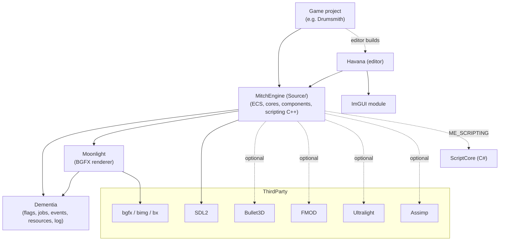
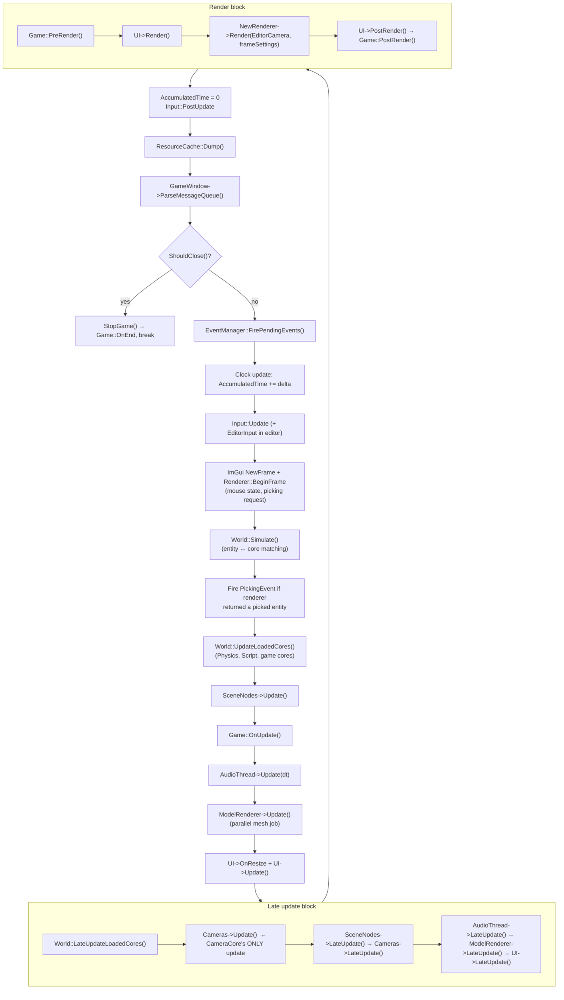

# Architecture

MitchEngine is a C++20 game engine organized as a small set of static-library modules around an ECS runtime. A singleton `Engine` owns the window, renderer, job system, and `World`; games subclass `Game` and are wired in with the `ME_APPLICATION_MAIN` macro. This doc covers the module layout, the engine lifecycle (init → frame loop → shutdown), the split between engine-owned and scene-loaded cores, and the compile-time feature-flag system that gates everything else.

> Verified against engine commit 047f57b8, 2026-07-10.

## Overview

The engine proper lives in `Source/` and links against two foundational modules: **Dementia** (`Modules/Dementia/` — utilities: feature flags, logging, job systems, events, resource cache, file/path) and **Moonlight** (`Modules/Moonlight/` — the BGFX renderer). The **Havana** editor (`Modules/Havana/`) wraps the engine in an editor application; **ScriptCore** (`Modules/ScriptCore/`) is the C# half of the scripting system; **ImGUI** (`Modules/ImGUI/`) and **Tool** (`Modules/Tool/`) support editor/tool builds. Third-party code lives in `ThirdParty/`; prebuilt tool binaries (e.g. `shaderc`) in `Tools/`.

Everything runs on one main thread except explicitly parallelized work dispatched through `SimpleJobSystem` (see `Docs/Jobs-and-Events.md`). There is no fixed timestep: the loop runs as fast as vsync/OS allows and passes the raw frame delta to updates.

## Key Files

| Path | Role |
|------|------|
| `Source/Engine/Engine.h` / `Source/Engine/Engine.cpp` | The `Engine` singleton: init, frame loop, scene loading, subsystem ownership |
| `Source/Game.h` | Abstract `Game` interface + `ME_APPLICATION_MAIN` entry-point macros (UWP and desktop variants) |
| `Source/Engine/World.h` / `Source/Engine/World.cpp` | ECS world — entities, cores, `Simulate()` (details in `Docs/ECS.md`) |
| `Source/Engine/Clock.h` | Frame clock (float seconds; `Update()` computes delta) |
| `Modules/Dementia/Source/Dementia.h` | Feature-flag definitions (`USING`, `IN_USE`, `USE_IF`) |
| `Source/Config/EngineConfig.h` | Window size/position/title persistence (`Assets\Config\Engine.cfg`) |
| `Source/Engine/Input.h` | Input state (two instances in editor builds — game + editor) |

## How It Works

### Module dependency graph

The dotted edges are compile-time optional — each is gated by a feature flag that the build system only defines when the corresponding `ThirdParty/` directory exists (see `Docs/Build-System.md`).

### Application bootstrap

Games implement the pure-virtual `Game` interface (`Source/Game.h`): `OnInitialize`, `OnStart`, `OnUpdate(const UpdateContext&)`, `OnEnd`, `PreRender`, `PostRender`. `ME_APPLICATION_MAIN(className)` generates `main()`, constructs the game, and calls `GetEngine().Init(&app)` then `GetEngine().Run()`. There are **two variants** of the macro: the UWP one wraps everything in `WinMain` + `SDL_WinRTRunApp` + `Windows::Foundation::Initialize`; the desktop one is a plain `main`. The Havana editor is itself a `Game` subclass (`EditorApp`) using the same entry point.

### `Engine::Init` sequence

1. `CLog` set up — log file `Engine.txt`, verbosity `Info`.
2. **Editor-only config bootstrap quirk**: if running from the engine directory, `Assets\Config\Engine.cfg` is copied into the game project's config path if missing (directory creation is Win64-only).
3. `EngineConfig` loads window title/size/position from `Assets\Config\Engine.cfg` (note the hardcoded backslash-relative path handed to `Path`).
4. `SDLWindow` is created on **all** platforms — including UWP, where the dedicated `UWPWindow` implementation is commented out. The window gets a `ResizeFunc` lambda that forwards resizes to the renderer, `UICore`, config, and a `WindowResizedEvent`.
5. `BGFXRenderer::Create` — on Linux the SDL display pointer and window type (X11/Wayland) are passed through.
6. ImGui SDL2 backend init, chosen per platform: D3D (Win64), Metal (macOS), Vulkan (Linux).
7. `World` is created, then the **five engine-owned cores** are `new`ed: `CameraCore`, `SceneCore`, `RenderCore`, `AudioCore`, `UICore` (held as raw public members `Cameras`, `SceneNodes`, `ModelRenderer`, `AudioThread`, `UI`).
8. A gizmo-draw callback is registered on the renderer that iterates every core's `OnDrawGuizmo`.
9. `Engine::InitGame` adds the five cores to the world via `World::AddCore<T>` and calls `Game::OnInitialize()`. (It also unconditionally logs the error-level marker `YIKES("Engine::InitGame")` — a leftover.)
10. `ResizeFunc` is fired once manually, and `SystemRegistry` registers `Engine`, the renderer, and the `SimpleJobSystem` so they are reachable through `UpdateContext`.

### Engine-owned vs scene-loaded cores

This is a load-bearing architectural split:

- **Engine-owned cores** (`CameraCore`, `SceneCore`, `RenderCore`, `AudioCore`, `UICore`) are created in `Engine::Init`, held as raw pointers on `Engine`, and updated **explicitly by name** in the frame loop.
- **Scene-loaded cores** (`PhysicsCore`, `ScriptCore`, and any game-defined cores) are *not* created by the engine. They are instantiated by name from the `"Cores"` array of a `.lvl` scene file (see `Docs/Serialization-and-Scenes.md`) and live in `World::m_loadedCores`, updated via `World::UpdateLoadedCores` / `LateUpdateLoadedCores`.

Consequences: physics only exists if the scene declares it; core update order is partly hardcoded (engine cores) and partly map-ordered (loaded cores); and the frame-loop comment `// TODO: This is wrong?? There's more than just physics in loaded cores...` in `Engine::Run` reflects that the loaded-core update block is profiled under the label "Physics" even though it updates every loaded core.

### The frame loop (`Engine::Run`)

Timing details worth knowing:

- `DeltaTime` for the frame is `AccumulatedTime` (the clock delta accumulated since last frame). There is a commented-out `//if (AccumulatedTime >= MaxDeltaTime)` gate and an `AccumulatedTime = std::fmod(AccumulatedTime, MaxDeltaTime)` line whose result is immediately overwritten by `AccumulatedTime = 0` — remnants of an abandoned fixed-timestep design. `Engine::FPS` (144) only feeds the dead `MaxDeltaTime` math.
- `CameraCore` (`Cameras`) has **no early update** — its `Update` is called inside the late-update block, after game logic. Anything that moves a camera during `OnUpdate` is picked up the same frame; anything reading camera matrices during `OnUpdate` sees last frame's.
- In non-editor builds, `EditorCamera.OutputSize` is refreshed from the window each frame inside the render block — the member named "EditorCamera" is used as the backbuffer camera descriptor in game builds too.

### Scene loading

`Engine` subscribes to `LoadSceneEvent` (and `WindowMovedEvent`) in its constructor. `Engine::LoadScene`:

1. `Cameras->Init()` — resets camera core state.
2. `CurrentScene->UnLoad()` + `delete CurrentScene` (raw pointer).
3. `World::Unload()` — destroys `DestroyOnLoad` entities/cores.
4. `SceneNodes->Init()`, then `new Scene(file)` + `Scene::Load(world)` (assert on failure unless it's a new empty scene).
5. `ScriptEngine::SetWorld` (scripting builds).
6. `GameWorld->AddCore<UICore>(*UI)` — UICore is **re-added after every scene load** (the unload removes it from the world's map).
7. `World::Simulate()`, then `SceneLoadedEvent` fires.
8. **Non-editor builds only**: a second `Simulate()` plus `World::Start()` — in the editor, Start happens when the user presses Play (see `Docs/Editor-Havana.md`).

### Shutdown

Window close → `StopGame()` (which only calls `Game::OnEnd()`) → loop break → `engineConfig.Save()`. That is the entire teardown: `~Engine` is empty, and the `new`ed subsystems (`GameWindow`, `NewRenderer`, the five cores) are never deleted — process exit is the cleanup. Don't add shutdown-order-dependent logic to core destructors and expect it to run.

### Feature flags (`Modules/Dementia/Source/Dementia.h`)

The current implementation is simple value macros — `IN_USE` = `1`, `NOT_IN_USE` = `0`, `USING(x)` = `(x)`, `USE_IF(x)` = `((x) ? 1 : 0)`. (Older docs describe a `(1 <flag> 1)` preprocessor-arithmetic trick; that scheme is gone.) The convention still stands: **always test with `#if USING( ME_FLAG )`**, never `#ifdef`, so composite `USE_IF` expressions keep working.

Flags are driven by `DEFINE_ME_*` preprocessor defines that Sharpmake sets per target (see `Docs/Build-System.md`):

| Flag | Meaning / derivation |
|------|----------------------|
| `ME_PLATFORM_WIN64` / `ME_PLATFORM_UWP` / `ME_PLATFORM_MACOS` / `ME_PLATFORM_LINUX` | Target platform |
| `ME_PLATFORM_WINDOWS` | `WIN64 \|\| UWP` |
| `ME_DEBUG` | From `_DEBUG` (not a `DEFINE_ME_*`) |
| `ME_RELEASE` / `ME_RETAIL` | Build config |
| `ME_EDITOR` | Havana editor build |
| `ME_TOOLS` | Effectively always on when `DEFINE_ME_TOOLS` is defined (`USE_IF(EDITOR \|\| IN_USE)`), else only with editor |
| `ME_GAME_TOOLS` | `TOOLS && !EDITOR` — debug tooling in game builds |
| `ME_FMOD` | `DEFINE_ME_FMOD && !HEADLESS` |
| `ME_DOTNET` → `ME_SCRIPTING` | .NET scripting chain |
| `ME_ULTRALIGHT` → `ME_UI` | `ULTRALIGHT && !HEADLESS` |
| `ME_OPTICK` | **Value-checked** (`#if DEFINE_ME_OPTICK`), unlike every other flag which is presence-checked — `DEFINE_ME_OPTICK` must be defined *to a value* |
| `ME_PROFILING` | `DEBUG \|\| RELEASE` (i.e. not RETAIL) |
| `ME_IMGUI` | `EDITOR \|\| TOOLS \|\| PROFILING` |
| `ME_BASIC_PROFILER` | `IMGUI && PROFILING` |
| `ME_HEADLESS` | No window/rendering |
| `ME_ENABLE_RENDERDOC` | RenderDoc integration |
| `ME_EDITOR_WIN64` / `ME_EDITOR_MACOS` | Editor + platform composites |

## Caveats & Fragility

- **No teardown.** Nothing owned by `Engine` is destroyed on exit; `Engine::IsRunning()` is hardcoded to return `true`. RAII in cores/components must not depend on engine-driven destruction order.
- **Two core-update paths.** Engine-owned cores are updated by explicit member calls in a hardcoded order; scene-loaded cores through `UpdateLoadedCores` in map order. Adding an engine-level core means editing the frame loop by hand.
- **`YIKES("Engine::InitGame")`** logs an error-level line on every boot — noise, not an actual error.
- **Fixed-timestep remnants.** `FPS`, `MaxDeltaTime`, the commented gate, and the dead `fmod` suggest frame-rate independence that does not exist; all updates get the raw variable delta.
- **`UICore` is re-added on every scene load** in `Engine::LoadScene`; if you add another engine-owned core that must survive scene loads, it needs the same treatment (or `DestroyOnLoad = false`).
- **Non-editor scene load runs `Simulate()` twice** (once unconditionally, once in the non-editor block) — harmless today but easy to trip over when reasoning about `OnEntityAdded` timing.
- **`Camera::CurrentCamera` static global** is consulted by the resize path and UI sizing every frame; a scene without a main camera skips UI resize silently.
- **Window/UI resize flows through a lambda captured in `Engine::Init`** (`ResizeFunc`) — it fires a `WindowResizedEvent` *and* directly pokes the renderer, UI, and config; resize behavior is split between that lambda and event receivers.
- **`Assets\Config\Engine.cfg`** path is written with backslashes and relies on `Path` normalization; the editor-only first-run copy creates directories on Win64 only.
- The frame-loop label **"Physics" on the loaded-core update block is a lie** — it updates *all* loaded cores (the in-code TODO acknowledges this).

## Related Docs

- `Docs/ECS.md` — what `World::Simulate` actually does; core/component machinery
- `Docs/Jobs-and-Events.md` — `SimpleJobSystem`, `EventManager`, threading rules
- `Docs/Rendering-Pipeline.md` — what happens inside `NewRenderer->Render`
- `Docs/Serialization-and-Scenes.md` — `.lvl` files, the `"Cores"` array, prefabs
- `Docs/Build-System.md` — how `DEFINE_ME_*` flags get set per target
- `Docs/State-of-the-Engine.md` — assessment and improvement priorities
