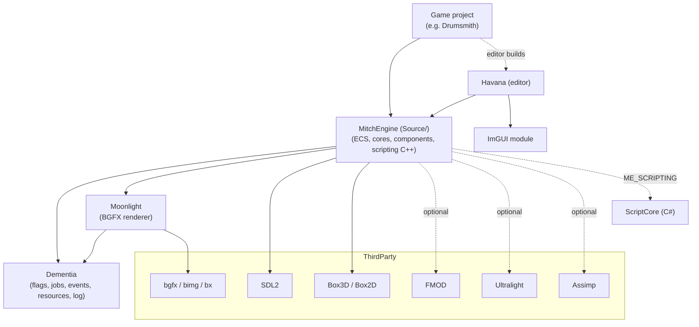
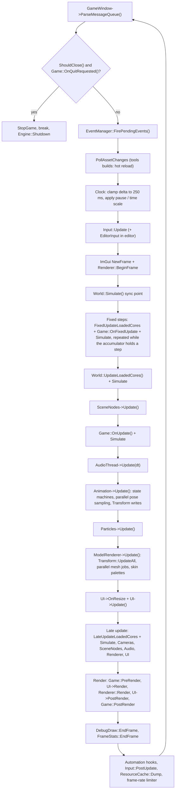

# Architecture

MitchEngine is a C++20 game engine organized as a small set of static-library modules around an ECS runtime. A singleton `Engine` owns the window, renderer, job system, and `World`; games subclass `Game` and are wired in with the `ME_APPLICATION_MAIN` macro. This doc covers the module layout, the engine lifecycle (init → frame loop → shutdown), the split between engine-owned and scene-loaded cores, and the compile-time feature-flag system that gates everything else.

> Verified against engine commit 7e869c6e, 2026-10-09; engine-owned cores and physics against 8fdd99b1, 2026-10-09; animation against 07617c5f, 2026-10-09.

## Overview

The engine proper lives in `Source/` and links against two foundational modules: **Dementia** (`Modules/Dementia/` — utilities: feature flags, logging, job systems, events, resource cache, file/path) and **Moonlight** (`Modules/Moonlight/` — the BGFX renderer). The **Havana** editor (`Modules/Havana/`) wraps the engine in an editor application; **ScriptCore** (`Modules/ScriptCore/`) is the C# half of the scripting system; **ImGUI** (`Modules/ImGUI/`) and **Tool** (`Modules/Tool/`) support editor/tool builds. Third-party code lives in `ThirdParty/`; prebuilt tool binaries (e.g. `shaderc`) in `Tools/`.

Everything runs on one main thread except explicitly parallelized work dispatched through `Jobs::JobSystem` (see `Docs/Jobs-and-Events.md`). The loop runs a **fixed-timestep simulation** (`FixedUpdate`, 60 Hz by default) inside a variable-rate frame (`Update`/`LateUpdate`/render), with time scale, pause and single-step support.

## Key Files

| Path | Role |
|------|------|
| `Source/Engine/Engine.h` / `Source/Engine/Engine.cpp` | The `Engine` singleton: init, frame loop, scene loading, subsystem ownership |
| `Source/Game.h` | Abstract `Game` interface + `ME_APPLICATION_MAIN` entry-point macros (UWP and desktop variants) |
| `Source/Engine/World.h` / `Source/Engine/World.cpp` | ECS world — entities, cores, `Simulate()` (details in `Docs/ECS.md`) |
| `Source/Engine/Clock.h` | Frame clock (float seconds; `Update()` computes delta) |
| `Modules/Dementia/Source/Dementia.h` | Feature-flag definitions (`USING`, `IN_USE`, `USE_IF`) |
| `Source/Config/EngineConfig.h` | Window size/position/title persistence (`Assets\Config\Engine.cfg`) |
| `Source/Engine/Input.h` | Input state (two instances in editor builds — game + editor) |

## How It Works

### Module dependency graph

```mermaid
flowchart TD
    subgraph ThirdParty
        BGFX[bgfx / bimg / bx]
        SDL2[SDL2]
        Box[Box3D / Box2D]
        FMOD[FMOD]
        UL[Ultralight]
        Assimp[Assimp]
    end
    Dementia["Dementia<br/>(flags, jobs, events, resources, log)"]
    Moonlight["Moonlight<br/>(BGFX renderer)"]
    EngineSrc["MitchEngine (Source/)<br/>(ECS, cores, components, scripting C++)"]
    ImGuiMod["ImGUI module"]
    Havana["Havana (editor)"]
    ScriptCore["ScriptCore (C#)"]
    GameProj["Game project<br/>(e.g. Drumsmith)"]

    Moonlight --> Dementia
    Moonlight --> BGFX
    EngineSrc --> Dementia
    EngineSrc --> Moonlight
    EngineSrc --> SDL2
    EngineSrc --> Box
    EngineSrc -.optional.-> FMOD
    EngineSrc -.optional.-> UL
    EngineSrc -.optional.-> Assimp
    Havana --> EngineSrc
    Havana --> ImGuiMod
    EngineSrc -.ME_SCRIPTING.-> ScriptCore
    GameProj --> EngineSrc
    GameProj -.editor builds.-> Havana
```

The dotted edges are compile-time optional — each is gated by a feature flag that the build system only defines when the corresponding `ThirdParty/` directory exists (see `Docs/Build-System.md`).

### Application bootstrap

Games implement the pure-virtual `Game` interface (`Source/Game.h`): `OnInitialize`, `OnStart`, `OnUpdate(const UpdateContext&)`, `OnEnd`, `PreRender`, `PostRender`. `ME_APPLICATION_MAIN(className)` generates `main()`, constructs the game, and calls `GetEngine().Init(&app)` then `GetEngine().Run()`. There are **two variants** of the macro: the UWP one wraps everything in `WinMain` + `SDL_WinRTRunApp` + `Windows::Foundation::Initialize`; the desktop one is a plain `main`. The Havana editor is itself a `Game` subclass (`EditorApp`) using the same entry point.

### `Engine::Init` sequence

1. `CLog` set up — log file `Engine.txt`, verbosity `Info`.
2. **Editor-only config bootstrap quirk**: if running from the engine directory, `Assets\Config\Engine.cfg` is copied into the game project's config path if missing (directory creation is Win64-only).
3. `EngineConfig` loads window title/size/position from `Assets\Config\Engine.cfg` (note the hardcoded backslash-relative path handed to `Path`).
4. `SDLWindow` is created on **all** platforms — including UWP, where the dedicated `UWPWindow` implementation is commented out. The window gets a `ResizeFunc` lambda that forwards resizes to the renderer, `UICore`, config, and a `WindowResizedEvent`.
5. `BGFXRenderer::Create` — on Linux the SDL display pointer and window type (X11/Wayland) are passed through.
6. ImGui SDL2 backend init, chosen per platform: D3D (Win64), Metal (macOS), Vulkan (Linux).
7. `World` is created, then the **nine engine-owned cores** are `new`ed: `CameraCore`, `SceneCore`, `RenderCore`, `ParticleCore`, `PhysicsCore`, `Physics2DCore`, `AnimationCore`, `AudioCore`, `UICore` (held as raw public members `Cameras`, `SceneNodes`, `ModelRenderer`, `Particles`, `Physics`, `Physics2D`, `Animation`, `AudioThread`, `UI`).
8. A gizmo-draw callback is registered on the renderer that iterates every core's `OnDrawGuizmo`.
9. `Engine::InitGame` adds the nine cores to the world via `World::AddCore<T>` and calls `Game::OnInitialize()`. (It also unconditionally logs the error-level marker `YIKES("Engine::InitGame")` — a leftover.)
10. `ResizeFunc` is fired once manually, and `SystemRegistry` registers `Engine`, the renderer, and the `Jobs::JobSystem` so they are reachable through `UpdateContext`.

### Engine-owned vs scene-loaded cores

This is a load-bearing architectural split:

- **Engine-owned cores** (`CameraCore`, `SceneCore`, `RenderCore`, `ParticleCore`, `PhysicsCore`, `Physics2DCore`, `AnimationCore`, `AudioCore`, `UICore`) are created in `Engine::Init`, held as raw pointers on `Engine`, and updated **explicitly by name** in the frame loop. The two physics cores step inside the fixed-step loop and write interpolated poses right after it (`Docs/Physics.md`). `AnimationCore` runs after gameplay and audio, before render preparation (`Docs/Animation.md`).
- **Scene-loaded cores** (`ScriptCore`, `SelfDestructor`, and any game-defined cores) are *not* created by the engine. They are instantiated by name from the `"Cores"` array of a `.lvl` scene file (see `Docs/Serialization-and-Scenes.md`) and live in `World::m_loadedCores`, updated via `World::UpdateLoadedCores` / `LateUpdateLoadedCores`.

Consequences: core update order is partly hardcoded (engine cores) and partly priority-ordered (loaded cores, `BaseCore::GetPriority`). A scene that still lists an engine-owned core in `"Cores"` (old scenes name `PhysicsCore`) gets the existing instance back from `World::AddCoreByName`.

### The frame loop (`Engine::Run`)

```mermaid
flowchart TD
    A["GameWindow->ParseMessageQueue()"] --> B{"ShouldClose() and Game::OnQuitRequested()?"}
    B -- yes --> Z["StopGame, break, Engine::Shutdown"]
    B -- no --> C["EventManager::FirePendingEvents()"]
    C --> C2["PollAssetChanges (tools builds: hot reload)"]
    C2 --> D["Clock: clamp delta to 250 ms, apply pause / time scale"]
    D --> E["Input::Update (+ EditorInput in editor)"]
    E --> F["ImGui NewFrame + Renderer::BeginFrame"]
    F --> G["World::Simulate() sync point"]
    G --> H["Fixed steps: FixedUpdateLoadedCores + Game::OnFixedUpdate + Simulate, repeated while the accumulator holds a step"]
    H --> I["World::UpdateLoadedCores() + Simulate"]
    I --> J["SceneNodes->Update()"]
    J --> K["Game::OnUpdate() + Simulate"]
    K --> L["AudioThread->Update(dt)"]
    L --> L2["Animation->Update(): state machines, parallel pose sampling, Transform writes"]
    L2 --> L3["Particles->Update()"]
    L3 --> M["ModelRenderer->Update(): Transform::UpdateAll, parallel mesh jobs, skin palettes"]
    M --> N["UI->OnResize + UI->Update()"]
    N --> O["Late update: LateUpdateLoadedCores + Simulate, Cameras, SceneNodes, Audio, Renderer, UI"]
    O --> P["Render: Game::PreRender, UI->Render, Renderer::Render, UI->PostRender, Game::PostRender"]
    P --> P2["DebugDraw::EndFrame, FrameStats::EndFrame"]
    P2 --> Q["Automation hooks, Input::PostUpdate, ResourceCache::Dump, frame-rate limiter"]
    Q --> A
```

Timing details worth knowing:

- **Delta**: the clock delta is clamped to `m_maxFrameDelta` (250 ms) so hitches don't produce a burst of catch-up steps. While paused the scaled delta is 0, except after `Engine::StepFrame`, which advances exactly one fixed step.
- **Fixed steps**: the accumulator gains the scaled delta and runs up to 8 steps of `Engine::GetFixedTimeStep()` (default 1/60 s); a larger backlog is dropped. `UpdateContext::GetInterpolationAlpha()` reports progress toward the next step for smoothing. Inside `FixedUpdate`, `GetDeltaTime()` returns the fixed delta.
- **Settings**: `FixedTimeStep` and `MaxFrameRate` in `Engine.cfg`, overridable with `--fixed-step` / `--max-fps`. `Engine::SetTimeScale`, `SetPaused`, `StepFrame` and `SetMaxFrameRate` are available at runtime.
- `CameraCore` (`Cameras`) has **no early update** — its `Update` runs in the late-update block, after game logic.
- In non-editor builds, `EditorCamera.OutputSize` is refreshed from the window each frame inside the render block — the member named "EditorCamera" is used as the backbuffer camera descriptor in game builds too.
- Command-line automation (`--frames`, `--screenshot`, `--perf-report`, `--trace`, `--scene`, `--no-ui`, `--width`/`--height`) is handled by `Source/Engine/AutomationRunner.cpp`. `AutomationRunner::IsUnattendedRun()` (those flags, `--editor-exec` or `--transient`) suppresses writing the user's settings (`Engine.cfg` window state, editor preferences, ImGui layout).
- **Quitting**: when the window asks to close, `Game::OnQuitRequested()` may veto (the editor does while there are unsaved changes or play mode is running). It then calls `IWindow::CancelClose()` and quits later with `Engine::Quit( true )`, which forces the close.
- **Frame statistics**: `ME_STAT_SCOPE( "Name" )` records named, nestable CPU scopes into `FrameStats` (`Modules/Dementia/Source/Profiling/FrameStats.h`). The engine scopes every phase above, and `World` scopes each scene-loaded core's update and fixed update. The renderer adds GPU and draw statistics. The editor's stats overlay and Profiler window display them.

### Scene loading

`Engine` subscribes to `LoadSceneEvent` (and `WindowMovedEvent`) in its constructor. `Engine::LoadScene`:

1. `Cameras->Init()` — resets camera core state.
2. `CurrentScene->UnLoad()` + `delete CurrentScene` (raw pointer).
3. `World::Unload()` — destroys `DestroyOnLoad` entities/cores.
4. `SceneNodes->Init()`, then `new Scene(file)` + `Scene::Load(world)` (assert on failure unless it's a new empty scene).
5. `ScriptEngine::SetWorld` (scripting builds).
6. `GameWorld->AddCore<UICore>(*UI)` — UICore is **re-added after every scene load** (the unload removes it from the world's map).
7. `World::Simulate()`, then `SceneLoadedEvent` fires.
8. **Non-editor builds only**: a second `Simulate()` plus `World::Start()` — in the editor, Start happens when the user presses Play (see `Docs/Editor-Havana.md`).

`Engine::LoadSceneFromData( json, path )` runs the same sequence from already-parsed scene data (the scene's `FilePath` is set to `path`); the editor uses it to restore play-mode snapshots and autosaves.

### Shutdown

Window close → `StopGame()` (`Game::OnEnd()`) → loop break → `engineConfig.Save()` (skipped for automation runs) → `Engine::Shutdown`: the asset watcher stops, the World is stopped and destroyed (every component gets `OnDisable`/`OnDestroy`), the job workers are joined and the log is flushed. The renderer and the `new`ed engine cores are not destroyed and bgfx is not shut down; process exit cleans those up.

### Feature flags (`Modules/Dementia/Source/Dementia.h`)

The current implementation is simple value macros — `IN_USE` = `1`, `NOT_IN_USE` = `0`, `USING(x)` = `(x)`, `USE_IF(x)` = `((x) ? 1 : 0)`. (Older docs describe a `(1 <flag> 1)` preprocessor-arithmetic trick; that scheme is gone.) The convention still stands: **always test with `#if USING( ME_FLAG )`**, never `#ifdef`, so composite `USE_IF` expressions keep working.

Flags are driven by `DEFINE_ME_*` preprocessor defines that Sharpmake sets per target (see `Docs/Build-System.md`):

| Flag | Meaning / derivation |
|------|----------------------|
| `ME_PLATFORM_WIN64` / `ME_PLATFORM_UWP` / `ME_PLATFORM_MACOS` / `ME_PLATFORM_LINUX` | Target platform |
| `ME_PLATFORM_WINDOWS` | `WIN64 \|\| UWP` |
| `ME_DEBUG` | From `_DEBUG` (not a `DEFINE_ME_*`) |
| `ME_RELEASE` / `ME_RETAIL` | Build config |
| `ME_EDITOR` | Havana editor build |
| `ME_TOOLS` | Effectively always on when `DEFINE_ME_TOOLS` is defined (`USE_IF(EDITOR \|\| IN_USE)`), else only with editor |
| `ME_GAME_TOOLS` | `TOOLS && !EDITOR` — debug tooling in game builds |
| `ME_FMOD` | `DEFINE_ME_FMOD && !HEADLESS` |
| `ME_DOTNET` → `ME_SCRIPTING` | .NET scripting chain |
| `ME_ULTRALIGHT` → `ME_UI` | `ULTRALIGHT && !HEADLESS` |
| `ME_OPTICK` | **Value-checked** (`#if DEFINE_ME_OPTICK`), unlike every other flag which is presence-checked — `DEFINE_ME_OPTICK` must be defined *to a value* |
| `ME_PROFILING` | `DEBUG \|\| RELEASE` (i.e. not RETAIL) |
| `ME_IMGUI` | `EDITOR \|\| TOOLS \|\| PROFILING` |
| `ME_BASIC_PROFILER` | `IMGUI && PROFILING` |
| `ME_HEADLESS` | No window/rendering |
| `ME_ENABLE_RENDERDOC` | RenderDoc integration |
| `ME_EDITOR_WIN64` / `ME_EDITOR_MACOS` | Editor + platform composites |

## Caveats & Fragility

- **Partial teardown.** `Engine::Shutdown` destroys the World and jobs, but not the renderer, window or engine cores, and never calls `bgfx::shutdown`. `Engine::IsRunning()` is hardcoded to return `true`.
- **Two core-update paths.** Engine-owned cores are updated by explicit member calls in a hardcoded order; scene-loaded cores through `UpdateLoadedCores` in priority order. Adding an engine-level core means editing the frame loop by hand.
- **`YIKES("Engine::InitGame")`** logs an error-level line on every boot — noise, not an actual error.
- **`UICore` is re-added on every scene load** in `Engine::LoadScene`; if you add another engine-owned core that must survive scene loads, it needs the same treatment (or `DestroyOnLoad = false`).
- **Non-editor scene load runs `Simulate()` twice** (once unconditionally, once in the non-editor block) — harmless today but easy to trip over when reasoning about `OnEntityAdded` timing.
- **`Camera::CurrentCamera` static global** is consulted by the resize path and UI sizing every frame; a scene without a main camera skips UI resize silently.
- **Window/UI resize flows through a lambda captured in `Engine::Init`** (`ResizeFunc`) — it fires a `WindowResizedEvent` *and* directly pokes the renderer, UI, and config; resize behavior is split between that lambda and event receivers.
- **`Assets\Config\Engine.cfg`** path is written with backslashes and relies on `Path` normalization; the editor-only first-run copy creates directories on Win64 only.

## Related Docs

- `Docs/ECS.md` — what `World::Simulate` actually does; core/component machinery
- `Docs/Jobs-and-Events.md` — `Jobs::JobSystem`, `EventManager`, threading rules
- `Docs/Rendering-Pipeline.md` — what happens inside `NewRenderer->Render`
- `Docs/Serialization-and-Scenes.md` — `.lvl` files, the `"Cores"` array, prefabs
- `Docs/Build-System.md` — how `DEFINE_ME_*` flags get set per target
- `Docs/State-of-the-Engine.md` — assessment and improvement priorities
