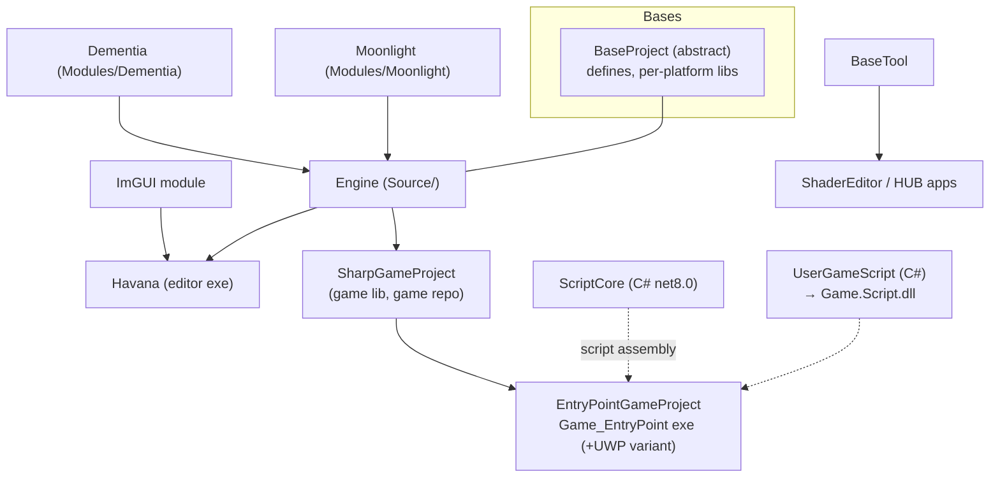

# Build System

Builds are generated by **Sharpmake** (C# build-description, vendored at `Tools/Sharpmake/`): the game repo's `Game.sharpmake.cs` includes `Engine.sharpmake.cs`, and generation scripts produce Visual Studio solutions, Xcode projects, or GNU makefiles. The signature behavior to understand: **feature flags are set by directory existence** — if a ThirdParty SDK folder is present at generation time, the feature compiles in; if not, it silently compiles out. This doc maps the project graph, the target matrix, the define conditions, and the Linux/Nix dev shell.

> Verified against engine commit 047f57b8 (+ Linux CI/packaging changes), 2026-07-11.

## Overview

Nothing is built without regenerating projects first — adding files, changing defines, or installing an SDK all require re-running the generation script. Generated artifacts (`.sln`, `.vcxproj`, `.make`, `Makefile`, `compile_commands.json`) are gitignored and must never be committed.

## Key Files

| Path | Role |
|------|------|
| `Engine.sharpmake.cs` | `Globals` (all SDK paths + `RootDir`), `BaseProject`, `Engine`, `EntryPointGameProject` (+UWP), solution bases |
| `Tools/CommonTarget.sharpmake.cs` | The target matrix (platform × mode × optimization) |
| `Tools/BaseProject.sharpmake.cs` | Per-platform/per-config define + lib wiring (the "why is my feature off" file) |
| `Tools/BaseTool.sharpmake.cs`, `Tools/SharpmakeProject.sharpmake.cs` | Tool-app + sharpmake-project bases |
| `Modules/ScriptCore/ScriptCore.sharpmake.cs` | The C# script assembly (net8.0) |
| `../Game.sharpmake.cs` (game repo) | `SharpGameProject` (game lib), `UserGameScript`, solution — includes the engine file |
| `../Project/GenerateSolution.sh` / `.bat` / `.command` (game repo) | Generation entry points |
| `ThirdParty/GenerateSolutions.sh` / `.bat` / `.command` | One-time third-party project generation (`.sh`: cmake configure only; `--build-bgfx` rebuilds the bgfx archives) |
| `../flake.nix` (game repo; template ships it via `Tools/ProjectTemplate/flake.nix`) | Linux dev shell (all native deps + .NET + env exports) |
| `Tools/NewProjectSetup.sh` / `.bat` / `.command` | New-project bootstrap (clone engine, copy template, generate); `.sh` wraps generation in `nix develop` when nix is present |
| `Tools/PackageLinuxBuild.sh` | Packages a `.build/<Target>` folder into a relocatable tar.gz (bundled libs + `run.sh` launcher) |
| `.github/workflows/Linux.yml` (+ `Windows.yml`, `macOS.yml`, `UWP.yml`) | CI: sets up an `EmptyProject` from the template and builds Editor/Game × Debug/Release; Linux builds inside the template's nix dev shell and uploads tar.gz artifacts |

## How It Works

### Project graph

Outputs land in `.build/[target.Name]/` at the game-repo root (e.g. `.build/Editor_Debug/Havana`, `.build/Game_linux_Debug/Game_EntryPoint_x64`). Post-build steps copy runtime DLLs (FMOD, Ultralight, nethost, Optick) from `ThirdParty` locations into the output dir.

### Target matrix (`CommonTarget`)

- **Platforms**: `win64`, `uwp`, `mac`, `linux`
- **Mode fragment**: `Game` and `Editor` (editor targets add `DEFINE_ME_EDITOR` + `DEFINE_ME_TOOLS`)
- **Optimization**: `Debug`, `Release`, `Retail` — third-party libs map Retail→Release (`GetThirdPartyOptimization`)

Linux makefile config names follow `<mode>_<platform>_<opt>` lowercased, e.g. `make -f Drumsmith.make Havana config=editor_debug`, `Game_EntryPoint config=game_linux_debug`.

### The define conditions — "why is my feature compiled out"

From `Tools/BaseProject.sharpmake.cs` (+ `Engine.sharpmake.cs` `Globals`):

| Define | Condition |
|--------|-----------|
| `DEFINE_ME_PLATFORM_*` | The target platform, always |
| `DEFINE_ME_EDITOR` + `DEFINE_ME_TOOLS` | Editor-mode targets |
| `DEFINE_ME_DEBUG` + `DEFINE_ME_TOOLS` | Debug optimization (tools ride along in debug game builds) |
| `DEFINE_ME_ULTRALIGHT` | `Globals.IsUltralightEnabled` (checks `ThirdParty/UltralightSDK` presence) |
| `DEFINE_ME_FMOD` | `Globals.FMOD_<Platform>_Dir` exists (Win64/UWP: installed SDK path; Linux: SDK dir with `api/core/lib/x86_64`) |
| `DEFINE_ME_DOTNET` | `Globals.DOTNET_Win64_Dir` (Win64/UWP) or `Globals.DOTNET_Linux_Dir` (Linux) exists — **no macOS path** |
| `DEFINE_ME_OPTICK` | Win64 (per-optimization lib copy from `ThirdParty/Lib/Optick/Win64/…`) |
| `DEFINE_ME_RENDERDOC` | RenderDoc integration available |

Because these are **generation-time filesystem checks**, two machines with different SDKs silently produce different feature sets from identical source. When a feature "doesn't work", check the generation log/defines before debugging code. `Globals.MONO_*_Dir` checks still exist but define nothing — Mono leftovers (with `ThirdParty/Mono.sharpmake.cs` fully vestigial).

### Generating and building

1. **Once**: run `ThirdParty/GenerateSolutions.sh` (or `.bat`/`.command`) to generate third-party projects. On Linux this is cmake-configure only (produces `assimp/config.h` etc.); the engine links the prebuilt archives committed under `ThirdParty/Lib/*/linux/{Debug,Release}`. `GenerateSolutions.sh --build-bgfx` rebuilds the bgfx toolchain/archives from source when refreshing `ThirdParty/Lib/BGFX/linux`.
2. **Per change**: run the game repo's `Project/GenerateSolution.sh` (Linux — also runs `bear -- make …` to produce `compile_commands.json` for clangd/CLion), `.bat` (Windows → `.sln`), or `.command` (macOS → Xcode). All three invoke `dotnet Engine/Tools/Sharpmake/Sharpmake.Application.dll /sources('../Game.sharpmake.cs')`.
3. Build in the IDE, or on Linux: `make -f <Game>.make <Project> config=<config> -j$(nproc)`.

### ThirdParty inventory

`ThirdParty/`: `Assimp`, `bgfx` + `bimg` + `bx`, `Bullet`, `FMOD`, `glm`, `ImGui`, `JSON` (nlohmann), `Optick`, `RenderDoc`, `SDL`, `UltralightSDK`, `ChromeTrace`, plus prebuilt outputs under `ThirdParty/Lib/` and runtime binaries under `ThirdParty/Bin/`. Some are source-built (Bullet, bgfx family), some prebuilt SDK drops (FMOD, Ultralight, Optick libs).

### Tools (`Tools/` at engine root)

Prebuilt per-platform binaries in `Tools/Win64|macOS|linux/` (**`shaderc`**, `texturec` — used by the asset cook, `Docs/Resources-and-Assets.md`), the vendored **Sharpmake** application, **Optick.exe** (profiler viewer), and standalone tool apps: **ShaderEditor** (node-graph shader authoring feeding `ShaderGraphMaterial`) and **HUB** (MitchHub project launcher), plus `ProjectTemplate`/`NewProjectSetup` scripts for spinning up new game projects.

### The Linux/Nix dev shell (game repo `../flake.nix`; template copy in `Tools/ProjectTemplate/flake.nix`)

New projects get a flake (+ lock) from the template — same shell minus the game-specific extras (e.g. Drumsmith's nodejs for the Vue UI). CI (`Linux.yml`) runs generation and make through `nix develop` on this flake.

`nix develop` provides: gcc/cmake toolchain, SDL, `mesa`/`libglvnd`/`vulkan-loader`, Wayland + the X11 header set, `alsa-lib`, `curl`, `bzip2`, **dotnet-sdk_8** (exports `DOTNET_ROOT`, discovers `DOTNET_LINUX_NATIVE_DIR` by `find`-ing the host pack), `fontconfig` + **gtk3/glib** (Ultralight's runtime deps), and **nodejs_20 + python3 — flagged in-file for the Vue HTML/JS UI**, i.e. the Ultralight replacement direction (`Docs/UI-Ultralight-and-ImGui.md`). The shellHook also sets `LD_LIBRARY_PATH` so bgfx can `dlopen` `libEGL` and Ultralight finds GTK.

## Caveats & Fragility

- **Silent feature variance**: directory-existence defines mean a fresh clone without SDKs builds a quietly reduced engine (no FMOD, no scripting, no Ultralight). There's no generation-time report of what got enabled; grep the generated project files for `DEFINE_ME_` to audit.
- **Regeneration is mandatory** after adding/removing source files or SDKs — stale projects fail in confusing ways (missing defines rather than missing files).
- **Prebuilt `ThirdParty/Lib` archives can drift from submodule headers**: the Linux BGFX *Release* archives sat stale for a long time (undefined `bgfx::setViewName`/`createTexture2D` at link) while Debug was current. If a `*_release` config fails with undefined bgfx symbols, refresh via `GenerateSolutions.sh --build-bgfx` and copy the `.a` files from `bgfx/.build/linux64_gcc/bin` into `Lib/BGFX/linux/Release` (only the already-tracked set — the shaderc-only deps like `spirv-opt`/`tint-*` are ~700MB and stay uncommitted).
- **Hardcoded SDK paths on Windows** (e.g. FMOD under Program Files, the .NET host pack version in `Globals.DOTNET_Win64_Dir`) — version bumps of installed SDKs require editing `Engine.sharpmake.cs`.
- **macOS scripting is unwired** (no `DEFINE_ME_DOTNET` path) and Optick is Win64-only — platform feature parity is uneven by construction (see the matrix in `Docs/State-of-the-Engine.md`).
- **The dev shell is load-bearing on Linux**: outside `nix develop`, the .NET native dir, GTK stack, and EGL paths must be assembled by hand.
- **`ScriptCore`/`UserGameScript` sharpmake configs are near-duplicates** (in-code TODO: factor a common base "when there's a third one").
- **Retail builds still define `ME_TOOLS` in debug**-adjacent paths — the `Debug ⇒ DEFINE_ME_TOOLS` coupling means "game debug" builds carry tool code; only Retail is clean.

## Related Docs

- `Docs/Architecture.md` — the feature-flag system these defines feed
- `Docs/Scripting-DotNet.md` — the .NET host dirs in detail
- `Docs/Resources-and-Assets.md` / `Docs/Materials-and-Shaders.md` — the cook tools shipped in `Tools/`
- `Docs/State-of-the-Engine.md` — platform matrix and debt items
