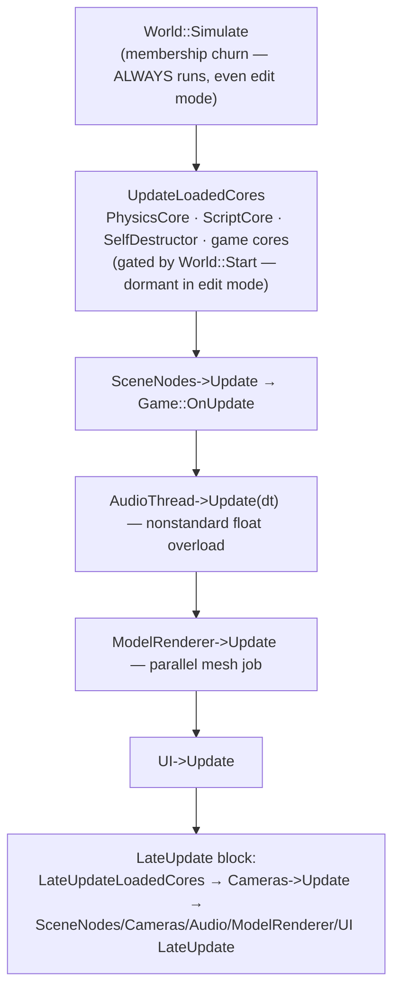

# Cores and Components Reference

The catalog: every core (system) and component the engine ships, what each core filters on, when it updates, and which components are decorative or orphaned. Deep-dives for Physics (Bullet3D) and Audio (FMOD) live here; Rendering, UI, and Scripting cores have their own docs.

> Verified against engine commit 047f57b8, 2026-07-10.

## Overview

Cores come in two flavors (see `Docs/Architecture.md`): **engine-owned** (created in `Engine::Init`, ticked explicitly by the frame loop) and **scene-loaded** (declared in a `.lvl` file's `"Cores"` array, ticked via `World::UpdateLoadedCores` — *only while the world is started*, i.e. Play mode or game builds). Filters use the DSL from `Docs/ECS.md`.

## Cores

| Core | Filter | Flavor | One-liner |
|------|--------|--------|-----------|
| `SceneCore` (`Source/Cores/SceneCore.h`) | `Transform` | engine-owned | Owns the root transform entity and the scene hierarchy |
| `CameraCore` (`Source/Cores/Cameras/CameraCore.h`) | `Camera` + `Transform` | engine-owned | Builds `Moonlight::CameraData` commands; manages `Camera::CurrentCamera` |
| `RenderCore` (`Source/Cores/Rendering/RenderCore.h`) | `Transform` + `Mesh` | engine-owned | Parallel cull + `MeshCommand` fill — see `Docs/Rendering-Pipeline.md` |
| `AudioCore` (`Source/Cores/AudioCore.h`) | `AudioSource` | engine-owned | FMOD playback + path-keyed sound cache |
| `UICore` (`Source/Cores/UI/UICore.h`) | `BasicUIView` | engine-owned | Ultralight HTML views — see `Docs/UI-Ultralight-and-ImGui.md` |
| `PhysicsCore` (`Source/Cores/PhysicsCore.h`) | `Transform` + one of (`Rigidbody`, `CharacterController`) | scene-loaded | Bullet3D world, transform sync, collision events, raycasts |
| `ScriptCore` (`Source/Cores/Scripting/ScriptCore.h`) | `ScriptComponent` | scene-loaded | .NET script lifecycle — see `Docs/Scripting-DotNet.md` |
| `SelfDestructor` (`Source/Cores/Utility/SelfDestructCore.h`) | `SelfDestruct` | scene-loaded | Kills entities when their `Lifetime` expires (note the class name — not "SelfDestructCore") |
| `FlyingCameraCore` (`Source/Cores/Cameras/FlyingCameraCore.h`) | `FlyingCamera` + `Camera` | scene-loaded/editor | WASD+mouse free-fly camera control |
| `EditorCore` (`Modules/Havana/Source/Cores/EditorCore.h`) | — | editor-only | Selection/gizmo state — see `Docs/Editor-Havana.md` |

### Update phases at a glance

`CameraCore::Update` runs **only inside the LateUpdate block** — camera moves made in `Game::OnUpdate`/scripts apply the same frame; camera *reads* during update see last frame's matrices.

### PhysicsCore (Bullet3D) — deep dive

- The Bullet world (`btDiscreteDynamicsWorld` + default dispatcher/broadphase/solver) is built in the **constructor**, not `Init` (which is empty); gravity is hardcoded `(0, -9.8, 0)` at construction. Compiled out entirely without `ME_PHYSICS_3D`.
- `Update`: `PhysicsWorld->stepSimulation( deltaTime, 10 )` — **variable timestep** (in-code comment: "Need a fixed delta probably"); Bullet's internal substepping (max 10) is the only mitigation.
- After stepping, a serial loop (chunked by `Burst::GenerateChunks(size, 11, …)` but the job dispatch is commented out — it runs inline) syncs per entity:
  - **Dynamic `Rigidbody`** → Bullet transform is written back to the `Transform` via `SetPosition` + `SetRotation(eulerZYX→degrees)` — every dynamic body dirties its transform subtree every frame, and rotation round-trips through Euler angles.
  - **`CharacterController`** → transform rotation is pushed *into* Bullet, `Controller.Update()` runs, then position is pulled back via `SetWorldPosition`.
- `InitRigidbody` is called for every rigidbody **every frame** (lazy-init guard inside).
- Collision events: `PhysicsCore` implements `ICollisionEvents` (`Source/Physics/RigidBodyWithCollisionEvents.h`) — `OnCollisionStart/Continue/Stop` with contact point/normal/impulse, wired through a custom `btRigidBodyWithEvents` and forwarded to the involved `Rigidbody` components.
- `Raycast(position, direction, RaycastHit&)` wraps Bullet's closest-hit ray test (`Source/Physics/RaycastHit.h`).

### AudioCore (FMOD) — deep dive

- Gated by `ME_FMOD` (which requires the FMOD SDK present at build time *and* not headless — see `Docs/Build-System.md`).
- **Signature quirk:** `AudioCore::Update(float dt)` is an *overload*, not an override of `BaseCore::Update(const UpdateContext&)` — the engine calls it explicitly (`AudioThread->Update(deltaTime)`). Code iterating cores generically never updates audio.
- Maintains `m_cachedSounds` — a path-keyed map of `SharedPtr<AudioSource>` used to preload/reuse sounds; also an `EventReceiver` for `PlayAudioEvent`/`StopAudioEvent` (`Source/Events/AudioEvents.h`), so gameplay can fire-and-forget audio without holding components.
- `OnStart`/`OnStop` manage the FMOD system lifecycle with the world's start/stop.

## Components

| Component | File | Purpose |
|-----------|------|---------|
| `Transform` | `Source/Components/Transform.h` | Hierarchy node: position/rotation/scale, parent/children (`SharedPtr<Transform>` links), name. Dirty-flag cached matrices — see below |
| `Camera` | `Source/Components/Camera.h` | Projection (perspective/ortho), FOV, near/far, clear type (color/skybox/procedural), main-camera flag; statics `Camera::CurrentCamera` / `Camera::EditorCamera` |
| `Mesh` | `Source/Components/Graphics/Mesh.h` | One renderable mesh: `MeshData*`, per-instance material, renderer cache slot `Id` |
| `Model` | `Source/Components/Graphics/Model.h` | Assimp model reference; `Init()` **expands the model's node tree into real child entities** with `Transform` + `Mesh` components |
| `Light` / `DirectionalLight` | `Source/Components/Lighting/Light.h`, `Source/Components/Lighting/DirectionalLight.h` | **Decorative** — no core or renderer path consumes them (see `Docs/Rendering-Pipeline.md`) |
| `Rigidbody` | `Source/Components/Physics/Rigidbody.h` | Bullet body (box/sphere collider shapes), mass/velocity, per-body collision-event hookups |
| `CharacterController` | `Source/Components/Physics/CharacterController.h` | Kinematic capsule driven by `PhysicsCore` (rotation in, position out) |
| `Collider2D` | `Source/Components/Physics/Collider2D.h` | **Orphaned** — no core filters it; physics is 3D-only |
| `AudioSource` | `Source/Components/Audio/AudioSource.h` | FMOD channel wrapper: path, preload/loop flags, play/stop; also declares the `wav`/`mp3` metadata types |
| `ScriptComponent` | `Source/Components/Scripting/ScriptComponent.h` | Script by type name + `m_dotnetHandle` (int) + saved-fields JSON |
| `BasicUIView` | `Source/Components/UI/BasicUIView.h` | Ultralight HTML view + JS bridge |
| `Canvas` | `Source/Components/UI/Canvas.h` | **Empty file** — placeholder |
| `FlyingCamera` | `Source/Components/Cameras/FlyingCamera.h` | Free-fly parameters (speed etc.) for `FlyingCameraCore` |
| `DebugCube` | `Source/Components/Debug/DebugCube.h` | Debug visualization cube |
| `SelfDestruct` | `Source/Cores/Utility/SelfDestructCore.h` | Lifetime in seconds; the core kills the entity when it expires (declared in the core's header, not `Source/Components/`) |

### Transform dirty-flag semantics

`Transform` tracks `IsLocalToWorldDirty` / `IsWorldToLocalDirty` separately. `SetDirty(true)`:

- **early-outs if already dirty** (`if( Dirty && IsLocalToWorldDirty ) return;`) — repeated mutation of the same subtree costs one flag write, and
- **propagates eagerly to children** (recursive), so any descendant's cached matrix is invalidated immediately.

Matrix recompute is **lazy** — `GetLocalToWorldMatrix()` rebuilds (parent-first) only when dirty. A static scene costs near-zero per frame; the expensive pattern is *wide* mutation (e.g. physics writing every dynamic body's transform each step — see above). World-space setters (`SetWorldPosition`) convert through the parent's `GetWorldToLocalMatrix`.

## Caveats & Fragility

- **Physics uses a variable timestep** — simulation behavior is frame-rate-dependent beyond what 10 Bullet substeps mask; the in-code TODO acknowledges it.
- **Rigidbody rotation syncs through Euler ZYX degrees** every frame — susceptible to gimbal/representation drift for bodies tumbling on multiple axes.
- **`AudioCore::Update(float)` doesn't override the base** — don't "fix" a missing update by adding AudioCore to a generic core loop; the engine's explicit call is the contract.
- **`Light`/`DirectionalLight` do nothing**; the only scene light is the procedural sky's sun. Don't debug "why isn't my light working" in components — the plumbing doesn't exist.
- **`Collider2D` and `Canvas` are dead weight** (orphaned / empty file).
- **`Model::Init` creates real entities** as children — deleting a Model component does not delete the entities it spawned, and re-`Init` is guarded only by an in-memory `IsInitialized` flag.
- **`Camera::CurrentCamera`/`EditorCamera` are mutable statics** used by resize, UI sizing, and picking; scenes without a main camera silently skip those paths.
- **Component headers pull editor includes**: several component headers include `imgui.h`/`HavanaUtils.h` unconditionally (e.g. `Source/Cores/Utility/SelfDestructCore.h`) — kept building by ImGui being present in most configs (`ME_IMGUI` covers editor, tools, and profiling builds).
- **`SelfDestructor` vs "SelfDestructCore"** naming mismatch — grep for the class, not the filename.

## Related Docs

- `Docs/ECS.md` — filter DSL, registration, core lifecycle hooks
- `Docs/Architecture.md` — which cores tick where in the frame
- `Docs/Rendering-Pipeline.md`, `Docs/UI-Ultralight-and-ImGui.md`, `Docs/Scripting-DotNet.md` — the specialized cores in depth
- `Docs/State-of-the-Engine.md` — verdicts on the orphaned pieces
