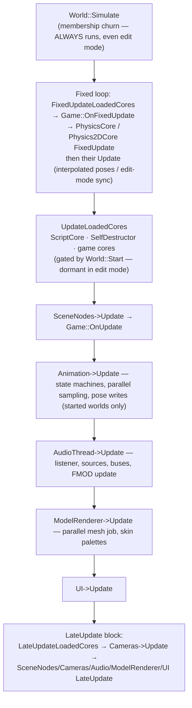

# Cores and Components Reference

The catalog: every core (system) and component the engine ships, what each core filters on, when it updates, and which components are decorative or orphaned. Audio, Physics, Animation, Rendering, UI, and Scripting have their own docs.

> Verified against engine commit 047f57b8, 2026-07-10; the rendering rows (RenderCore, ParticleCore, Mesh, Light, PostProcess, ParticleSystem) against 1fa55311, 2026-10-09 (overhaul Wave 3); the physics rows against 8fdd99b1, 2026-10-09 (overhaul Wave 4); the animation rows (AnimationCore, Animator, Model, Mesh skinning) against 07617c5f, 2026-10-09; the audio rows against afce7083, 2026-10-09.

## Overview

Cores come in two flavors (see `Docs/Architecture.md`): **engine-owned** (created in `Engine::Init`, ticked explicitly by the frame loop) and **scene-loaded** (declared in a `.lvl` file's `"Cores"` array, ticked via `World::UpdateLoadedCores` — *only while the world is started*, i.e. Play mode or game builds). Filters use the DSL from `Docs/ECS.md`.

## Cores

| Core | Filter | Flavor | One-liner |
|------|--------|--------|-----------|
| `SceneCore` (`Source/Cores/SceneCore.h`) | `Transform` | engine-owned | Owns the root transform entity and the scene hierarchy |
| `CameraCore` (`Source/Cores/Cameras/CameraCore.h`) | `Camera` + `Transform` | engine-owned | Builds `Moonlight::CameraData` commands; manages `Camera::CurrentCamera` |
| `RenderCore` (`Source/Cores/Rendering/RenderCore.h`) | `Transform` + `Mesh` | engine-owned | Gathers `Light`s, parallel AABB cull + `MeshCommand` fill for every mesh — see `Docs/Rendering-Pipeline.md` |
| `ParticleCore` (`Source/Cores/Rendering/ParticleCore.h`) | `Transform` + `ParticleSystem` | engine-owned | Simulates particle systems (job per system) into renderer batches; runs in edit mode too, so effects preview live |
| `AudioCore` (`Source/Cores/AudioCore.h`) | `AudioSource` | engine-owned | FMOD: mixer buses, listener placement, 3D source sync, overlapping one-shots, pause with the game — see `Docs/Audio.md` |
| `UICore` (`Source/Cores/UI/UICore.h`) | `BasicUIView` | engine-owned | Ultralight HTML views — see `Docs/UI-Ultralight-and-ImGui.md` |
| `PhysicsCore` (`Source/Cores/PhysicsCore.h`) | `Transform` + one of (`Rigidbody`, a collider, `CharacterController`, `PhysicsJoint`) | engine-owned | Box3D world: fixed-step simulation (play mode), interpolated poses, edit-mode body sync, `CollisionEvent`s, queries, character mover — see `Docs/Physics.md`. Old scenes' `"PhysicsCore"` core entries resolve to it |
| `Physics2DCore` (`Source/Cores/Physics2DCore.h`) | `Transform` + one of (`Rigidbody2D`, a 2D collider, `CharacterController2D`, `PhysicsJoint2D`) | engine-owned | The Box2D counterpart in the XY plane: same lifecycle, events (`Is2D`), layers and queries — see `Docs/Physics.md` |
| `AnimationCore` (`Source/Cores/AnimationCore.h`) | `Transform` + `Animator` | engine-owned | Plays Animators while the world is started: binds clips to node entities by name, steps state machines, samples poses in parallel, writes Transforms, fires `AnimationEvent`s — see `Docs/Animation.md` |
| `ScriptCore` (`Source/Cores/Scripting/ScriptCore.h`) | `ScriptComponent` | scene-loaded | .NET script lifecycle — see `Docs/Scripting-DotNet.md` |
| `SelfDestructor` (`Source/Cores/Utility/SelfDestructCore.h`) | `SelfDestruct` | scene-loaded | Kills entities when their `Lifetime` expires (note the class name — not "SelfDestructCore") |
| `FlyingCameraCore` (`Source/Cores/Cameras/FlyingCameraCore.h`) | `FlyingCamera` + `Camera` + `Transform` | scene-loaded | Free-fly camera: the `Move` / `Look` actions (or WASD + right-drag), E / Q or shoulders to rise and sink, sprint — see `Docs/Input.md` |
| `EditorCore` (`Modules/Havana/Source/Cores/EditorCore.h`) | — | editor-only | Selection/gizmo state — see `Docs/Editor-Havana.md` |

### Update phases at a glance

```mermaid
flowchart TD
    A["World::Simulate<br/>(membership churn — ALWAYS runs, even edit mode)"] --> P["Fixed loop: FixedUpdateLoadedCores → Game::OnFixedUpdate → PhysicsCore / Physics2DCore FixedUpdate<br/>then their Update (interpolated poses / edit-mode sync)"]
    P --> B["UpdateLoadedCores<br/>ScriptCore · SelfDestructor · game cores<br/>(gated by World::Start — dormant in edit mode)"]
    B --> C["SceneNodes->Update → Game::OnUpdate"]
    C --> D2["Animation->Update — state machines, parallel sampling, pose writes (started worlds only)"]
    D2 --> D["AudioThread->Update — listener, sources, buses, FMOD update"]
    D --> E["ModelRenderer->Update — parallel mesh job, skin palettes"]
    E --> F["UI->Update"]
    F --> G["LateUpdate block:<br/>LateUpdateLoadedCores → Cameras->Update →<br/>SceneNodes/Cameras/Audio/ModelRenderer/UI LateUpdate"]
```

`CameraCore::Update` runs **only inside the LateUpdate block** — camera moves made in `Game::OnUpdate`/scripts apply the same frame; camera *reads* during update see last frame's matrices.

Physics (Box3D) has its own deep dive: `Docs/Physics.md`.

Audio (FMOD) has its own deep dive: `Docs/Audio.md`.

## Components

| Component | File | Purpose |
|-----------|------|---------|
| `Transform` | `Source/Components/Transform.h` | Hierarchy node: position/rotation/scale, parent/children (`SharedPtr<Transform>` links), name. Dirty-flag cached matrices — see below |
| `Camera` | `Source/Components/Camera.h` | Projection (perspective/ortho), FOV, near/far, clear type (color/skybox/procedural), main-camera flag; statics `Camera::CurrentCamera` / `Camera::EditorCamera` |
| `Mesh` | `Source/Components/Graphics/Mesh.h` | One renderable mesh: `MeshData*` (primitives share one geometry per shape: Plane, Cube, Sphere, Cylinder, Capsule), per-instance material (default `StandardMaterial`), `CastShadows`, renderer cache slot `Id`. Skinned meshes resolve their bone entities by name and build a bone palette each frame (`UpdateSkin`) |
| `Model` | `Source/Components/Graphics/Model.h` | Assimp model reference; `Init()` **expands the model's node tree into real child entities** with `Transform` + `Mesh` components (bones included, reusing existing children by name); the inspector lists the model's animation clips |
| `Animator` | `Source/Components/Animation/Animator.h` | Plays the Model's (or `ClipSource`'s, or code-built) clips on the node entities below it: states, 1D blends, parameter / exit-time transitions with cross-fades, event markers; `Play`, `SetFloat` / `SetBool` / `SetTrigger` |
| `Light` | `Source/Components/Lighting/Light.h` | Directional / Point / Spot: colour, intensity, range, cone angles, shadows (texel-unit biases, shadow distance). Scenes' old `DirectionalLight` components migrate on load |
| `PostProcess` | `Source/Components/Graphics/PostProcess.h` | Per-camera exposure (manual / auto), tonemapper, bloom, SSAO, colour grading, vignette, FXAA |
| `ParticleSystem` | `Source/Components/Effects/ParticleSystem.h` | CPU emitter: shapes, rate + burst, randomized ranges, over-lifetime size/colour/alpha, gravity/drag/noise, world or local space, billboard/stretched/flat soft particles with flipbooks |
| `Rigidbody` | `Source/Components/Physics/Rigidbody.h` | Static / kinematic / dynamic body: mass, damping, gravity scale, CCD, axis locks, interpolation; forces, velocities, `MoveTo`, `Teleport` |
| `BoxCollider` / `SphereCollider` / `CapsuleCollider` / `MeshCollider` | `Source/Components/Physics/Colliders.h` | Collision shapes (centre, trigger, friction, restitution, density); compound into an ancestor's `Rigidbody`, static on their own |
| `PhysicsJoint` | `Source/Components/Physics/PhysicsJoint.h` | Fixed / hinge / ball-socket / slider / distance joint with limits, motor, spring, break force |
| `CharacterController` | `Source/Components/Physics/CharacterController.h` | Upright capsule moved by the Box3D mover: walk, slopes, ground snap, jump, push |
| `Rigidbody2D` | `Source/Components/Physics/Rigidbody2D.h` | 2D body in the XY plane: type, mass, damping, gravity scale, bullet, freeze rotation, interpolation; forces, velocities, `MoveTo`, `Teleport` |
| `BoxCollider2D` / `CircleCollider2D` / `CapsuleCollider2D` / `PolygonCollider2D` / `EdgeCollider2D` | `Source/Components/Physics/Colliders2D.h` | 2D shapes (offset, trigger, friction, restitution, density); polygons up to 8 hull vertices, edges as two-sided segments |
| `PhysicsJoint2D` | `Source/Components/Physics/PhysicsJoint2D.h` | Fixed / hinge / slider / distance / wheel joint with limits, motor, spring, break force |
| `CharacterController2D` | `Source/Components/Physics/CharacterController2D.h` | Platformer capsule on the Box2D mover: run, slopes, ground snap, jump with coyote time, push |
| `AudioSource` | `Source/Components/Audio/AudioSource.h` | Clip on a mixer bus: volume, pitch, mute, loop, PlayOnAwake, 2D/3D spatial blend, min/max distance, rolloff, doppler, priority; `Play`, `PlayOneShot` (overlapping), `Stop`, `Pause`; also declares the `wav`/`mp3` metadata types |
| `AudioListener` | `Source/Components/Audio/AudioListener.h` | Where the game hears from; the first active one wins (else the camera) |
| `ScriptComponent` | `Source/Components/Scripting/ScriptComponent.h` | Script by type name + `m_dotnetHandle` (int) + saved-fields JSON |
| `BasicUIView` | `Source/Components/UI/BasicUIView.h` | Ultralight HTML view + JS bridge |
| `Canvas` | `Source/Components/UI/Canvas.h` | **Empty file** — placeholder |
| `FlyingCamera` | `Source/Components/Cameras/FlyingCamera.h` | Free-fly parameters (speed etc.) for `FlyingCameraCore` |
| `DebugCube` | `Source/Components/Debug/DebugCube.h` | Debug visualization cube |
| `SelfDestruct` | `Source/Cores/Utility/SelfDestructCore.h` | Lifetime in seconds; the core kills the entity when it expires (declared in the core's header, not `Source/Components/`) |

### Transform dirty-flag semantics

`Transform` tracks `IsLocalToWorldDirty` / `IsWorldToLocalDirty` separately. `SetDirty(true)`:

- **early-outs if already dirty** (`if( Dirty && IsLocalToWorldDirty ) return;`) — repeated mutation of the same subtree costs one flag write, and
- **propagates eagerly to children** (recursive), so any descendant's cached matrix is invalidated immediately.

Matrix recompute is **lazy** — `GetLocalToWorldMatrix()` rebuilds (parent-first) only when dirty. A static scene costs near-zero per frame; the expensive pattern is *wide* mutation (e.g. physics writing every awake dynamic body's transform each frame). World-space setters (`SetWorldPosition`) convert through the parent's `GetWorldToLocalMatrix`.

## Caveats & Fragility

- **`Canvas` is dead weight** (empty file).
- **`Model::Init` creates real entities** as children — deleting a Model component does not delete the entities it spawned, and re-`Init` is guarded only by an in-memory `IsInitialized` flag.
- **`Camera::CurrentCamera`/`EditorCamera` are mutable statics** used by resize, UI sizing, and picking; scenes without a main camera silently skip those paths.
- **Component headers pull editor includes**: several component headers include `imgui.h`/`HavanaUtils.h` unconditionally (e.g. `Source/Cores/Utility/SelfDestructCore.h`) — kept building by ImGui being present in most configs (`ME_IMGUI` covers editor, tools, and profiling builds).
- **`SelfDestructor` vs "SelfDestructCore"** naming mismatch — grep for the class, not the filename.

## Related Docs

- `Docs/ECS.md` — filter DSL, registration, core lifecycle hooks
- `Docs/Architecture.md` — which cores tick where in the frame
- `Docs/Animation.md` — `Animator` and `AnimationCore` in depth
- `Docs/Rendering-Pipeline.md`, `Docs/UI-Ultralight-and-ImGui.md`, `Docs/Scripting-DotNet.md` — the specialized cores in depth
- `Docs/State-of-the-Engine.md` — verdicts on the orphaned pieces
