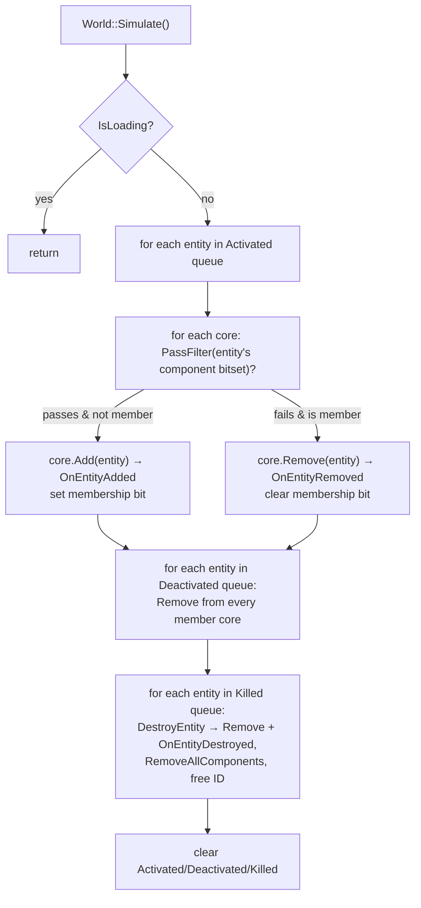

# ECS

MitchEngine's ECS is an **Entity–Component–Core** design: entities are generational IDs into pooled storage, components are heap-allocated data objects attached per entity, and *cores* are the systems — each declares a `ComponentFilter` and receives the entities that match it. `World` owns all of it and reconciles entity↔core membership in `Simulate()` once per frame. This doc covers the machinery and the recipes for adding components and cores.

> Verified against engine commit 047f57b8, 2026-07-10.

## Overview

The design optimizes for authoring convenience, not data locality: components are `shared_ptr<BaseComponent>` stored per entity, and cores iterate `std::vector<Entity>` membership lists, fetching components through virtual-free but pointer-chasing lookups. Type identity comes from `ClassTypeId` (a per-base-class monotonic counter), which means **type IDs are assigned in first-touch order and are not stable across runs or builds** — all serialization therefore goes through registry name strings, never type IDs.

## Key Files

| Path | Role |
|------|------|
| `Source/ECS/EntityID.h` | 64-bit ID: 48-bit index + 16-bit generation counter, packed by `Value()` |
| `Source/ECS/EntityIdPool.h` / `Source/ECS/EntityIdPool.cpp` | Free-list index recycling; bumps the counter on `Remove` |
| `Source/ECS/Entity.h` / `Source/ECS/Entity.cpp` | Entity value type (`World*` + ID); `AddComponent<T>`, `AddComponentByName` |
| `Source/ECS/EntityHandle.h` | Safe reference: ID + `WeakPtr<World>` |
| `Source/ECS/Component.h` | `BaseComponent` / `Component<T>` CRTP, `ME_REGISTER_COMPONENT` |
| `Source/ECS/ComponentDetail.h` | Name-string → factory `ComponentRegistry` |
| `Source/ECS/ComponentStorage.h` | Per-entity `shared_ptr` array + component-type bitset |
| `Source/ECS/Core.h` / `Source/ECS/Core.cpp` | `BaseCore` / `Core<T>`, `ME_REGISTER_CORE`, `CleanTypeName` demangling |
| `Source/ECS/CoreDetail.h` | Name-string → factory `CoreRegistry` |
| `Source/ECS/ComponentFilter.h` | Requires / RequiresOneOf / Excludes bitset filter |
| `Source/Engine/World.h` / `Source/Engine/World.cpp` | Entity lifecycle, core registry, `Simulate`, prefabs, unload |
| `Modules/Dementia/Source/ClassTypeId.h` | `TypeId` generation (static counter per base class) |

## How It Works

### Entity identity

`EntityID` packs into a `uint64_t` via `Value()`: `(Counter & 0xFFFF) << 48 | (Index & 0xFFFFFFFFFFFF)`. The bit widths come from `MITCH_ENTITY_ID_INDEX_BIT_COUNT` (48) and `MITCH_ENTITY_ID_COUNTER_BIT_COUNT` (16), but the masks in `Value()` are hardcoded — change the macros and they silently drift. Beware a visual trap in the struct: `IntType Index { MITCH_ENTITY_ID_INDEX_BIT_COUNT };` *looks* like a bit-field declaration but is actually a brace default-initializer (value 48) that every constructor immediately overwrites — a fossil of an earlier bit-field layout.

`EntityIdPool` hands out indices from a free list; `Remove` increments the slot's counter before returning the index to the free list, so a stale `EntityID` held after destruction no longer matches anything: `World::GetEntity`/`EntityExists` look up the **full** (index+counter) ID in the `Alive` map. `World` starts with a pool of 50 (`DEFAULT_ENTITY_POOL_SIZE`) and grows via `CheckForResize` on every `CreateEntity`.

Prefer `EntityHandle` (ID + `WeakPtr<World>`) over raw `Entity` for anything stored across frames — `Entity` is a bare `World*` + ID with no liveness check of its own.

### Components

Components subclass `Component<T>` (CRTP) and pass their display/serialization name up as a string literal, e.g. `Transform() : Component("Transform")`. `BaseComponent`'s constructor strips everything before the first space (handles MSVC's `"class Foo"` `typeid` spelling; literals without spaces pass through). The serialization contract is `OnSerialize(json&)` / `OnDeserialize(const json&)` (private, called by the sealed `Serialize`/`Deserialize`), with `Init()` guaranteed to run **after** `OnDeserialize`.

Storage (`ComponentStorage`) keeps, per entity index: a `vector<shared_ptr<BaseComponent>>` and a `ComponentTypeArray` bitset of which component types are present. `Entity::AddComponent<T>` **silently returns the existing component** if the entity already has one — it never replaces.

Registration hooks the type into a name-keyed factory map so scenes/prefabs can construct components from strings:

```cpp
ME_REGISTER_COMPONENT( Transform )                    // registry key "Transform"
ME_REGISTER_COMPONENT_FOLDER( PointLight, "Lighting/" ) // editor "Add Component" grouping
```

`Entity::AddComponentByName` looks up that registry and warns (`"Factory not found for component ..."`) on a miss — the scene keeps loading without the component.

### Cores (systems)

`BaseCore` lifecycle, in the order the engine drives it:

| Hook | When |
|------|------|
| ctor | `Core<T>(ComponentFilter&)` — declare the filter here |
| `Init()` | When added to a world (`World::AddCore`), and re-called manually for some engine cores on scene load |
| `OnAddedToWorld()` | Right after `Init` |
| `OnEntityAdded/Removed/Destroyed` | During `World::Simulate` reconciliation |
| `OnStart()` / `OnStop()` | `World::Start` / `World::Stop` — toggles `IsRunning` |
| `Update` / `LateUpdate` | Per frame — but see the `IsRunning` gate below |
| `OnDrawGuizmo(DebugDrawer*)` | Editor gizmo pass |
| `OnEditorInspect()` / `OnSerialize` / `OnDeserialize` | Editor inspector & scene persistence |
| `OnRemovedFromWorld()` | `World::Unload`/`Destroy` for `DestroyOnLoad` cores |

`Core<T>`'s constructor names the core from `typeid(T).name()`, cleaned by `CleanTypeName` (`Source/ECS/Core.cpp`) — `abi::__cxa_demangle` + namespace strip on GCC/Clang, `"class "` strip on MSVC — so registry keys and serialized `"Type"` names match the plain class name **cross-platform**.

The filter DSL: `ComponentFilter().Requires<Transform>().Requires<Mesh>()`, plus `RequiresOneOf<T>()` (at least one of the marked types) and `Excludes<T>()`.

### World: two core containers, two ownership stories

- `Cores` — *all* cores, keyed by `TypeId`, held as `unique_ptr<BaseCore, CoreDeleter>` where **`CoreDeleter` deliberately does not delete** (it just nulls the world pointer and clears the entity list). Engine-owned cores are members of `Engine`; name-created cores simply leak until process exit.
- `m_loadedCores` — the subset added with `HandleUpdate = true` (everything created by `World::AddCoreByName`, i.e. cores declared in scene files). Only these are ticked by `UpdateLoadedCores`/`LateUpdateLoadedCores`; engine-owned cores are ticked by name in `Engine::Run` (see `Docs/Architecture.md`).

**The `IsRunning` gate matters:** `UpdateLoadedCores` skips cores whose `IsRunning` is false, and `IsRunning` only becomes true in `World::Start()` — which runs after scene load in game builds, or when the user presses Play in the editor. Scene-loaded cores (physics, scripts) are therefore **dormant in editor edit-mode**, which is what makes edit-mode "paused".

### `Simulate()` — entity↔core reconciliation



Per-entity core membership is a `std::bitset<64>` (`World::TEntityAttributes::Attribute::Cores`) indexed by core `TypeId` — a hard cap of **64 core types**, unchecked at the high end. Note the loop contains `if( !InCore.second->IsRunning ) { //continue; }` — the body is commented out, so **cores receive `OnEntityAdded`/`OnEntityRemoved` regardless of running state** (only `Update` is gated).

Membership changes are driven by `Entity::SetActive(true)` (queues into `Activated`) — adding a component does **not** re-evaluate filters until something re-activates the entity. Scene/prefab loading calls `SetActive(true)` after adding all components for exactly this reason. `MarkForDelete` queues into `Killed`; actual destruction happens at the next `Simulate`, so components stay valid for the remainder of the frame.

### Lifecycle operations

- `World::Unload()` — destroys entities and loaded cores with `DestroyOnLoad == true` (the default); survivors persist across scene loads. Used by `Engine::LoadScene`.
- `World::Destroy()` — destroys *everything* (editor Stop path).
- `World::CreateFromPrefab(path, parent)` — loads JSON through `ResourceCache::Get<JsonResource>` (so repeated spawns reuse the parsed JSON), then `LoadPrefab` recursively: **if the parent already has a child with the prefab's `Name`, that entity is reused/merged instead of created** — components deserialize onto the existing child.

## How to Extend

### Add a component

1. Create a header + cpp pair under `Source/Components/` (or a game-side equivalent):

```cpp
#pragma once
#include "ECS/Component.h"

class MyThing final
    : public Component<MyThing>
{
public:
    MyThing()
        : Component( "MyThing" )   // must match the class name; this is the registry + scene-file key
    {
    }

    virtual void Init() override;                              // runs after OnDeserialize
    virtual void OnSerialize( json& outJson ) override;        // write fields
    virtual void OnDeserialize( const json& inJson ) override; // read fields

#if USING( ME_EDITOR )
    virtual void OnEditorInspect() override;                   // ImGui inspector
#endif

    float Speed = 1.f;
};
ME_REGISTER_COMPONENT_FOLDER( MyThing, "Gameplay/" )
```

2. That's it — the macro's static registration makes it constructible from scenes, prefabs, and the editor's Add Component menu. **Renaming the class or the string breaks every scene that serialized it** (see `Docs/Serialization-and-Scenes.md`).

### Add a core

1. Create the core with its filter and register it:

```cpp
#pragma once
#include "ECS/Core.h"
#include "Components/MyThing.h"
#include "Components/Transform.h"

class MyThingCore final
    : public Core<MyThingCore>
{
public:
    MyThingCore()
        : Base( ComponentFilter().Requires<Transform>().Requires<MyThing>() )
    {
        // SetIsSerializable( false ); // only for cores that should never appear in scene files
    }

    virtual void Update( const UpdateContext& inUpdateContext ) override
    {
        for( Entity& ent : GetEntities() )
        {
            MyThing& thing = ent.GetComponent<MyThing>();
            // ...
        }
    }

private:
    virtual void Init() override {}
    virtual void OnEntityAdded( Entity& NewEntity ) override {}
    virtual void OnEntityRemoved( Entity& InEntity ) override {}
};
ME_REGISTER_CORE( MyThingCore )
```

2. Get it into a world one of two ways:
   - **Scene-loaded** (normal for gameplay): add it to the scene's core list in the editor — it serializes into the `.lvl` `"Cores"` array and `World::AddCoreByName` instantiates it on load. It ticks via `UpdateLoadedCores` **only while the world is started** (Play mode / game builds).
   - **Engine-owned** (rare): construct it in `Engine::Init`, `AddCore<T>` it in `Engine::InitGame`, and call its `Update` explicitly in `Engine::Run` — this means editing the engine frame loop.
3. Remember `Serialize` is pure virtual on `BaseCore` in editor builds — `Core<T>` provides the sealed implementation that writes `"Type"` and calls your `OnSerialize`, so overriding `OnSerialize`/`OnDeserialize` is all you need for per-core settings.

## Caveats & Fragility

- **64-core cap**: per-entity membership is `bitset<64>` indexed by core `TypeId`; a 65th core type indexes out of range (UB via `bitset::operator[]`, not a checked failure). `DestroyEntity`'s guard is also written `Attr.Cores.size() >= CoreIndex` (always true for valid indices) rather than `>`.
- **TypeIds are first-touch-ordered** — never persist or compare them across processes; use registry names.
- **Filters re-evaluate only on activation**, not on component add/remove. If you add a component to an already-active entity mid-game and expect a core to pick it up, you must `SetActive(true)` again (queues re-reconciliation).
- **`AddComponent<T>` never replaces** — it returns the existing instance silently.
- **Loaded cores don't tick until `World::Start`** — in editor edit-mode only engine-owned cores update. `OnEntityAdded` etc. still fire in edit mode (the `IsRunning` check in `Simulate` is commented out).
- **`CoreDeleter` never frees** — cores created through `AddCoreByName` leak until exit by design; don't put must-run cleanup in core destructors (they may run never, or only at static teardown).
- **Components are `shared_ptr`-boxed** — no contiguous iteration; a core update is a pointer chase per entity per component. Budget accordingly for entity-heavy systems.
- **`World::FindEntityByIDValue` is a linear scan** over all alive entities.
- **`Entity` equality/`operator bool`** checks only the world pointer, not liveness — a copied `Entity` whose target died still converts to `true`. Use `World::EntityExists`/`GetEntity` (full generational check) or `EntityHandle`.
- **Registry misses are soft**: unknown component/core names log a warning and return null; scene loads continue with data silently dropped.

## Related Docs

- `Docs/Architecture.md` — when `Simulate` and the core updates run in the frame
- `Docs/Serialization-and-Scenes.md` — how registry names drive `.lvl`/prefab loading
- `Docs/Cores-and-Components-Reference.md` — catalog of every existing core and component
- `Docs/Jobs-and-Events.md` — threading rules when cores fan work out to jobs
