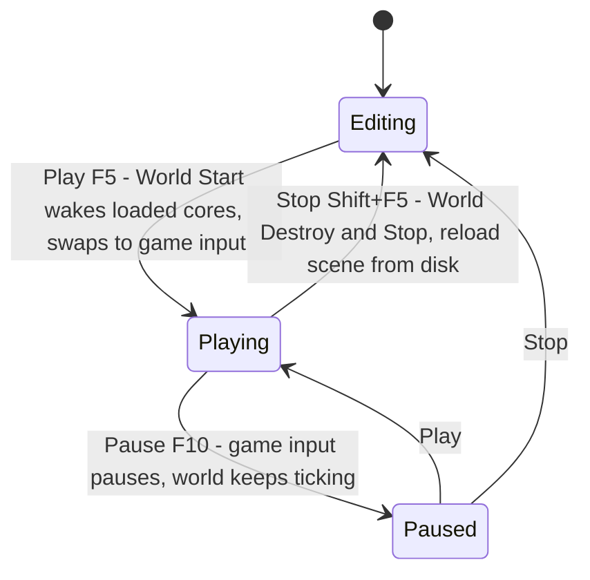

# Havana Editor

Havana is the ImGui-based editor: an `EditorApp` (itself a `Game` subclass, so it uses the standard engine entry point from `Modules/Havana/Source/main.cpp`) hosting dockable widgets — scene view with gizmos, hierarchy, inspector, asset browser, log — plus an undo/redo command system and GPU-based entity picking. Play-in-editor runs the game **in the live editor world** and restores by reloading the scene file from disk. This doc maps the architecture and the workflow-critical behaviors.

> Verified against engine commit 047f57b8, 2026-07-10.

## Overview

Editor builds are gated by `ME_EDITOR` (Sharpmake "Editor" targets — `Docs/Build-System.md`). The editor renders through the normal pipeline: the editor camera renders at view 1 into its own framebuffer, `SceneViewWidget` displays that texture inside ImGui, and `PickingPass` piggybacks on the editor camera (`Docs/Rendering-Pipeline.md`). A second `Input` instance (`Engine::GetEditorInput`) keeps editor hotkeys working while game input is paused (`Docs/Platform-Window-Input-Config.md`).

## Key Files

| Path | Role |
|------|------|
| `Modules/Havana/Source/EditorApp.h` / `Modules/Havana/Source/EditorApp.cpp` | The editor "game": init, play/pause/stop, camera switching |
| `Modules/Havana/Source/Havana.h` / `Modules/Havana/Source/Havana.cpp` | UI container: widget ownership, ImGui frame, game callbacks |
| `Modules/Havana/Source/Widgets/` | `SceneViewWidget` (viewport + ImGuizmo), `SceneHierarchyWidget`, `PropertiesWidget`, `AssetBrowser`, `AssetPreviewWidget`, `LogWidget`, `MainMenuWidget` (toolbar + play controls), `ResourceMonitorWidget`, `Modules/Havana/Source/Widgets/CurveEditor.h` |
| `Modules/Havana/Source/Commands/ICommand.h`, `Modules/Havana/Source/Commands/CommandManager.h`, `Modules/Havana/Source/Commands/EditorCommands.h` | Undo/redo |
| `Modules/Havana/Source/Cores/EditorCore.h` | Editor scene-management core (selection state etc.) |
| `Modules/Moonlight/Source/RenderPasses/PickingPass.cpp` | Entity-ID buffer + CPU readback |

## How It Works

### Startup

`EditorApp::OnInitialize` creates the `Havana` UI and `EditorCore`, wires the play/pause/stop callbacks into `MainMenuWidget`, fires `NewSceneEvent`, adds `EditorCore` to the world, and loads `InitialLevel` — which comes from `EngineConfig`'s `"CurrentScene"` value. Note the header's self-aware wart: `EditorApp.h` includes the **game's** `ComponentRegistry.h` via a relative `../../Game/Source/` path ("I don't like this") — the editor binary is coupled to the game project layout so game components register with the editor.

### Play-in-editor state machine

The important mechanics, straight from `EditorApp::StartGame`/`StopGame`:

- **Play does not snapshot the world.** It calls `World::Start()` on the live editor world — the same entities you were editing start simulating (that's also what wakes the dormant scene-loaded cores; see `Docs/ECS.md`).
- **Play does not save.** The scene on disk stays as of your last manual save (Ctrl+S / `SaveSceneEvent`).
- **Stop = destroy + reload from disk**: `World::Destroy()`, `World::Stop()`, `NewSceneEvent`, then `Engine::LoadScene(config["CurrentScene"])`. Consequently **any edits made since the last save are lost when you press Stop** — runtime mutations *and* unsaved editor work both vanish. Save before you play.
- **Pause** only pauses *game input* and flips a flag — cores keep updating (pausing gameplay is the game's job via input starvation).
- `EditorApp::UpdateCameras` swaps rendering between `Camera::EditorCamera` and the game's main camera based on play state.

### Widgets

All ImGui, all owned by `Havana`. Highlights:

- **`SceneViewWidget`** — displays the editor camera's framebuffer texture; hosts **ImGuizmo** translate/rotate/scale gizmos with local/world toggle; `MaximizeOnPlay` support. Manipulating a gizmo edits the selected `Transform`.
- **`SceneHierarchyWidget`** — the transform tree (names live on `Transform` — `Docs/Serialization-and-Scenes.md`); selection source.
- **`PropertiesWidget`** — the inspector: per-component `OnEditorInspect()` plus add/remove component (from the component registry, with the folder grouping from `ME_REGISTER_COMPONENT_FOLDER`).
- **`MainMenuWidget`** — menus (save fires `SaveSceneEvent`), toolbar with Play (F5) / Pause (F10) / Stop (Shift+F5).
- **`AssetBrowser`** / **`AssetPreviewWidget`** — asset tree browsing/preview (uses `ResourceCache`, including the recursive `FindByName` — `Docs/Resources-and-Assets.md`).
- **`LogWidget`** — in-editor `CLog` view; **`ResourceMonitorWidget`** — live resource-cache contents.

### Undo/redo

`CommandManager` keeps two `vector<ICommand*>` stacks (`Items` + `RedoStack`); `ICommand` is a plain `Do()`/`Undo()` pair with a name. Concrete commands live in `EditorCommands.h`. Coverage is **narrow** — gizmo/property operations that were explicitly wrapped in commands; most editor mutations (component add/remove, hierarchy changes, etc.) bypass the stack and are not undoable. Commands are raw-pointer owned by the stacks.

### Entity picking

`PickingPass` (editor camera only): every pickable mesh is drawn into a small offscreen ID buffer (`picking_shaded.vert` + `picking_id.frag`, entity ID encoded as color via the `u_id` uniform), the ID target is blitted to a CPU-readable texture (bgfx requires the blit — you can't read render targets directly), and a few frames later the readback is scanned — **the ID with the most pixels under the cursor region wins**. The winning entity lands in `FrameRenderData::RequestedEntityID`, which `Engine::Run` turns into a `PickingEvent` the next frame; `EditorCore` reacts by selecting the entity. Black = clicked nothing.

## Caveats & Fragility

- **Stop-reverts-to-last-save is the #1 workflow trap** — there is no save prompt on Play and no world snapshot; Stop discards everything since the last Ctrl+S.
- **Undo coverage is partial** and there's no dirty-scene indicator tied to it; muscle-memory Ctrl+Z will miss many operations.
- **The editor links against game code** (relative-path `ComponentRegistry.h` include) — building the editor for a differently-shaped game project means touching Havana.
- **Picking is asynchronous** (blit + N-frame GPU readback) — selection lags a couple frames; rapid clicks can select stale targets. The pass also has its own hardcoded FOV/near/far (`m_fov`, 0.1–100) independent of the real camera — offset picking at extreme ranges.
- **Pause doesn't pause the world** — timers/audio/scripts keep running; only game input stops.
- **Editor state lives in `EngineConfig`** (`"CurrentScene"`) — external scene renames break the reload-on-stop path until the config updates.
- The play-state flags (`m_isGameRunning`/`m_isGamePaused`) are plain bools on `EditorApp` consulted all over the widgets — no single source of truth with the world's own `IsRunning` core flags.

## Related Docs

- `Docs/Architecture.md` — how `EditorApp` slots into `ME_APPLICATION_MAIN` and the frame loop
- `Docs/ECS.md` — `World::Start/Stop/Destroy` semantics behind play-in-editor
- `Docs/Rendering-Pipeline.md` — editor camera view, scene-view texture, picking pass placement
- `Docs/Serialization-and-Scenes.md` — what Save writes and Stop reloads
- `Docs/State-of-the-Engine.md` — editor workflow improvement notes
