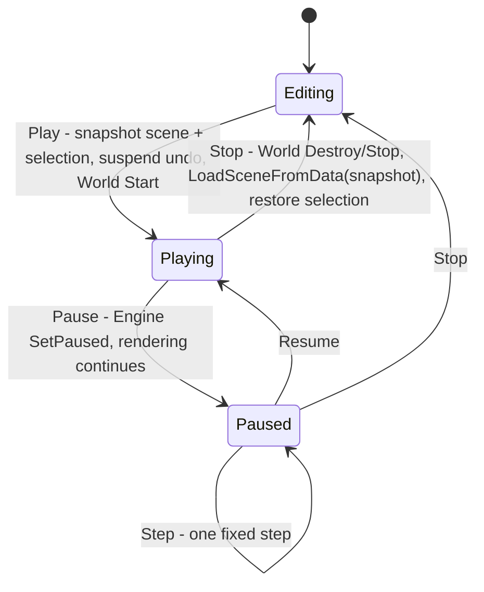

# Havana Editor

Havana is the ImGui-based editor. `EditorApp` is itself a `Game` subclass (standard entry point in `Modules/Havana/Source/main.cpp`) that hosts dockable widgets around a small set of **editor services**: one `Selection`, an `UndoStack`, named `EditorActions` (menus, shortcuts, command palette, scripts) and `EditorOps`, the undoable operations every widget uses to change the scene. Play mode snapshots the scene in memory and restores it on Stop. `--editor-exec` drives all of it from a script for unattended testing.

> Verified against engine commit 7e869c6e, 2026-10-09; Create menu, overlays and View menu rendering toggles against 1fa55311, 2026-10-09 (Wave 3).

## Overview

Editor builds are gated by `ME_EDITOR` (Sharpmake "Editor" targets, `Docs/Build-System.md`). The editor camera renders into its own framebuffer that the **World View** displays; `PickingPass` reads entity IDs back from it (`Docs/Rendering-Pipeline.md`). A second `Input` (`Engine::GetEditorInput`) keeps editor input alive while the game owns the keyboard. Editor shortcuts themselves go through ImGui (`EditorActions::ProcessShortcuts`).

## Key Files

| Path | Role |
|------|------|
| `Modules/Havana/Source/EditorApp.h/.cpp` | The editor "game": play/pause/step/stop, scene management (new/open/save, unsaved prompt, autosave/recovery), quit veto |
| `Modules/Havana/Source/Havana.h/.cpp` | UI container: widgets, dockspace, action registration, focus contexts |
| `Modules/Havana/Source/Editor/Selection.*` | Selection service (multi-select, active entity/core, pick drill-down) |
| `Modules/Havana/Source/Editor/UndoStack.*` | Undo/redo history, transactions, merging, dirty tracking |
| `Modules/Havana/Source/Editor/EditorOperations.*` | `EditorOps`: undoable create/delete/duplicate/paste/reparent/rename/active/layer/add/remove component/component edits |
| `Modules/Havana/Source/Editor/EditorActions.*`, `DefaultEditorActions.*` | Action registry, shortcuts, command palette, rebinding |
| `Modules/Havana/Source/Editor/ReflectionUI.*` | Inspector widgets generated from reflection |
| `Modules/Havana/Source/Editor/PrefabTools.*` | Prefab create/override/apply/revert/unpack |
| `Modules/Havana/Source/Editor/EditorCameraController.*` | Scene camera navigation |
| `Modules/Havana/Source/Editor/SceneTools.*` | Bounds, ray picking, grid/selection/gizmo overlays |
| `Modules/Havana/Source/Editor/EditorAutomation.*` | `--editor-exec` script runner |
| `Modules/Havana/Source/Cores/EditorCore.*` | Owns the scene camera, queues overlays, saves scenes |
| `Modules/Havana/Source/Widgets/` | `SceneViewWidget` (World/Game View), `SceneHierarchyWidget`, `PropertiesWidget`, `AssetBrowser`, `LogWidget`, `HistoryWidget`, `ProfilerWidget`, `SettingsWidgets` (Preferences, Project Settings), `MainMenuWidget`, `AssetPreviewWidget`, `ResourceMonitorWidget` |
| `Modules/Havana/Source/Utils/EditorConfig.h` | Per-user state and preferences (`.tmp/Havana.cfg`) |
| `Source/Engine/ProjectSettings.*` | Project settings (layer names) in `Assets/Config/ProjectSettings.json` |

## How It Works

### Selection

`Selection::Get()` is the single source of truth: an ordered list of entities (the last one is **active**, the one the inspector shows) or one core. Widgets query it every frame; `GetVersion()` changes on every edit, `SelectionChangedEvent` fires after changes, and the legacy `InspectEvent`/`ClearInspectEvent`/`PickingEvent` are accepted as requests. `GetRootEntities()` drops entities whose ancestor is also selected (what delete/duplicate/drag act on). `SaveGUIDs`/`RestoreGUIDs` let selection survive play mode and undo.

Scene-view picking: a click (press and release without dragging) requests a GPU pick; empty space clears the selection, Ctrl toggles, Shift adds. `ResolvePickTarget` selects the outermost model or prefab-instance root first, then one level deeper per click on the same branch.

### Undo and editor operations

Every scene edit goes through `EditorOps`, which applies the change and pushes an `UndoCommand`. Commands identify entities by **GUID**, never pointers, so they survive deletes and re-creates:

- Create/delete/duplicate/paste serialize the affected subtrees (`SceneSerializer::SerializeEntities`) and restore them with identical GUIDs and sibling positions. Undoing a create re-selects what was selected before.
- Reparent/reorder records parent, sibling index and transform state before and after (world transforms are kept).
- Component edits store before/after JSON. The inspector captures them generically: it snapshots each inspected component and commits when the interaction in that component's UI ends. Custom `OnEditorInspect` code therefore gets undo for free. Gizmo drags record one step per drag.

`UndoStack` supports transactions (`UndoTransaction` RAII), merging consecutive commands with the same merge key, a 256-entry cap, and dirty tracking: the scene is dirty when the undo cursor isn't at the saved position, which drives the `*` in the title and the unsaved-changes prompts. While playing, the stack is **suspended**: pushes are dropped and undo/redo are disabled.

### Actions, shortcuts and the command palette

`EditorActions` holds named actions (`Edit.Undo`, `Gizmo.Rotate`, ...) with display names, categories, shortcuts (`ImGuiMod_Shortcut` = Ctrl, or Cmd on macOS), an optional alternate shortcut, an enabled predicate and a **context**:

- `Global` actions fire anywhere.
- `Scene` actions (delete, copy/paste, gizmo keys, frame selected) only fire while the Hierarchy or World View has focus.

Shortcuts don't fire while typing in a text field unless the action opts in (Save does). While the game owns input, only actions flagged `AllowWhileGameFocused` (Play/Stop/Pause/Step) fire. Menus use `EditorActions::MenuItem(id)`, so labels, shortcuts and enabled state stay consistent. Ctrl+Shift+P opens the fuzzy command palette. Shortcuts can be rebound in Preferences > Shortcuts; overrides persist in the editor config and apply to actions registered later.

| Default shortcut | Action |
|------|------|
| Ctrl+Z / Ctrl+Y, Ctrl+Shift+Z | Undo / Redo |
| Ctrl+X / C / V / D, Delete, F2 | Cut / Copy / Paste / Duplicate, Delete, Rename (scene context) |
| Ctrl+A, Esc | Select all / deselect (scene context) |
| Ctrl+Shift+N, Alt+Shift+N | Create empty / create empty child |
| Ctrl+N / O / S, Ctrl+Shift+S | New / Open / Save / Save As |
| Ctrl+P or F5, Ctrl+Alt+P or F10, F11 | Play/Stop, Pause, Step one fixed frame |
| W / E / R / T, X, Z | Move / Rotate / Scale / Universal gizmo, local/world, pivot/center (scene context) |
| F, Keypad 1/3/7, Keypad 5 | Frame selection, front/right/top views, perspective/ortho |
| Ctrl+H, Ctrl+Space, Ctrl+, | History panel, asset browser, Preferences |

### Play mode


```mermaid
stateDiagram-v2
    [*] --> Editing
    Editing --> Playing : Play - snapshot scene + selection, suspend undo, World Start
    Playing --> Paused : Pause - Engine SetPaused, rendering continues
    Paused --> Paused : Step - one fixed step
    Paused --> Playing : Resume
    Playing --> Editing : Stop - World Destroy/Stop, LoadSceneFromData(snapshot), restore selection
    Paused --> Editing : Stop
```

`EditorApp::Play` serializes the world in memory (`SceneSerializer::SerializeWorld`), records the selection GUIDs and dirty state, suspends undo and starts the world. `Stop` destroys the world and reloads the snapshot through `Engine::LoadSceneFromData` under the scene's real path. Because GUIDs are preserved, the selection and the whole undo history are valid again afterwards. The Game View's "Maximize On Play" option fills the dock area while playing. The main menu has a time-scale slider while playing.

### Scene management

New/Open/Quit (including closing the window) go through `RunWithUnsavedCheck`. If the scene is dirty, a modal offers Save / Don't Save / Cancel. Closing the window is vetoed via `Game::OnQuitRequested` and `IWindow::CancelClose` until answered. Scene loads are queued events, processed at the start of the next frame. File > Open Recent lists the last 10 scenes.

**Autosave**: while the scene is dirty, every `Autosave.IntervalSeconds` (default 120 s, 0 = off) the world is written to `.tmp/Autosave/Autosave.lvl` with `Session.json`. A clean exit deletes them. If they exist at startup, the editor offers to recover the autosave under the original scene path, marked dirty.

### Scene view (World View)

- **Gizmo** (upstream ImGuizmo): Move/Rotate/Scale/Universal, local/world, pivot/center, snapping with per-mode increments (toolbar toggle, Ctrl inverts while dragging). With several selected entities the gizmo drives a proxy matrix P, and every dragged root gets `W = P * P0^-1 * W0` through `Transform::SetWorldMatrix`, so parents and rotation are handled correctly. Physics bodies are teleported along.
- **View cube** (top right) snaps the camera around its pivot.
- **Camera** (`EditorCameraController`): RMB fly (WASD/QE/Space, wheel changes speed, Shift fast), Alt+LMB orbit, MMB pan, Alt+RMB dolly, wheel zoom toward the pivot (orthographic size in ortho). F frames the selection's bounds, or the whole scene when nothing is selected, fitting both FOV axes. The view persists in the editor config.
- **Overlays** (`SceneTools`, drawn with `DebugDraw` as editor-only lines): a distance-faded grid at y = 0 whose spacing follows camera height, with X/Z axis lines; selection bounds (bright where visible, faint through geometry); camera frustums; light gizmos per type (directional arrow, point range sphere, spot cones); the selected particle system's emission shape; clickable camera/light/audio/particle icons; a stats overlay (fps, ms, GPU ms, draws, triangles, entities). Each can be toggled from the View menu. The View menu also switches shadows and the shadow-cascade tint on and off (actions `View.Shadows`, `View.ShadowCascades`).
- **Marquee**: drag on empty space to box-select pickable entities (resolved to their pick roots), Shift/Ctrl add.
- **Drops**: models and prefabs dropped on the view land on the surface under the cursor (oriented-bounds raycast), else on the ground plane.

### Hierarchy

Multi-select (Ctrl toggles, Shift ranges), search with `t:Type` to filter by component, inline rename (F2 or double-click), drag onto a row to reparent or between rows to reorder (keeps world transforms, cycle-safe), an active toggle per row, prefab instances drawn blue and inactive rows dimmed. The Create menu (and Create Child) offers empty entities, 3D Objects (Cube, Plane, Sphere, Cylinder, Capsule; StandardMaterial), Camera, Light (Directional, Point, Spot), Effects (Fire, Smoke, Sparks particle presets) and Audio Source. Transform-less entities are listed under "Utility". Scene-view picks reveal and scroll to the picked row.

### Inspector

The entity header shows active, name, layer (with Project Settings names) and GUID (click to copy), plus a prefab bar for instances. Components are drawn as collapsible sections with an enable toggle and a context menu: Reset (reflected defaults), Copy/Paste Values, Remove, and Revert/Apply to Prefab for instances.

Reflected components get generated UI from `ReflectionUI`, chosen from each field's `PropertyType` and metadata:

- Ranges become sliders; angles are edited in degrees.
- Colours and HDR colours get colour pickers; vectors get axis-coloured drags; quaternions are edited as stable Euler angles.
- Enums become combos; nested structs and arrays (with +/-) are expanded.
- Asset paths get drag-drop and a picker; `EntityHandle` fields accept hierarchy drags.

Hand-written `OnEditorInspect` still runs after the generated UI for extras.

With several entities selected, the inspector shows the components every selected entity has. Fields whose values differ are flagged, and an edit applies to all of them as one undo step. Searchable Add Component lists only components the entity doesn't have.

### Prefabs

Instances carry a link: `EntityRecord::PrefabAsset` (project-local path) and `PrefabSource` (the entity's GUID inside the prefab file).

- **Create**: dropping a hierarchy entity on an asset-browser folder calls `PrefabTools::CreatePrefab`. It writes the prefab with `SceneSerializer::SerializePrefab`, and the entity becomes the first instance.
- **Overrides** are top-level component values that differ from the source (float-tolerant). The instance root's position and rotation never count. Overridden fields get a blue marker and label. Right-click a label to revert or apply that field.
- **Apply All** rewrites the prefab from the instance, keeping stable source GUIDs. It then pushes the changes into every other instance whose values still match the old prefab, and adds components the prefab gained.
- **Revert All** restores values, re-adds removed components, and removes added components and added child entities. It is undoable.
- **Unpack** clears the links (undoable). Nested prefab links inside a prefab are kept.

### Asset browser

A folder tree (Assets and Engine Assets, tracked by absolute path) plus grid or list contents:

- **Navigation**: back/forward/up, clickable breadcrumbs, recursive search and a type filter.
- **Thumbnails**: textures that are already compiled, at most two loaded per frame.
- **Details pane**: preview and import settings (Apply re-exports and reloads).
- **File operations**: create folder/scene/prefab/material/C# script, rename (F2, moves the `.meta`), duplicate (Ctrl+D), move (Alt-drag files, or drag folders, onto folders or breadcrumbs), delete to `.tmp/Trash` after confirmation, show in file manager, copy path, reimport.
- **Picker mode**: the same window serves `RequestAssetSelectionEvent`. Double-click selects; save dialogs save into the browsed folder with the right extension.
- `AssetsChangedEvent` from the asset watcher refreshes it.

### Console, history, profiler, settings

- **Log**: level toggles with counts, search, duplicate collapsing, timestamps, auto-scroll that pauses when you scroll up, a detail pane, copy. Double-click opens `file:line` references in the code editor (`PlatformUtils::OpenInCodeEditor`: Preferences command, `$ME_CODE_EDITOR`, or `code -g`).
- **History**: the undo stack; click an entry to jump there.
- **Profiler**: CPU/GPU frame history, per-phase and per-core CPU scopes from `FrameStats` (`ME_STAT_SCOPE`), per-view GPU timings (the bgfx profiler is enabled only while this window is open).
- **Preferences** (per user) and **Project Settings** (fixed update rate and frame cap in `Engine.cfg`, layer names).

### Automation: `--editor-exec`

```bash
./.build/Editor_Debug/Havana --scene Assets/Scenes/Tests/HierarchyTest.lvl \
    --editor-exec Assets/Scenes/Tests/EditorFlows.edscript --editor-exec-result .tmp/result.json
```

The script runs one command per frame after a short warm-up and logs `[editor-exec] PASSED` or `FAILED (n)` (plus an optional JSON report), then quits. Unattended runs never write `Engine.cfg`, `.tmp/Havana.cfg` or the ImGui layout. Commands with two arguments use `a | b` when a name contains spaces.

| Command | Effect |
|------|------|
| `wait N`, `log text` | Wait frames, log |
| `action Id`, `undo`, `redo` | Run an editor action / undo / redo |
| `select a,b`, `select-add a`, `select-none` | Selection (names, or `Parent/Child` paths) |
| `create Name [| Parent]`, `rename Name`, `reparent Child | Parent|root` | Structural edits |
| `add-component T`, `remove-component T`, `set Type.Field <json>` | Component edits on the active entity |
| `create-prefab Entity | path`, `instantiate path`, `prefab-apply/-revert/-unpack Entity` | Prefab workflow |
| `play`, `stop`, `load path`, `save-as path`, `show-assets folder`, `focus-window name`, `screenshot path`, `quit` | Editor state |
| `mark-count`, `assert-count N`, `assert-count-delta N` | Entity counts |
| `assert-exists/-missing Name`, `assert-selected N`, `assert-active Name`, `assert-parent Child | Parent`, `assert-children Name | N` | Scene structure |
| `assert-field Name | Type.Field | <json>`, `assert-dirty 0/1`, `assert-playing 0/1`, `assert-prefab Name | path/none`, `assert-overridden Name | Type.Field | 0/1` | State |

`Assets/Scenes/Tests/EditorFlows.edscript` and `PrefabFlows.edscript` in the game repository are the regression scripts.

## How to Extend

**Add an editor action** (menus, palette, shortcuts and scripts all pick it up):

```cpp
EditorAction action{ "Tools.Bake", "Bake Lighting", "Tools", ImGuiMod_Shortcut | ImGuiKey_B, 0,
    []() { /* ... */ }, []() { return !app->IsGameRunning(); } };
action.Context = ActionContext::Global;
EditorActions::Get().Register( action );
```

**Make an edit undoable**: change the scene through `EditorOps` where an operation exists. Otherwise capture `EditorOps::CaptureComponent` before and after and call `EditorOps::RecordComponentEdit`, or push your own `UndoCommand` that identifies entities by GUID.

**Get an inspector for a component**: reflect its fields (`Docs/ECS.md`). Override `OnEditorInspect` only for extra UI such as buttons or previews.

## Caveats & Fragility

- **Asset references are paths.** Moving or renaming assets in the browser doesn't update scenes that reference them (a warning is logged).
- **Prefab Apply isn't undoable** (it writes the file). Propagation only adds components and changes values; entities added to a prefab don't appear in other existing instances until they're re-instanced.
- **Non-reflected components** (Mesh, Model, AudioSource, Rigidbody, CharacterController) can't be multi-edited. Their prefab overrides show at component level only.
- **Undo during play** is unavailable by design. Edits made while playing are discarded on Stop.
- **Thumbnails** exist only for textures that are already compiled; models and materials show icons.
- **Engine/Assets vs Assets**: local asset paths are ambiguous between the two trees (the engine's `Path` falls back to `Engine/Assets`). The browser tracks folders by absolute path to avoid this.

## Related Docs

- `Docs/Serialization-and-Scenes.md` — GUIDs, `SerializeEntities`, prefab data
- `Docs/ECS.md` — reflection and component lifecycle
- `Docs/Rendering-Pipeline.md` — picking pass, debug draw
- `Docs/Architecture.md` — frame loop, FrameStats scopes, quit flow
- `Docs/State-of-the-Engine.md` — assessment and priorities
