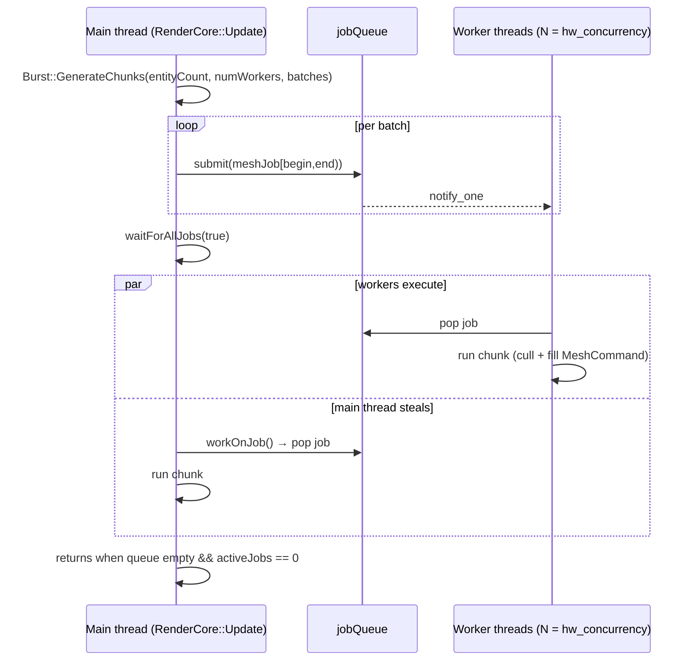

# Jobs and Events

The engine is single-threaded except where work is explicitly fanned out through `SimpleJobSystem`, and engine-wide communication happens through `EventManager` — a synchronous, immediate-dispatch, **not thread-safe** broadcaster. This doc is the threading rulebook: what may run off the main thread, what must not, and the exact semantics (and races) of both systems.

> Verified against engine commit 047f57b8, 2026-07-10.

## Overview

There are two generations of job system in the tree. **`SimpleJobSystem`** (`Modules/Dementia/Source/Work/SimpleJobSystem.h`) is the live one: a mutex+condvar thread pool owned by `Engine`, registered as an `ISystem` so it's reachable via `Engine::GetJobSystem()` or `UpdateContext::GetSystem`. The older **`JobEngine`/`Job`/`JobQueue`/`Pool`/`Worker`** family (same directory) plus `Modules/Dementia/Source/Core/JobSystem.h` are vestigial — their only engine references are `#include`s in `Source/Engine/Engine.h` and a fully commented-out physics-parallelization experiment in `Source/Cores/PhysicsCore.cpp`. Don't build on them.

Events are typed broadcasts: subclass `Event<T>`, receivers implement `EventReceiver::OnEvent` and register for specific `TypeId`s. `Fire()` walks the receiver list *right now, on the calling thread*.

## Key Files

| Path | Role |
|------|------|
| `Modules/Dementia/Source/Work/SimpleJobSystem.h` | The live thread pool (header-only) |
| `Modules/Dementia/Source/Work/Burst.h` / `Modules/Dementia/Source/Work/Burst.cpp` | `GenerateChunks` range splitting; Windows-only physical-core query |
| `Source/Cores/Rendering/RenderCore.cpp` | The canonical job-dispatch usage pattern |
| `Modules/Dementia/Source/Events/EventManager.h` / `Modules/Dementia/Source/Events/EventManager.cpp` | Singleton dispatcher |
| `Modules/Dementia/Source/Events/Event.h` / `Modules/Dementia/Source/Events/EventReceiver.h` | `Event<T>` CRTP + receiver interface |
| `Source/Events/SceneEvents.h`, `Source/Events/PlatformEvents.h`, `Source/Events/AudioEvents.h`, `Source/Events/HavanaEvents.h` | Engine event inventory |
| `Modules/Dementia/Source/Work/JobEngine.h` (+ Job/JobQueue/Pool/Worker) | **Vestigial** legacy job system |

## How It Works

### SimpleJobSystem

- Constructed with `std::thread::hardware_concurrency()` workers (all logical cores — the engine's main thread competes with them).
- `submit(SimpleJob)` (a `std::function<void()>`) enqueues and returns a `shared_ptr<atomic<bool>>` completion flag you can poll.
- `waitForAllJobs(allowMainThreadWork = true)`:
  - `true` — the calling thread **steals jobs** from the queue (`workOnJob`) until queue and active count drain, yielding when there's nothing to steal. This is the mode the engine uses.
  - `false` — blocks on a condition variable until idle.
- There is no cancellation, no priorities, no job dependencies, and no per-job wait — you either poll the returned flag or drain the whole system.



**Known race — early return from `waitForAllJobs`:** a worker pops the last job (queue now empty) and only *then* increments `activeJobs`. In the window between pop and increment, the waiter can observe `queue empty && activeJobs == 0` and return while that job hasn't run yet. The window is tiny and the main-thread-stealing mode narrows it further (the main thread usually drains the queue itself), but it exists. Corollary: don't treat `waitForAllJobs` returning as a memory-visibility fence for the final job's writes.

(Cosmetic: `activeJobs` is incremented twice per job — once by the wrapper `submit` builds, once by the executor loop — and decremented twice; balanced, but don't read it as a job count.)

### Burst

`Burst::GenerateChunks(size, num, out)` splits `size` items into `num` contiguous `[begin, end)` ranges, distributing the remainder one-per-chunk. If `size <= num` it emits a **single chunk** covering everything — small workloads intentionally don't parallelize. `GetMaxBurstThreads`/`GetPhysicalProcessorCount` exist **only on Windows** (`USING( ME_PLATFORM_WINDOWS )`); portable code should size off `SimpleJobSystem::GetNumWorkers()` like `RenderCore` does. `kMaxBurstThreads` is 32.

### The canonical pattern (from `RenderCore::Update`)

```cpp
std::vector<std::pair<int, int>> batches;
Burst::GenerateChunks( Renderables.size(), simpleJobSystem.GetNumWorkers(), batches );
for( auto& batch : batches )
{
    auto meshJob = [&renderer, &Renderables, &cameras, batchBegin, batchEnd]() { /* ... */ };
    simpleJobSystem.submit( meshJob );
}
simpleJobSystem.waitForAllJobs( true );
```

The lambdas capture locals **by reference**, which is only safe because `waitForAllJobs` is called before the scope ends. This is the implicit contract for all job dispatch in the engine: **jobs must be joined within the dispatching scope.** Fire-and-forget jobs must capture by value/`shared_ptr` and touch nothing frame-scoped.

### Events

`Event<T>` gives each event type a `TypeId` (via `ClassTypeId<BaseEvent>` — first-touch ordering, see `Docs/ECS.md`). Usage:

```cpp
// fire
SceneLoadedEvent evt;
evt.LoadedScene = CurrentScene;
evt.Fire();                    // synchronous, on the calling thread

// receive
class Thing : public EventReceiver {
    Thing() {
        EventManager::GetInstance().RegisterReceiver( this,
            { SceneLoadedEvent::GetEventId(), WindowResizedEvent::GetEventId() } );
    }
    bool OnEvent( const BaseEvent& evt ) override {
        if( evt.GetEventId() == SceneLoadedEvent::GetEventId() ) {
            auto& loaded = static_cast<const SceneLoadedEvent&>( evt );
            // ...
            return false;   // true would CONSUME the event — later receivers never see it
        }
        return false;
    }
};
```

Semantics to keep in mind:

- **Dispatch is immediate and re-entrant** — `Fire()` runs every receiver before returning; a receiver may fire further events (e.g. `LoadSceneEvent` → `Engine::LoadScene` does substantial work inside dispatch).
- **Returning `true` from `OnEvent` stops propagation** to receivers registered later. Registration order = dispatch order.
- **The queue path is dead.** `EventManager::QueueEvent`/`FirePendingEvents` exist (and `FirePendingEvents` runs at the top of every frame — see `Docs/Architecture.md`), but `Event<T>::Queue()`'s body is commented out, so nothing ever enqueues. All real traffic is `Fire()`.
- **Receivers must deregister themselves** (`DeRegisterReciever` — note the spelling) before destruction; `EventReceiver` has no auto-deregistering destructor, so a destroyed receiver leaves a dangling pointer in the dispatch lists.

Event inventory: `Source/Events/SceneEvents.h` (`LoadSceneEvent`, `SceneLoadedEvent`), `Source/Events/PlatformEvents.h` (`WindowResizedEvent`, `WindowMovedEvent`), `Source/Events/AudioEvents.h` (`PlayAudioEvent`, `StopAudioEvent`), `Source/Events/HavanaEvents.h` (editor: `PickingEvent`, `PreviewResourceEvent`, `RequestAssetSelectionEvent`, `SaveSceneEvent`, `NewSceneEvent`), `Modules/Dementia/Source/Events/EditorEvents.h` (`InspectEvent`, `ClearInspectEvent`, `TestEditorEvent`).

## The Threading Rulebook

Safe inside a job:

- Pure computation over the job's own `[begin, end)` slice of a pre-sized container.
- Reading components/transforms **provided nothing mutates them concurrently** (the engine guarantees this by running the mesh job at a fixed point in the frame — nothing else runs during `waitForAllJobs`).
- `CommandCache` operations (`Modules/Moonlight/Source/Utils/CommandCache.h`) — internally mutexed; this is how mesh jobs publish `MeshCommand`s.

**Not** safe inside a job (main thread only):

- `Event::Fire` / `EventManager` anything — no locks, receiver lists are plain vectors.
- Entity/component create, destroy, activate — `World`'s caches are unsynchronized.
- `ResourceCache::Get` / `Dump` — the singleton's `std::map` has no locking.
- bgfx calls — the renderer owns submission on the main thread (bgfx encoders are not used).
- ImGui, `CLog` file writes (unsynchronized), config, scripting calls.

If a job needs any of the above, have the job record intent into its own slice of a results buffer and apply it on the main thread after `waitForAllJobs`.

## Caveats & Fragility

- **`waitForAllJobs` early-return race** described above — don't use it as a strict happens-before edge for the last job.
- **Worker count = logical cores**, so the pool oversubscribes against the main thread during steal-mode waits; heavy jobs can starve the OS scheduler on low-core machines.
- **No exception isolation**: a throwing job propagates through `workerThread` and terminates (workers have no try/catch).
- **`shutdown` only in the destructor**: the pool joins in `~SimpleJobSystem` (static-teardown time, since `Engine` is a leaked singleton — see `Docs/Architecture.md`); jobs still queued at exit run or are dropped depending on timing.
- **Event dispatch during iteration**: registering/deregistering receivers from inside `OnEvent` mutates the vector being iterated in `FireEvent` — avoid subscribing/unsubscribing during dispatch.
- **`FirePendingEvents` is a decoy** — it looks like deferred delivery exists; it doesn't. If you need next-frame delivery you currently have to build it (or un-comment and finish `Event<T>::Queue`, which also needs an ownership story since `Queue` would have to copy the event into a `SharedPtr`).

## Related Docs

- `Docs/Architecture.md` — where `FirePendingEvents` and the job-consuming updates sit in the frame
- `Docs/Rendering-Pipeline.md` — the mesh job's producer/consumer relationship with the renderer
- `Docs/ECS.md` — `TypeId` generation shared by events and components
- `Docs/State-of-the-Engine.md` — recommendations for the queue path and legacy job systems
