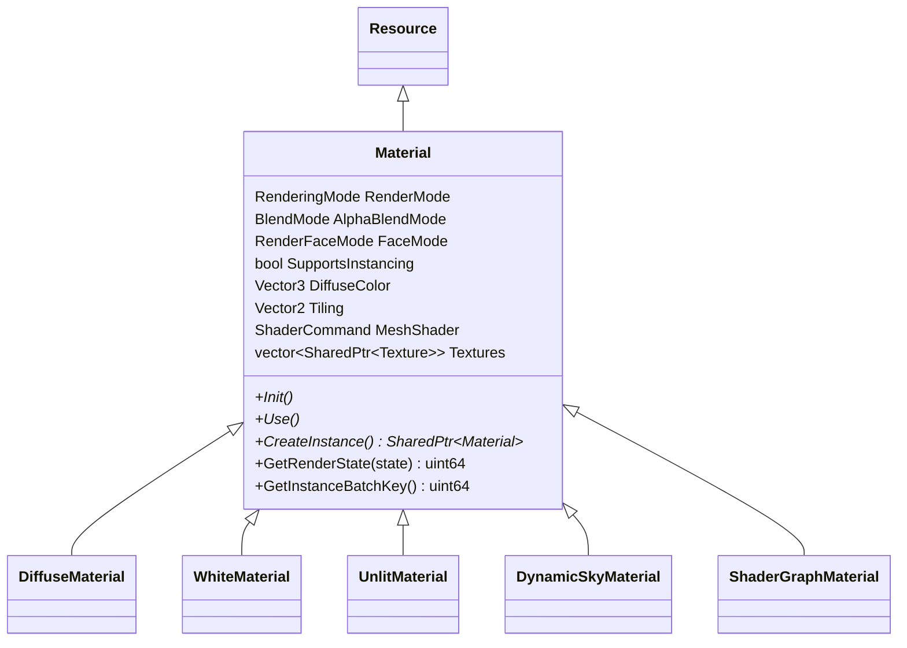
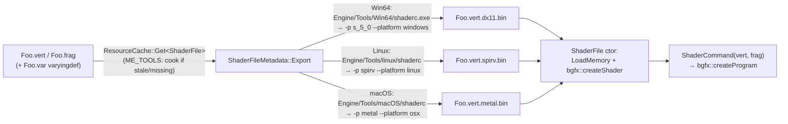

# Materials and Shaders

Materials are code-defined `Material` subclasses (a `Resource` specialization) registered by name; each `Mesh` component owns a **unique material instance** created via `CreateInstance()`, serialized inline into the component's JSON. Shaders are bgfx `.sc`-style `.vert`/`.frag` sources compiled **offline** to per-backend binaries by `shaderc`, triggered on demand by the resource-metadata cook (see `Docs/Resources-and-Assets.md`). This doc covers the material contract, the instancing batch key, the shader pipeline, and how to add a material.

> Verified against engine commit 047f57b8, 2026-07-10.

## Overview

There is no data-driven material/shader graph in the runtime path — a material type *is* a C++ class that knows its shader pair, its uniforms, and how to upload them in `Use()`. The `.mat` extension has a registered metadata type but materials are not actually loaded from `.mat` files in practice; they ride inside `Mesh` component serialization. `ShaderGraphMaterial` (fed by the `Tools/ShaderEditor/` node editor) is the half-finished exception.

## Key Files

| Path | Role |
|------|------|
| `Modules/Moonlight/Source/Graphics/Material.h` / `Modules/Moonlight/Source/Graphics/Material.cpp` | Base class: render/blend/face modes, textures, batch key, registry macros |
| `Modules/Moonlight/Source/Graphics/MaterialDetail.h` | Name → factory `MaterialRegistry` (same pattern as component/core registries) |
| `Modules/Moonlight/Source/Materials/DiffuseMaterial.h` | The standard material (+ `WhiteMaterial`); the instancing reference |
| `Modules/Moonlight/Source/Shaders/UnlitMaterial.h` | Unlit variant (note: lives under `Shaders/`, not `Materials/`) |
| `Modules/Moonlight/Source/Materials/DynamicSkyMaterial.h` | Procedural sky material |
| `Modules/Moonlight/Source/Materials/ShaderGraphMaterial.h` | Half-finished node-graph material |
| `Modules/Moonlight/Source/Graphics/ShaderCommand.h` | vert+frag → `bgfx::ProgramHandle` wrapper |
| `Modules/Moonlight/Source/Graphics/ShaderFile.h` | Compiled-shader resource + the `shaderc` cook (`ShaderFileMetadata::Export`) |
| `Modules/Moonlight/Source/Utils/BGFXUtils.cpp` | `LoadProgram`, `GetPlatformString` (renderer → profile string) |

## How It Works

### Class hierarchy



Registered names (what appears in scene JSON and the editor dropdown): `Diffuse`, `White`, `Unlit`, `DynamicSky`, `ShaderGraphMaterial` — via `ME_REGISTER_MATERIAL_NAME(Type, "Name")` (there's also a `_FOLDER` variant for editor grouping).

### The material contract

- **`Init()`** — create uniform handles. Convention (see `DiffuseMaterial`): uniforms are `inline static` and guarded with `bgfx::isValid` so all instances share one handle set.
- **`Use()`** — upload per-instance uniform values right before submit. Called by `BindMeshDrawState` after textures are bound (slots 0/1/2 = diffuse/normal/opacity — see `Docs/Rendering-Pipeline.md`).
- **`CreateInstance()`** — clone; `Mesh::OnDeserialize` and model loading call this so **every mesh gets its own material object**. This is why instancing can't key on material pointers.
- **`GetRenderState(state)`** — merges the material's blend mode (transparent only: `Alpha`/`Premultiply`/`Additive`/`Multiply`) and face mode (`Front`→`CULL_CCW`, `Back`→`CULL_CW`, `Both`→no cull) into the renderer's base state bits.

### The instancing batch key

`Material::GetInstanceBatchKey()` hashes the GPU-observable state: shader program idx, diffuse/normal/opacity texture idxs, `GetRenderState(0)`, `DiffuseColor` (3 floats, bit-exact), `Tiling` (2 floats). Meshes with `SupportsInstancing == true` whose `(vertexBuffer, indexBuffer, batchKey)` triple matches are drawn as one instanced batch using the *first* command's material as representative.

**The invariant to preserve:** any state your material subclass reads in `Use()` or contributes to `GetRenderState` **must be mixed into the batch key** (override `GetInstanceBatchKey`, mix your extra fields). If you add a uniform and don't extend the key, two visually different instances hash equal, get batched together, and silently render with the representative's values. Opt in to instancing with `SupportsInstancing = true` (only `DiffuseMaterial`/`WhiteMaterial` do today).

### Serialization path

Materials serialize *inside* the `Mesh` component (`Source/Components/Graphics/Mesh.cpp`): `OnSerialize` writes a `"Material"` object with `"Type"` (the registered name) plus base-material fields; `OnDeserialize` recreates by name from the `MaterialRegistry`, falling back to `DiffuseMaterial` when the name is unknown, then calls `Init()` and `OnDeserialize` on the new instance. Texture paths inside materials load through `ResourceCache::Get<Texture>` during deserialize (synchronous — see `Docs/Resources-and-Assets.md`).

### Shader pipeline

Shader sources live in `Assets/Shaders/` (engine) with **three files per program**: `Foo.vert`, `Foo.frag`, and `Foo.var` (the bgfx varying definition — required; the cook passes `--varyingdef`). Compiled binaries land **next to the sources** as `Foo.vert.<profile>.bin` / `Foo.frag.<profile>.bin`, where `<profile>` = `Moonlight::GetPlatformString()`: `dx11` (D3D11/12), `spirv` (Vulkan), `metal`, `glsl`, `essl`.



Mechanics worth knowing:

- The cook is a **blocking shell-out** (`PlatformUtils::SystemCall` on Win64, plain `system()` on macOS/Linux) fired from inside `ResourceCache::Get` in tools builds when the sidecar is flagged or the binary is missing. Failures don't propagate — the subsequent `ShaderFile` constructor's `ME_ASSERT_MSG( fullPath.Exists, "Shader doesn't exist." )` is the backstop.
- On macOS/Linux the source/output paths are built as `<shaderc dir>/../../../<local path>` — the cook **assumes the engine lives three directories up from the shaderc binary** (i.e. the standard `Engine/Tools/<platform>/` layout inside a game project). Both also pass `-i Engine/Assets/Shaders` so engine shader includes (`bgfx_shader.sh` etc.) resolve.
- A material binds its program via `Material::LoadShader`/the `ShaderCommand(vert, frag)` constructor, which pulls both stages through `ResourceCache::Get<ShaderFile>` and `bgfx::createProgram`s them. `DiffuseMaterial` hardcodes `"Assets/Shaders/Diffuse"`.

## How to Extend

### Add a material type

1. Subclass `Material` (model it on `Modules/Moonlight/Source/Materials/DiffuseMaterial.h`):

```cpp
#pragma once
#include "Graphics/Material.h"

class RimlightMaterial
    : public Moonlight::Material
{
public:
    RimlightMaterial()
        : Moonlight::Material( "RimlightMaterial", "Assets/Shaders/Rimlight" ) // expects Rimlight.vert/.frag/.var
    {
        SupportsInstancing = true; // only if the shader reads i_data instance attribs
    }

    void Init() override
    {
        if( !bgfx::isValid( s_rimColor ) )
        {
            s_rimColor = bgfx::createUniform( "s_rimColor", bgfx::UniformType::Vec4 );
        }
    }

    virtual void Use() final
    {
        bgfx::setUniform( s_rimColor, &RimColor.x );
    }

    SharedPtr<Material> CreateInstance() final
    {
        return MakeShared<RimlightMaterial>( *this );
    }

    // REQUIRED if instancing + custom state: fold RimColor into the batch key
    virtual uint64_t GetInstanceBatchKey() const override;

    Vector4 RimColor { 1.f, 1.f, 1.f, 1.f };

private:
    inline static bgfx::UniformHandle s_rimColor = BGFX_INVALID_HANDLE;
};
ME_REGISTER_MATERIAL_NAME( RimlightMaterial, "Rimlight" )
```

2. Author `Assets/Shaders/Rimlight.vert`, `.frag`, and `.var`. Instanced shaders must read the transform from instance data; compare `Assets/Shaders/Diffuse.vert`.
3. Override `OnSerialize`/`OnDeserialize` if you add fields beyond the base set — the base already handles render/blend/face modes, color, tiling, and textures.
4. First tools-build run cooks the binaries automatically; commit them (runtime/retail builds can't cook).

## Caveats & Fragility

- **Batch-key completeness is on you** — the base key covers only base-material state; forgetting to extend it in a subclass causes silent visual mis-batching (worst kind of bug: intermittent, scene-dependent).
- **`ShaderGraphMaterial` is half-finished**: `Use()` binds every graph texture to hardcoded stage **3** (all uniforms overwrite the same slot), `Init` recreates uniforms per instance without the validity guard, and the flow depends on the external `Tools/ShaderEditor/` app. Treat as experimental.
- **`.mat` metadata is vestigial** — `MaterialResourceMetadata::Export` is empty and its compiled-twin check looks for `Foo.mat.mat`; materials actually live inside `Mesh` JSON.
- **Cook failures are silent** until the `ShaderFile` existence assert (debug) or a crash/invalid handle (release). Check the log for the `BRUH`-printed shaderc command line on Linux.
- **Relative-path assumption** in the macOS/Linux cook (`shaderc dir + /../../../`) breaks if `Engine/` is not a direct submodule folder of the working directory the app runs from.
- **Uniform naming is global in bgfx** — two materials declaring the same uniform name with different types collide at the bgfx level; the engine namespaces by convention only (`s_diffuse`, `s_tiling`, …).
- **`UnlitMaterial` lives in `Modules/Moonlight/Source/Shaders/`** rather than `Materials/` — easy to miss when enumerating material types.
- Unknown material names in scenes **silently become `DiffuseMaterial`** (`Mesh::OnDeserialize` fallback) — a renamed material class degrades scenes without errors.

## Related Docs

- `Docs/Rendering-Pipeline.md` — where `Use`/`GetRenderState`/batching execute
- `Docs/Resources-and-Assets.md` — the metadata/cook machinery `ShaderFileMetadata` plugs into
- `Docs/Serialization-and-Scenes.md` — the `Mesh` JSON that embeds materials
- `Docs/State-of-the-Engine.md` — ShaderGraph finish-or-delete recommendation
