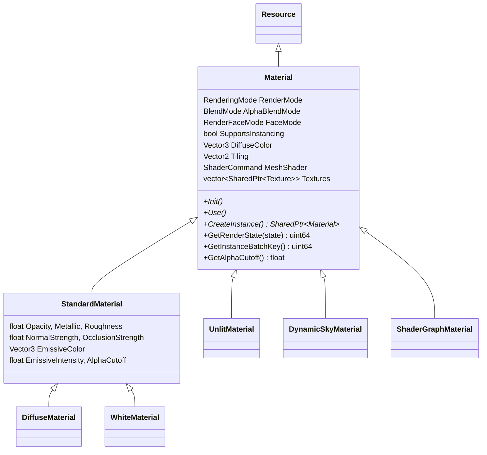
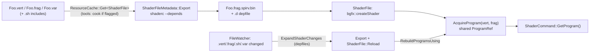

# Materials and Shaders

Materials are code-defined `Material` subclasses (a `Resource` specialization) registered by name. Each `Mesh` component owns a **unique material instance**, created via `CreateInstance()` and serialized inline into the component's JSON. The workhorse is **`StandardMaterial`**, metallic-roughness PBR in glTF conventions.

Shaders are bgfx `.vert`/`.frag` sources compiled to per-backend binaries by `shaderc`, either in batch (`Tools/BuildShaders.sh`) or on demand by the resource-metadata cook. In tools builds they **hot reload**: editing a shader, a shared `.sh` include or a `.var` file recompiles it and swaps the program in place. This doc covers the material contract, the instancing batch key, the shader pipeline and how to add a material.

> Verified against engine commit 1fa55311, 2026-10-09 (overhaul Wave 3).

## Overview

A material type *is* a C++ class that knows its shader pair, its uniforms, and how to upload them in `Use()`. Materials ride inside `Mesh` JSON; the `.mat` extension has a registered metadata type that isn't used in practice. `ShaderGraphMaterial` (fed by the `Tools/ShaderEditor/` node editor) is the half-finished exception.

## Key Files

| Path | Role |
|------|------|
| `Modules/Moonlight/Source/Graphics/Material.h` / `Material.cpp` | Base class: render/blend/face modes, textures, batch key, alpha cutoff hook, registry macros |
| `Modules/Moonlight/Source/Materials/StandardMaterial.h` / `.cpp` | PBR material (the default for meshes, primitives and imported models) |
| `Modules/Moonlight/Source/Materials/DiffuseMaterial.h` | Legacy names `DiffuseMaterial` / `WhiteMaterial`, now `StandardMaterial` subclasses so old scenes load |
| `Modules/Moonlight/Source/Shaders/UnlitMaterial.h` | Unlit material (note: under `Shaders/`, not `Materials/`) |
| `Modules/Moonlight/Source/Materials/DynamicSkyMaterial.h` | Procedural sky |
| `Modules/Moonlight/Source/Materials/ShaderGraphMaterial.h` | Half-finished node-graph material |
| `Modules/Moonlight/Source/Graphics/ShaderCommand.h` | A shader pair's program; shares a hot-reloadable `ProgramRef` |
| `Modules/Moonlight/Source/Utils/BGFXUtils.cpp` | Program registry (`AcquireProgram`, `RebuildProgramsUsing`), `LoadProgram`, `GetPlatformString` |
| `Modules/Moonlight/Source/Graphics/ShaderFile.h` | Compiled-shader resource, `Reload`, and the `shaderc` cook (`ShaderFileMetadata::Export`) |
| `Modules/Moonlight/Source/Graphics/ShaderDependencies.cpp` | Maps changed `.sh` includes / `.var` files to the shaders built from them |
| `Assets/Shaders/Standard.vert` / `.frag`, `Lighting.sh` | The PBR shader and the shared lighting library |
| `Tools/BuildShaders.sh` | Batch compile (SPIR-V + GLSL 150) of everything, or a filtered subset |

## How It Works

### Class hierarchy


```mermaid
classDiagram
    Resource <|-- Material
    Material <|-- StandardMaterial
    StandardMaterial <|-- DiffuseMaterial
    StandardMaterial <|-- WhiteMaterial
    Material <|-- UnlitMaterial
    Material <|-- DynamicSkyMaterial
    Material <|-- ShaderGraphMaterial
    class Material {
        RenderingMode RenderMode
        BlendMode AlphaBlendMode
        RenderFaceMode FaceMode
        bool SupportsInstancing
        Vector3 DiffuseColor
        Vector2 Tiling
        ShaderCommand MeshShader
        vector~SharedPtr~Texture~~ Textures
        +Init()*
        +Use()*
        +CreateInstance()* SharedPtr~Material~
        +GetRenderState(state) uint64
        +GetInstanceBatchKey() uint64
        +GetAlphaCutoff() float
    }
    class StandardMaterial {
        float Opacity, Metallic, Roughness
        float NormalStrength, OcclusionStrength
        Vector3 EmissiveColor
        float EmissiveIntensity, AlphaCutoff
    }
```

`ME_REGISTER_MATERIAL_NAME(Type, "Display name")` registers a material under its **class name**. Scene JSON stores that name as `"Type"`, and the material's constructor `TypeName` must match it. The registered names are `StandardMaterial`, `DiffuseMaterial`, `WhiteMaterial`, `UnlitMaterial`, `DynamicSkyMaterial` and `ShaderGraphMaterial`. The display names ("Standard (PBR)", "Diffuse (legacy)", …) appear in the editor's material dropdown.

### StandardMaterial

| Input | Source |
|-------|--------|
| Base colour | `DiffuseColor` (sRGB, linearised in `Use()`) × `Opacity`, times the Diffuse texture (sRGB) |
| Normal | Normal texture: tangent space, Z reconstructed (two-channel maps work), scaled by `NormalStrength` |
| Metallic / roughness | Factors × `MetallicRoughness` texture (glTF packing: **G = roughness, B = metallic**) |
| Occlusion | `Occlusion` texture R, blended by `OcclusionStrength`; also drives specular occlusion |
| Emissive | `EmissiveColor` × `EmissiveIntensity` (HDR) × Emissive texture |
| Opacity | Alpha of base colour × Opacity texture R; `AlphaCutoff > 0` alpha-tests (also in shadow maps) |

`Standard.frag` evaluates the sun (shadowed) and the other directional lights, the clustered point and spot lights (spots optionally shadowed) and image-based ambient. See `Docs/Rendering-Pipeline.md`.

Model import (`ModelResource.cpp`) maps assimp's PBR keys onto these fields:

- `AI_MATKEY_BASE_COLOR`, metallic and roughness factors, emissive colour.
- `BASE_COLOR`, `METALNESS`/`DIFFUSE_ROUGHNESS` (or glTF's packed `UNKNOWN` slot), `EMISSIVE`, `AMBIENT_OCCLUSION`/`LIGHTMAP` and `NORMALS` textures.
- It falls back to the legacy diffuse colour and texture.

### The material contract

- **`Init()`**: create uniform handles. Convention: `inline static` handles guarded with `bgfx::isValid`, shared by all instances.
- **`Use()`**: upload per-instance uniforms right before submit (after the renderer bound textures and lighting).
- **`CreateInstance()`**: clone. Every mesh gets its own material object, which is why instancing can't key on material pointers.
- **`GetRenderState(state)`**: merges blend mode (transparent only) and face mode into the base state bits.
- **`GetAlphaCutoff()`**: > 0 for alpha-tested materials, so the shadow depth pass discards the same texels.

### The instancing batch key

`Material::GetInstanceBatchKey()` hashes:

- the program index;
- the diffuse, normal and opacity texture indices;
- `GetRenderState(0)`;
- `DiffuseColor` and `Tiling`, bit-exact.

`StandardMaterial` extends it with its other three textures and all of its scalar parameters. Meshes with `SupportsInstancing == true` and equal `(vertexBuffer, indexBuffer, batchKey)` draw as one instanced batch using the *first* command's material.

**The invariant to preserve:** anything your material reads in `Use()` or contributes to `GetRenderState` **must be mixed into the batch key**. If it isn't, visually different instances batch together and silently render with the representative's values.

Instancing-capable vertex shaders are **instance-only**: they read the model matrix from `i_data0..3` (`TEXCOORD7..4` in the `.var`), so every draw of that material, transparent ones included, feeds an instance buffer.

### Shader pipeline

Each program is `Foo.vert` + `Foo.frag` + **`Foo.var`** (bgfx varying definition, one per base name). Binaries land **next to the source** as `Foo.vert.<profile>.bin`, where `<profile>` is `Moonlight::GetPlatformString()`: `spirv`, `glsl`, `dx11`, `metal` or `essl`. `ShaderFile` loads the binary next to the resolved source (`Path` resolves game `Assets/` first, then `Engine/Assets/`).


```mermaid
flowchart LR
    S["Foo.vert / Foo.frag / Foo.var<br/>(+ .sh includes)"] -->|"ResourceCache::Get&lt;ShaderFile&gt;<br/>(tools: cook if flagged)"| E["ShaderFileMetadata::Export<br/>shaderc --depends"]
    E --> B["Foo.frag.spirv.bin<br/>+ .d depfile"]
    B --> SF["ShaderFile: bgfx::createShader"]
    SF --> REG["AcquireProgram(vert, frag)<br/>shared ProgramRef"]
    REG --> SC["ShaderCommand::GetProgram()"]
    W["FileWatcher: .vert/.frag/.sh/.var changed"] -->|"ExpandShaderChanges (depfiles)"| HR["Export + ShaderFile::Reload"]
    HR -->|"RebuildProgramsUsing"| REG
```

- **Cook**: `Export` runs the platform's `shaderc` (`Engine/Tools/<Win64|macOS|linux>/`) with absolute paths:
  - `-i Engine/Assets/Shaders` so engine includes resolve;
  - the profile picked from the running renderer (`spirv` / `150` / `s_5_0` / `metal` / `320_es`);
  - always a `--depends` depfile.

  It captures the compiler's output (`PlatformUtils::RunCommand`) and logs failures with the full error text.
- **Hot reload** (tools builds):
  1. The asset watcher reports a changed `.vert`/`.frag`, or a `.sh`/`.var`, which `ExpandShaderChanges` maps to every shader whose depfile lists it.
  2. The shader is re-exported **on a reimport thread** (`ShaderFileMetadata::ExportsInBackground`), so the editor keeps running while `shaderc` works, several shaders at once when an include changed. When it's done, `ResourceCache::PumpReimports` (start of the next frame) saves the meta and `ShaderFile::Reload` creates the new shader. A shader edited again mid-compile compiles again before it reloads.
  3. Every program acquired through the registry is rebuilt in place. `ShaderCommand::GetProgram()` reads the shared `ProgramRef`, so materials, post-processing, IBL, shadow, particle and picking passes all pick it up.

  Programs created with raw `LoadProgram` (Ultralight UI) don't reload.
- **Metas**: a shader's `.meta` lives next to its source (engine shader metas are committed in the engine repo). A missing `.meta` makes the editor cook that shader at startup.
- **Batch**: `Tools/BuildShaders.sh [filter]` compiles SPIR-V and GLSL 150 for every engine shader (or those whose path contains the filter) and refreshes shadow copies under the game's `Assets/Shaders`.

## How to Extend

### Add a lit material type

1. Subclass `StandardMaterial`, or `Material` for a different shading model, and register it:

```cpp
#pragma once
#include "Materials/StandardMaterial.h"

class ClearcoatMaterial
    : public StandardMaterial
{
public:
    ClearcoatMaterial()
        : StandardMaterial( "ClearcoatMaterial" )   // uses the Standard shader unless you LoadShader another
    {
    }

    SharedPtr<Material> CreateInstance() final
    {
        return MakeShared<ClearcoatMaterial>( *this );
    }

    // Any extra state read in Use() must be folded into the key.
    uint64_t GetInstanceBatchKey() const override;

    float Clearcoat = 1.f;
};
ME_REGISTER_MATERIAL_NAME( ClearcoatMaterial, "Clearcoat" )
```

2. For a custom shader:
   - Author `Assets/Shaders/Foo.vert`, `.frag` and `.var`.
   - Include `Common.sh` and `Lighting.sh`, build a `Surface`, and call `shadeLight` / `shadeClusteredLights` / `ambientLighting` (copy `Standard.frag`'s structure).
   - Include `Fog.sh` and end with `fogForward` like `Standard.frag`. Otherwise the shader stays unfogged when drawn as a transparent (after the fog pass); for opaque draws it's a no-op.
   - Instanced shaders read the model matrix from `i_data0..3`.
   - Note that bgfx's shaderc only allows `gl_FragCoord` inside `main()`.
3. Override `OnSerialize`/`OnDeserialize` for new fields; the base handles modes, colour, tiling and textures.
4. Run `Tools/BuildShaders.sh Foo`, or just open the editor (it cooks), then edit live.

## Caveats & Fragility

- **Batch-key completeness is on you.** A missing field causes silent, scene-dependent mis-batching.
- **Uniform names are global in bgfx.** Two materials declaring the same name with different types collide; the lighting library reserves `u_light*`, `u_cluster*`, `u_shadow*`, `u_cascade*`, `u_spotShadow*`, `u_env*`, `u_ambient*` and samplers on stages 8–15.
- **First cooks are synchronous.** A shader without a binary is compiled when it's first loaded, blocking the main thread for the `shaderc` call. Hot reloads compile in the background, and until a recompile lands the old program keeps drawing. Editing `Common.sh` recompiles every loaded shader.
- **`ShaderGraphMaterial` is half-finished**: all graph textures bind to stage 3, it recreates uniforms per instance, and it depends on the external `Tools/ShaderEditor/` app.
- **`.mat` metadata is vestigial.** Materials live inside `Mesh` JSON.
- **Unknown material names become `StandardMaterial`** (`Mesh::OnDeserialize` fallback); a renamed material class degrades scenes without errors.
- **Windows/macOS cook paths** were rewritten during the overhaul but are only verified on Linux.

## Related Docs

- `Docs/Rendering-Pipeline.md` — where `Use`, batching, lighting and shadows execute
- `Docs/Resources-and-Assets.md` — the metadata, cook and file-watcher machinery
- `Docs/Serialization-and-Scenes.md` — the `Mesh` JSON that embeds materials
- `Docs/State-of-the-Engine.md` — ShaderGraph finish-or-delete recommendation
