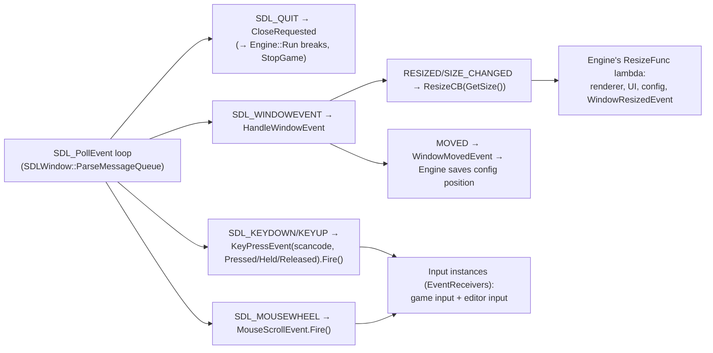

# Platform, Window, Input, Config

The OS boundary: an `IWindow` abstraction implemented by `SDLWindow` (SDL2, on **every** platform including UWP), input as polled SDL state plus window-fired events, and a small JSON config system that persists window geometry and editor state. This is where per-platform branches concentrate.

> Verified against engine commit 047f57b8, 2026-07-10.

## Overview

The window owns the message pump (`ParseMessageQueue`, first thing each frame — `Docs/Architecture.md`), translates SDL events into engine events, and reports resizes through a callback lambda installed by `Engine::Init`. Input is two-layered: `SDLWindow` *fires* `KeyPressEvent`/`MouseScrollEvent`, and `Input` instances *receive* them (as `EventReceiver`s) while also polling SDL keyboard/mouse state directly.

## Key Files

| Path | Role |
|------|------|
| `Source/Window/IWindow.h` | The window interface (size/position, fullscreen/maximize, exit, native ptr) |
| `Source/Window/SDLWindow.cpp` / `Source/Window/SDLWindow.h` | The implementation used everywhere; SDL event pump; native-handle extraction |
| `Source/Window/UWPWindow.cpp` | Vestigial dedicated UWP window (commented out in `Engine::Init`; UWP uses `SDLWindow`) |
| `Source/Engine/Input.h` / `Source/Engine/Input.cpp` | Key/mouse state, `KeyState`, `KeyPressEvent`/`MouseScrollEvent` definitions |
| `Source/Events/PlatformEvents.h` | `WindowResizedEvent`, `WindowMovedEvent` |
| `Modules/Dementia/Source/Config.h` | `ConfigFile` base: JSON `Root`, `GetValue`/`SetValue`, `OnSave`/`OnLoadConfig` |
| `Source/Config/EngineConfig.h` / `Source/Config/EngineConfig.cpp` | Window size/position/title + free-form values (`"Title"`, `"CurrentScene"`) |
| `Modules/Dementia/Source/Path.h`, `Modules/Dementia/Source/File.h` | Path normalization + file IO used by everything above |

## How It Works

### Window and the event pump

- Key repeat maps to `KeyState::Held`; first press is `Pressed`; key-up is `Released`. Key codes are **SDL scancodes** (physical layout, not layout-mapped keysyms).
- On Linux the window extracts X11 vs Wayland handles via `SDL_SYSWM` and hands bgfx the display pointer + window type (`RendererCreationSettings` — `Docs/Rendering-Pipeline.md`).
- Window events fire **synchronously inside `ParseMessageQueue`**, i.e. before this frame's `Input::Update` and everything else.
- `Engine::Quit()` = `GameWindow->Exit()` → close request → normal shutdown path.

### Input

`Input` is a plain class, not a singleton — the engine owns one for the game (`Engine::GetInput()`) and, in editor builds, a second for the editor (`GetEditorInput()`); **both receive the same fired events**, and each polls SDL state in its `Update()` (`SDL_GetKeyboardState`, `SDL_GetMouseState`, global mouse position for ImGui multi-viewport).

API surface: `IsKeyDown` / `WasKeyPressed` / `WasKeyReleased` (`KeyState` tracked per scancode), mouse buttons/position/scroll, and the flow-control trio `Pause()` / `Resume()` / `Stop()` — which is how the editor implements play/pause: pausing *game* input while editor input keeps running (`Docs/Editor-Havana.md`). `Update()`/`PostUpdate()` bracket the frame (PostUpdate clears per-frame pressed/released edges).

### Config

`ConfigFile` (Dementia) wraps a JSON file: `Load` parses into `Root`, `GetValue(key)`/`SetValue` for ad-hoc strings, `Save` calls your `OnSave(json&)` override then writes. `EngineConfig` persists `WindowSize`, `WindowPosition`, `WindowTitle`; other consumers stash free-form keys in the same file — notably the editor's `"CurrentScene"` (`Docs/Editor-Havana.md`) and the window `"Title"`.

Lifecycle: loaded in `Engine::Init` from `Assets\Config\Engine.cfg`; **saved once at clean exit** (`engineConfig.Save()` after the main loop); window position updates flow in live via `WindowMovedEvent`. Editor builds bootstrap a game-local copy of the engine's default config on first run (directory creation Win64-only — `Docs/Architecture.md`).

## Caveats & Fragility

- **A crash loses config changes** — save happens only on clean exit; there's no periodic flush.
- **Scancode-based keys**: bindings are physical positions; non-QWERTY layouts get positional (usually desirable for games, surprising for text-like input). There's no text-input path besides ImGui's.
- **Both Input instances see everything** — gating is by `Pause`/`Stop` state per instance, not by routing; new tooling must remember to check the right instance (game vs editor) or keys will double-trigger.
- **Event-vs-poll duality**: key *events* fire during the pump; polled state updates later in `Input::Update`. Code mixing `OnEvent(KeyPressEvent)` with `IsKeyDown` in the same frame can see them disagree for one frame.
- **No high-DPI handling** — sizes are raw pixels; scale factors aren't queried anywhere.
- **`UWPWindow` is dead code** kept compiling; UWP runs through `SDLWindow` + `SDL_WinRTRunApp` (`Docs/Architecture.md`).
- **`GetKeyCodeName` does an uncached lookup** (in-code TODO "Cache this :/") — fine for tooling, don't call per-frame per-key.
- Resize behavior is split between the `ResizeFunc` lambda (renderer/UI/config pokes) and `WindowResizedEvent` receivers — two mechanisms for one concern; check both when debugging resize issues.

## Related Docs

- `Docs/Architecture.md` — where the pump, input updates, and config save sit in the lifecycle
- `Docs/Jobs-and-Events.md` — the event system these window/input events ride on
- `Docs/Editor-Havana.md` — dual-input play/pause mechanics
- `Docs/Build-System.md` — per-platform SDL/bgfx wiring
