# Rendering Pipeline

Rendering is split into a CPU **producer** — `RenderCore` runs a parallel job that fills POD `MeshCommand`s per visible mesh — and a serial **consumer** — `BGFXRenderer` walks the command cache once per camera view and submits to bgfx. It is a forward renderer: no depth prepass, no shadows, no per-light data; opaque geometry is auto-instanced, transparents are distance-sorted. This doc maps the frame's data flow, the view-ID layout (which differs between editor and game builds), and the sharp edges.

> Verified against engine commit 047f57b8, 2026-07-10.

## Overview

The hot-path design goal is **no virtual calls in the submit loop**: everything the renderer needs per mesh (`BatchKey`, `VertexBufferIdx`, `IndexBufferIdx`, `IsTransparent`, `SupportsInstancing`) is precomputed into the `MeshCommand` by the parallel mesh job. bgfx runs single-threaded (`bgfx::renderFrame()` is called before `bgfx::init` to suppress the render thread), with `ViewMode::Sequential` on camera views — submission order *is* draw order.

Backend selection: Vulkan is forced on Linux, D3D11 on UWP ("Something is up with using DX12 and my shaders"); other platforms take bgfx's default (D3D11/12 on Windows, Metal on macOS). VSync is always on (`BGFX_RESET_VSYNC`).

## Key Files

| Path | Role |
|------|------|
| `Source/Cores/Rendering/RenderCore.cpp` / `Source/Cores/Rendering/RenderCore.h` | Producer: parallel cull + `MeshCommand` fill |
| `Modules/Moonlight/Source/Renderer.cpp` / `Modules/Moonlight/Source/Renderer.h` | Consumer: `BGFXRenderer` — view setup, instancing, submit |
| `Modules/Moonlight/Source/RenderCommands.h` | `MeshCommand`, `DebugColliderCommand`, the stub `LightCommand` |
| `Modules/Moonlight/Source/Utils/CommandCache.h` | Slot-based command storage shared producer↔consumer |
| `Modules/Moonlight/Source/Camera/CameraData.h` | Per-camera view/projection/frustum/output description |
| `Modules/Moonlight/Source/Device/FrameBuffer.h` | Per-camera render target, recreated on resize/reset |
| `Modules/Moonlight/Source/RenderPasses/PickingPass.cpp` | Editor-only entity-ID pass (see `Docs/Editor-Havana.md`) |
| `Modules/Moonlight/Source/Graphics/DynamicSky.cpp` | Procedural sky + the only live "sun" light |

## How It Works

### Frame data flow

```mermaid
flowchart LR
    subgraph ECS["ECS (main thread + jobs)"]
        T["Transform + Mesh components"] --> RC["RenderCore::Update"]
        RC -->|"Burst chunks × SimpleJobSystem"| J["parallel mesh jobs:<br/>frustum-test, fill MeshCommand"]
    end
    J -->|"MeshCache.Update(slot, cmd)"| MC["CommandCache&lt;MeshCommand&gt;<br/>(slot per Mesh component)"]
    subgraph R["BGFXRenderer::Render (main thread, serial)"]
        V1["per camera: RenderCameraView(id)"] --> OP["opaque loop:<br/>instanced batches + singles"]
        OP --> TR["transparent: sort back-to-front,<br/>depth-write off"]
        TR --> UI["view 9: UI composite (main cam)"]
        UI --> BL["blit camera buffer → texture"]
    end
    MC --> V1
    BL --> F["bgfx::frame()"]
```

### Command caches and slots

`CommandCache<T>` (`Modules/Moonlight/Source/Utils/CommandCache.h`) is a `vector<T>` with a free-index queue. `RenderCore::OnEntityAdded` `Push`es an empty `MeshCommand` and stores the returned slot index on the `Mesh` component (`Mesh::Id`); `OnEntityRemoved` `Pop`s it; the per-frame mesh job overwrites the slot via `Update`. The same structure holds `CameraData` (managed by `CameraCore`) and `DebugColliderCommand`s.

Threading contract: **`Push`/`Clear` lock a mutex; `Update`/`Pop`/`Get` do not.** Concurrent job writes are safe only because every job writes distinct slots and nothing `Push`es (which can reallocate the vector) while jobs run — a scheduling guarantee, not a structural one. Also note both `Pop` and `BGFXRenderer::UpdateMeshMatrix` guard with `Id > size()` instead of `>=` — `Id == size()` walks past the end.

### The mesh job (producer)

Per frame, `RenderCore::Update` splits the entity list into `GetNumWorkers()` chunks (`Burst::GenerateChunks`) and submits one job per chunk (pattern details in `Docs/Jobs-and-Events.md`). Each job, per entity:

1. Reads `Transform::GetLocalToWorldMatrix` (lazy-recomputed, see `Docs/Cores-and-Components-Reference.md`).
2. Culls: tests **only the matrix's translation column** (`meshMatrix[3]`) against each camera's `ViewFrustum` — a *point* test, no bounding volume. Sets `camera.VisibleFlags[entIndex]` per camera (the flag vectors are resized on the main thread before dispatch). Cameras with `ShouldCull == false` accept everything.
3. If visible to anyone, fills the `MeshCommand`: mesh pointer, material `SharedPtr` (refcount bump), transform, entity ID, and the precomputed hot fields — `IsTransparent`, `SupportsInstancing`, `BatchKey` (`Material::GetInstanceBatchKey()`, see `Docs/Materials-and-Shaders.md`), and raw bgfx `VertexBufferIdx`/`IndexBufferIdx`.

If an entity is *not* visible this frame, its slot keeps last frame's command — harmless because per-camera `VisibleFlags` gate consumption.

`RenderCore` also pokes `renderer.m_time` (delta + total time) directly each update — flagged in-code with "maybe this is fine? … it's not".

### View ID layout

`BGFXRenderer::Render` assigns views differently per build flavor:

| View | Editor build | Game build |
|------|-------------|------------|
| 0 (`kClearView`) | clear only | **main camera** (renders straight to backbuffer — `setViewFrameBuffer` is skipped for id 0) |
| 1 | editor camera (+ `PickingPass` right after) | first non-main camera |
| 2… | non-main cameras, then **main camera last** | further non-main cameras |
| 9 | UI composite (hardcoded) | UI composite (hardcoded) |
| 11+N | Ultralight GPU driver surfaces (`GPUDriver.h` `kViewId`) | same |
| 255 | ImGui (`Engine::Run` passes viewId 255 to `BeginFrame`) | same (when `ME_IMGUI`) |

Cameras that `ShouldRender == false` or lack a `Buffer` are skipped. Every camera view except view 0 renders into its `FrameBuffer` and ends with `bgfx::blit` of the buffer into `camera.Buffer->Texture` (that's what the editor's scene-view widget samples).

### Inside `RenderCameraView`

1. View setup: name, view/projection from `CameraData`, framebuffer (id > 0), viewport from `OutputSize`, clear color packed from `camera.ClearColor`, `ViewMode::Sequential`.
2. **Sky**: `ClearColorType::Procedural` → `DynamicSky::Draw`; `ClearColorType::Skybox` → the skybox model drawn at scale 10 around the camera position.
3. **Opaque loop** over the whole mesh cache (skipping invisible-for-this-camera and null-material commands):
   - Transparent commands are deferred into `TransparentIndicies`.
   - `SupportsInstancing` commands accumulate into an `InstanceBatch` keyed `(vertexBuffer, indexBuffer, materialKey)` — found by **linear scan** over active batches.
   - Everything else submits immediately via `RenderSingleMesh`.
4. **Instanced flush**: each batch submits through `RenderMeshInstanced` — chunked `bgfx::allocInstanceDataBuffer` loops (64-byte `glm::mat4` stride) with the batch's *representative* command binding textures/uniforms/state for the whole batch.
5. **Transparents**: debug-only `ME_ASSERT_MSG` if count ≥ `kMeshTransparencyTempSize` (60) — release builds just grow the vector; sorted **back-to-front** by squared distance to the camera; drawn with depth-*test* on but depth-*write* off. Instancing-capable transparents still go through `RenderMeshInstanced` with `count == 1`.
6. **Debug draw** (when enabled): the gizmo callback (every core's `OnDrawGuizmo`) plus queued `DebugColliderCommand`s.
7. **UI composite** (main camera with a valid `camera.UITexture` only): a screen-space quad at view 9, orthographic, with blend `BLEND_FUNC_SEPARATE(ONE, INV_SRC_ALPHA, INV_DST_ALPHA, ONE)` — premultiplied-alpha-over, chosen after artifacts with plain alpha (the rejected attempts are commented in place). See `Docs/UI-Ultralight-and-ImGui.md`.

### Draw state binding (`BindMeshDrawState`)

Texture slots: 0 = diffuse (`s_texDiffuse`), 1 = normal (`s_texNormal`), 2 = opacity (`s_texAlpha`). Missing normal or opacity textures fall back to `m_defaultOpacityTexture` (`Assets/Textures/DefaultAlpha.png`) — yes, **the opacity default is bound to the normal slot too**. Then `Material::Use()` uploads material uniforms, `Material::GetRenderState(state)` merges blend/cull bits, and the material's `ShaderCommand` program is returned for submit.

### Lighting reality

- Global uniforms per frame: `s_sunDirection` and `s_sunDiffuse` come from **`DynamicSky`'s sun model** (direction + XYZ-luminance-derived RGB), `u_time` from `RenderCore`.
- `s_ambient` uploads `m_ambient`, which is constructed with `bx::InitNone` and **never assigned anywhere** — the ambient uniform is uninitialized memory.
- The `Light` / `DirectionalLight` components exist but **nothing reads them** into the renderer; `LightCommand` is an empty stub (`float test`). There is exactly one light in practice: the procedural sky's sun.
- `Modules/Moonlight/Source/RenderPasses/DepthPass.h` exists but is empty — **no shadow mapping**.

### Resize and reset

`WindowResized` (from the window's resize callback) recreates the editor camera buffer and any camera buffer that `IsMain || MatchMainBufferSize`. `SetMSAALevel` flips reset flags and sets `NeedsReset`; the next `Render` call performs `bgfx::reset` and recreates every camera buffer. `FrameBuffer::ReCreate` destroys and recreates its textures; its separate `Resize` method is an empty TODO.

## Caveats & Fragility

- **Point culling**: visibility tests the transform origin only. Large meshes whose origin exits the frustum disappear while still on screen; there are no bounding volumes to fix this per-mesh.
- **View-ID collisions are possible**: camera views count up from 1 (editor) — with ~8+ active cameras they collide with the hardcoded UI view 9; Ultralight surfaces start at 11 (+ buffer index). Nothing validates.
- **`CommandCache::Update`/`Pop` are unlocked** — safe only under the current frame schedule; any new code that `Push`es meshes while mesh jobs run is a reallocation race.
- **Off-by-one guards** in `CommandCache::Pop` and `UpdateMeshMatrix` (`Id > size()` instead of `>=`).
- **Transparency assert is debug-only** and the sort is per-object distance — intersecting/large transparent geometry sorts wrong (standard limitation, no OIT).
- **Instance batch lookup is a linear scan** per opaque instanced mesh (`getBatch`); fine at current batch counts, quadratic-ish if material/geometry variety explodes.
- **Ambient uniform is uninitialized** (`m_ambient` = `bx::InitNone`, never set); shaders sampling `s_ambient` read garbage — effectively "whatever the driver zeroes or doesn't".
- **Light components are decorative** today; adding lights means building the missing `LightCommand` plumbing.
- **`Engine::LoadScene` → `RenderCore::Init` clears the whole mesh cache** (`ClearMeshes`) — anything caching mesh-cache indices across scene loads holds dangling slots.
- **Logging noise**: `Create` logs `BRUH("renderFrame")` twice and `BRUH("Renderer assets")` at warning level every boot.
- Per-camera `bgfx::blit` of the full render target every frame (including the main camera, whose guard is commented out) — bandwidth cost scales with camera count.

## Related Docs

- `Docs/Materials-and-Shaders.md` — batch keys, material state, shader cook
- `Docs/Jobs-and-Events.md` — the job dispatch + threading contract behind the mesh job
- `Docs/Cores-and-Components-Reference.md` — `Camera`, `Mesh`, `Transform` component details
- `Docs/UI-Ultralight-and-ImGui.md` — where `camera.UITexture` comes from
- `Docs/Editor-Havana.md` — `PickingPass` and the scene-view texture
- `Docs/State-of-the-Engine.md` — shadows/multi-light improvement notes
