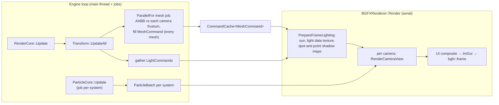

# Rendering Pipeline

Rendering is split into CPU **producers** and a serial **consumer**:

- **Producers** are `RenderCore` and `ParticleCore`. `RenderCore` runs a parallel job that fills one POD `MeshCommand` per mesh and gathers a `LightCommand` per light; `ParticleCore` simulates particle systems into per-system batches.
- **The consumer** is `BGFXRenderer`. It renders every camera through the same chain into HDR targets:
  1. Shadow cascades.
  2. Clustered-forward PBR opaque pass.
  3. SSAO.
  4. Height fog, optionally volumetric (light shafts, lit by every light).
  5. Transparent meshes.
  6. Particles.
  7. Temporal anti-aliasing (optional).
  8. Bloom, eye adaptation, tonemapping, grading and FXAA.
  9. UI composite.

Ambient light comes from per-camera image-based-lighting probes. This doc maps the frame, the view-ID scheme, the lighting data paths and the sharp edges.

> Verified against engine commit 1fa55311, 2026-10-09 (overhaul Wave 3); skinned meshes against 07617c5f, 2026-10-09; fog against b7c61e56, 2026-10-10.

## Overview

The hot-path design goal is **no virtual calls in the submit loop**. Everything the renderer needs per mesh is precomputed into the `MeshCommand` by the parallel mesh job:

- `BatchKey`, `VertexBufferIdx` and `IndexBufferIdx`
- `IsTransparent` and `SupportsInstancing`
- `CastShadows`, `AlphaCutoff` and `WorldBounds`

Opaque meshes are auto-instanced. Scene views use `ViewMode::Sequential`, so submission order *is* draw order.

Backend selection: Vulkan is forced on Linux and D3D11 on UWP; other platforms take bgfx's default (D3D11/12 on Windows, Metal on macOS). Everything that differs between backends is handled once:

- clip-space depth range (`caps->homogeneousDepth`)
- render-target orientation (`caps->originBottomLeft`)
- shader profile (`Moonlight::GetPlatformString()`)

## Key Files

| Path | Role |
|------|------|
| `Source/Cores/Rendering/RenderCore.cpp` | Producer: transforms → per-camera AABB culling → `MeshCommand`s; gathers `LightCommand`s |
| `Source/Cores/Rendering/ParticleCore.cpp` | Producer: simulates `ParticleSystem`s in parallel → `ParticleBatch`es |
| `Modules/Moonlight/Source/Renderer.cpp` / `Renderer.h` | Consumer: `BGFXRenderer` — views, lighting setup, shadows, opaque/transparent/particle passes |
| `Modules/Moonlight/Source/RenderViews.h` | The fixed view IDs and the per-frame `ViewAllocator` |
| `Modules/Moonlight/Source/RenderCommands.h` | `MeshCommand`, `LightCommand`, `ParticleInstance` / `ParticleBatch` |
| `Modules/Moonlight/Source/Device/FrameBuffer.h` | Per-camera targets: HDR scene, final, post, bloom mips, AO, luminance, cluster textures |
| `Modules/Moonlight/Source/Lighting/ClusterBuilder.cpp` | CPU light-to-froxel assignment for clustered forward |
| `Modules/Moonlight/Source/Lighting/ShadowCascades.cpp` | Cascade splits and stable, texel-snapped fitting |
| `Modules/Moonlight/Source/Lighting/EnvironmentLighting.cpp` | IBL probes: capture, prefilter, irradiance, BRDF LUT |
| `Modules/Moonlight/Source/RenderPasses/PostProcess.cpp` | SSAO, fog (`RenderFog`, `FogUniforms`), temporal AA (`RenderTemporalAA`, `TemporalJitter`), bloom, eye adaptation, tonemap + grading, FXAA |
| `Modules/Moonlight/Source/RenderPasses/PickingPass.cpp` | Editor entity-ID pass (see `Docs/Editor-Havana.md`) |
| `Modules/Moonlight/Source/Debug/DebugDraw.h` | Immediate-mode debug line API |
| `Modules/Moonlight/Source/Graphics/MeshLod.cpp` | Level-of-detail generation (meshoptimizer), relative screen height, level selection |
| `Modules/Moonlight/Source/Primitives/Primitives.cpp` | Shared Plane / Cube / Sphere / Cylinder / Capsule geometry |
| `Assets/Shaders/Lighting.sh` | BRDF, clustered light loop, shadow sampling, IBL — included by `Standard.frag` |
| `Assets/Shaders/Fog.sh` | Height-fog density, closed-form optical depth, view-ray reconstruction, Henyey-Greenstein phase, `fogForward` for transparents and particles |
| `Assets/Shaders/Post/FogScatter.frag`, `FogBlur.frag`, `Fog.frag` | Volumetric raymarch (half resolution), its depth-aware blur, and the composite (bilateral upsample or analytic fog) |
| `Assets/Shaders/Skinning.sh` | Bone palette uniform and `skinMatrix`, included by the `*Skinned` vertex shaders |

## How It Works

### Frame data flow

```mermaid
flowchart LR
    subgraph ECS["Engine loop (main thread + jobs)"]
        PC["ParticleCore::Update<br/>(job per system)"] --> PB["ParticleBatch per system"]
        RC["RenderCore::Update"] --> TU["Transform::UpdateAll"]
        TU --> LG["gather LightCommands"]
        TU --> MJ["ParallelFor mesh job:<br/>AABB vs each camera frustum,<br/>fill MeshCommand (every mesh)"]
    end
    MJ --> MC["CommandCache&lt;MeshCommand&gt;"]
    subgraph R["BGFXRenderer::Render (serial)"]
        F["PrepareFrameLighting:<br/>sun, light data texture,<br/>spot and point shadow maps"] --> C["per camera: RenderCameraView"]
        C --> P["UI composite → ImGui → bgfx::frame"]
    end
    MC --> F
    LG --> F
    PB --> C
```

`RenderCore` refreshes the command of **every** mesh each frame, visible or not. Shadow passes need casters outside the camera, and each command's `VisibilityIndex` always matches this frame's per-camera `VisibleFlags`. The opaque loop skips commands whose flag is 0 for the camera being drawn.

### Views

bgfx runs views in ascending ID order, so producers must have lower IDs than their consumers. `RenderViews.h` holds the fixed IDs:

| View | Purpose |
|------|---------|
| 0 | Backbuffer clear |
| 1–32 | Ultralight GPU driver buffers |
| 33 | UI resolve |
| 34–223 | **Dynamic band**: `ViewAllocator` hands these out per frame in submission order |
| 224–225 | Picking ID pass + readback blit (editor) |
| 226 | UI composite |
| 227–255 | ImGui (platform windows count down from 254; main pass is 255) |

`ViewAllocator::Allocate(name)` names each view for RenderDoc and returns `UINT16_MAX` when the band is exhausted; callers skip that pass. Allocation order per frame:

1. Spot-light and point-light shadow maps (the local shadow atlas).
2. For each camera (editor camera first, other cameras next, main camera last so it can sample render-to-texture cameras):
   1. Environment probe updates.
   2. 4 shadow cascades.
   3. Opaque.
   4. SSAO (3 views).
   5. Transparent.
   6. Particles.
   7. Temporal AA resolve (when on).
   8. Bloom down/up chain.
   9. Luminance + adaptation.
   10. Tonemap.
   11. FXAA.

### Inside `RenderCameraView`

1. **Targets**: the camera's `FrameBuffer` is resized to `OutputSize` and holds the targets below. Depth uses the best of D32F → D24S8 → D24 → D16.
   - `SceneBuffer`: RGBA16F colour plus sampleable depth.
   - `Buffer`: the BGRA8 final image, sharing that depth.
   - `PostBuffer`: LDR, used for FXAA.
   - Half-resolution bloom mips and AO targets.
   - 1×1 luminance targets.
   - The cluster textures.
   - `ParticleBuffer`: HDR colour *without* depth.
2. **Lighting setup**:
   - `PrepareCameraLighting` builds the clusters and the ambient fallback.
   - `EnvironmentLighting::Prepare` picks or refreshes the IBL probe.
   - `RenderSunShadows` renders the cascades.
3. **Opaque view** on `SceneBuffer`:
   - Clear to the linearised clear colour.
   - Sky (procedural `DynamicSky` or the skybox model).
   - Opaque meshes: instanced batches keyed `(vertexBuffer, indexBuffer, BatchKey)` plus singles.
4. **SSAO** multiplies the opaque HDR colour (before transparents).
5. **Fog** covers the opaque HDR colour (see Fog below). From here on, forward shaders fog themselves (`u_fogForward`).
6. **Transparent view**: meshes sorted back to front, depth-write off; then legacy gizmo callbacks and the Debug Draw v2 lines.
7. **Particles** (see below).
8. **Post** into the final target, then the **UI composite** for the main camera.

### Lights and clustered forward

`Light` components (Directional / Point / Spot) become `LightCommand`s every frame. Colour is linearised and multiplied by intensity; direction is the entity's forward axis.

`PrepareFrameLighting` handles the lights frame-wide:

- **Directional lights**: up to 4, uploaded as uniforms. The first shadow caster takes slot 0 and becomes "the sun". With no directional light at all, `DynamicSky`'s sun lights and shadows the scene.
- **Point and spot lights**: up to 256. Each is packed into **5 RGBA32F texels** of the light-data texture:
  1. Position and range.
  2. Colour and type.
  3. Direction and cos(outer angle).
  4. cos(inner angle).
  5. Shadow slot (spot tile, or point light 0-1), texel scale and biases.

Per camera, `ClusterBuilder` bins point and spot lights into a **16×9×24 froxel grid**:

- Screen tiles × exponential depth slices.
- Each light is tested as a sphere: the slice range comes from its view depth, and the tile rectangle from the projected corners of its view-space box (full screen if it crosses the near plane).
- The grid (offset, count) and the flattened index list go up as float textures (144×24 RGBA32F and 1024×128 R32F), so no compute shaders are needed.
- Limits: 64 lights per cluster and 131072 indices.

`Standard.frag` finds its cluster from `gl_FragCoord`, flipped for bottom-left-origin backends, and the view depth, then loops over the cluster's lights.

Shading (`Lighting.sh`) is GGX distribution, height-correlated Smith visibility, Schlick Fresnel and an energy-split Lambert diffuse. Point and spot falloff is windowed inverse-square that reaches zero at `Range`; spot cones are smoothstepped between the inner and outer angles.

### Shadows

- **Sun: cascaded shadow maps.**
  - Layout: 4 cascades in a 2×2 depth atlas (`Shadows.CascadeResolution`, default 2048 per cascade), using hardware compare samplers.
  - Splits: PSSM with λ = 0.75, out to `min(Light::ShadowDistance, camera far)`.
  - Stability: each cascade fits the **bounding sphere** of its frustum slice, so its size is rotation-invariant, and is **snapped to whole texels**, so edges don't shimmer.
  - Casters: the near plane is pulled back to the bounds of every caster (`m_casterBounds`), so tall or distant casters land in the map.
- **Spot lights**: the first 4 shadowed spots each get a tile of the local shadow atlas (`Shadows.SpotResolution`, default 1024), using a perspective projection slightly wider than the cone.
- **Point lights**: the first 2 shadowed point lights get six 90° faces each (a hair wider, so PCF at a face edge stays inside it) in the same atlas: `Shadows.PointResolution` (default 512) tiles in a 4×4 block to the right of the 2×2 spot block, so the atlas is 4096×2048 by default. The shader picks the face from the light-to-fragment direction's major axis. Spot and point faces share `u_localShadowMatrix[16]` (0-3 spots, 4-15 faces), the sampler and the PCF.
- **Casters**:
  - Drawn with one instanced depth-only shader (`ShadowDepth`) for every material, culled per cascade or spot frustum by `WorldBounds`.
  - Alpha-tested materials (`Material::GetAlphaCutoff() > 0`) bind their textures and discard in the depth pass too.
  - `Mesh::CastShadows` opts a mesh out.
- **Lookup**:
  - Cascade chosen by view depth; 3×3 PCF taps clamped inside the tile; 10% blend into the next cascade and a fade-out after the last.
  - Receiver biases are in **shadow texels**: `ShadowBias` pushes the receiver towards the light, and `ShadowNormalBias` along its normal **scaled by sin θ**. That's what keeps a sloped receiver out of its own PCF kernel.
- **Debug**: Scene View → View → *Shadow Cascades* tints the scene per cascade (action `View.ShadowCascades`).

### Image-based lighting

`EnvironmentLighting` keeps up to 3 probes, one per distinct background source:

- the procedural sky, captured per pixel from the Perez model without the sun disc and with a dim ground below the horizon;
- a skybox panorama, sampled as equirectangular;
- the clear colour.

A probe holds:

- a 128² RGBA16F capture, downsampled into separate 64/32/16 cubes (separate textures, so no read/write hazards);
- a 5-mip GGX-prefiltered specular cube (roughness = mip / 4, each level sampling the source sized for it);
- a 32² cosine-convolved irradiance cube.

A shared split-sum BRDF table is rendered once.

- **Refresh**: probes refresh only when their source key changes (the sky's sun position and time of day, the panorama texture, or the clear colour). A refresh is split over two frames, one step per frame engine-wide, after checking frame-buffer headroom.
- **Face addressing**: faces are addressed through `gl_FragCoord`, which maps to the same face texel on every backend.
- **Shading**:
  - Split-sum specular with Fdez-Agüera multiple-scattering compensation.
  - Frostbite's dominant direction for rough lobes.
  - Specular occlusion from material and SSAO occlusion.
  - Falls back to a hemisphere ambient until a probe is ready.
- **Controls**: `BGFXRenderer::EnableEnvironmentLighting` / `EnvironmentIntensity` (RenderCore inspector).

### Post-processing

Per camera, from `CameraData::Post`, which `CameraCore` copies from a `PostProcess` component (the editor view uses the main camera's):

- **SSAO**:
  - Runs at half resolution from depth (Alchemy-style), with edge-aware normals and depth lookups snapped to texel centres.
  - A depth-aware 4×4 blur follows.
  - It is applied as a multiply onto the opaque HDR colour.
- **Temporal anti-aliasing** (`TemporalAA`, off by default; the Lighting showcase uses it):
  - The renderer jitters the projection by a sub-pixel offset each frame (Halton 2, 3 over 8 frames). It shifts NDC through w, so either handedness works, and restores the matrix when the view is done. It also stores the unjittered view-projection.
  - `RenderTemporalAA` (`Post/TAA.frag`) runs on the HDR image once particles are in. It unjitters the current frame by sampling it at the jitter offset, and reprojects each pixel to last frame through the depth (`previous × inverse( current )` view-projection). It fetches the history there with a 5-tap Catmull-Rom, clips the history to the current 3×3 neighbourhood's mean ± deviation in YCoCg (variance clipping, so disocclusions and moved objects don't ghost), and blends 90% history with luma weights (Karis) against fireflies. `TemporalSharpness` adds back a little of the centre's contrast.
  - The result (`FrameBuffer::PostInput`, ping-ponged `TemporalHistory`) feeds bloom, eye adaptation and tonemapping. History is created on first use, dropped on resize, and invalid when TAA was off the frame before.
  - Captures stay repeatable: the jitter follows the camera's frame count, so `--frame-time` runs match.
- **Bloom**: thresholded downsample chain (up to 6 RGBA16F mips) and additive tent upsample.
- **Eye adaptation**: log-average luminance into 1×1, adapted over time between min/max EV (`AutoExposure`).
- **Tonemap**:
  - Exposure (manual stops or adapted), bloom mix and white balance.
  - ACES / AgX / Reinhard / none.
  - Saturation, contrast, lift/gamma/gain and vignette.
  - Accurate gamma encode with ±0.5 LSB dither.
  - Writes luma to alpha only when FXAA follows.
- **FXAA** into the final target.

### Fog

Exponential height fog, set per camera on the `PostProcess` component: `Fog`, `FogColor` (ambient in-scattering), `FogDensity` (extinction per metre at `FogHeight`), `FogHeightFalloff`, `FogStartDistance`, `FogMaxOpacity`, `FogSunIntensity` and `FogAnisotropy` (Henyey-Greenstein *g*). `VolumetricFog`, `VolumetricDistance` and `VolumetricSteps` turn on raymarched lighting. `PostProcess::RenderFog` runs after SSAO:

- **Analytic** (default): one full-resolution pass (`Post/Fog.frag`) rebuilds each pixel's view ray from depth and integrates the height fog in closed form. It is lit by the ambient fog colour plus the unshadowed sun through the phase function, so the fog glows towards the sun.
- **Volumetric**:
  - `Post/FogScatter.frag` marches each ray at half resolution (up to `VolumetricDistance`, `VolumetricSteps` steps, jittered with interleaved gradient noise) and lights every step:
    - the ambient fog colour;
    - the sun through its cascaded shadow, one hardware-filtered tap (`sunShadowVolume`), giving light shafts and shadowed volumes;
    - the cluster's point and spot lights with their shadows (`volumeLocalLight`, isotropic phase, scaled by `FogSunIntensity`).
  - Fog beyond the march distance is added analytically.
  - A depth-aware 4×4 blur (`FogBlur.frag`) hides the jitter.
  - `Fog.frag` upsamples it with a joint bilateral filter (bilinear × depth similarity).
- **Composite**: `src + dst · src.a` (in-scattering, transmittance) onto `ParticleBuffer`, the HDR colour without the depth attachment, so depth can be sampled. The sky's distance is the camera's far plane, so the horizon fogs over while the zenith stays clear.
- **Transparents and particles** draw after the composite, so they fog themselves. `BindLighting` binds the fog uniforms (`FogUniforms`, shared with the pass), and `u_fogForward` turns on `fogForward` (`Fog.sh`, analytic) in `Standard.frag` and `Particle.frag` for every pass after the fog. Additive particles are dimmed by the transmittance; blended ones take the fog colour.

`Assets/Scenes/Showcase/Fog.lvl` (dusk sun through a slatted wall, a shadowed spot lamp, lanterns) is the visual reference.

### Particles

`ParticleCore` (engine-owned, so it also runs in the editor) handles the CPU side:

- Each frame it loads textures on the main thread, then simulates every `ParticleSystem` as its own job.
- Each system fills a `ParticleBatch`: texture, blend, alignment, flipbook, softness, bounds, and 64-byte `ParticleInstance`s.

`RenderParticles` draws after the transparent view:

- **View**: a sequential view targeting `ParticleBuffer`, which is HDR colour only, so the scene depth can be read as a texture.
- **Ordering and culling**: systems are culled by bounds and drawn back to front. Alpha-blended systems also sort their particles.
- **Geometry**: quads are expanded in `Particle.vert` from `u_invView` axes, as billboards, velocity-stretched or horizontal.
- **Depth**: `Particle.frag` depth-tests against the scene depth and fades within `SoftParticleDistance` (soft particles).
- **Lighting** (`ParticleSystem::Lit`, set on the Smoke preset): the particle colour becomes an albedo lit like a volume by `volumeLighting` in `Lighting.sh`. That sums the sun with its cascaded shadow, the cluster's point and spot lights with their shadows (no N·L, half a Lambert lobe), and ambient irradiance from the environment probe. The particle pass binds the same lighting state as opaque draws, and the camera's clusters still match its view. Additive glows (fire, sparks) stay unlit.
- **Blending**: additive is premultiplied ONE/ONE; alpha uses the standard blend.

### Debug Draw v2, statistics, picking

- **Debug Draw v2** (`DebugDraw.h`): a thread-safe, immediate-mode line API:
  - Shapes: `Line`, `Ray`, `Arrow`, `Box`, `Circle`, `Sphere`, `Capsule`, `Cone`, `Axes`, `Frustum`, `Grid`.
  - Filled triangles (`Triangle`, `Triangles`): alpha blended, depth tested, never written to depth, drawn before the lines (the navmesh overlay uses them).
  - Every call takes a colour, a duration and flags (`NoDepthTest`, `EditorOnly`).
  - Collected once per frame and drawn in each camera's transparent view. `EditorOnly` lines go only to the editor camera.
- **Frame statistics**: `BGFXRenderer::GatherFrameStats` copies `bgfx::getStats()` into `FrameStats::RenderStats`. Per-view GPU timings need `BGFX_DEBUG_PROFILER`, which is on only while the editor's Profiler window is open.
- **Picking**: `PickingPass` renders entity IDs into a 32×32 target around the click and reads it back (see `Docs/Editor-Havana.md`).

### Levels of detail

A model whose import settings have **Generate LODs** on (`ModelResourceMetadata::GenerateLODs` and `LODs`, `Graphics/MeshLod.h`) gets simplified levels for each mesh, built with meshoptimizer when the model loads, on its loader thread.

- **Geometry.** Each level is only an index list over the full mesh's vertices, uploaded as one more index buffer (`MeshData::SetLods`, `GetIndexBuffer( lod )`). Skinning, the vertex buffer and bounds are shared. Levels simplify from the one before (nested), keeping attribute seams closed. Flat-shaded or unwelded meshes, which are all seams, fall back to collapsing across them. Small disconnected pieces are pruned once they're below the error. Each level keeps `Reduction` of the previous level's triangles, within `MaxError` (relative to the mesh's size). That error doubles per level, since each level shows at half the size. A level that can't get 10% smaller ends the chain. Meshes under `MinTriangles` (256) keep full detail.
- **Selection.** `RenderCore`'s mesh job measures each mesh's **relative screen height**: its world bounding sphere over the height the view sees at that distance (or the orthographic height). Level 1 draws below `TransitionHeight` (0.3 by default) and each further level below half the previous height (`SelectLod`). The camera is the scene view's while editing and the main camera in play. The chosen level's index buffer goes into the command (`IndexBufferIdx`, `Lod`), so the opaque, shadow, picking and instanced paths all draw the same level. Instancing batches by index buffer, so each level batches on its own. `RenderCore::LodBias` scales the height first (inspector, `--lod-bias`): above 1 keeps detail longer, and 0 always draws the coarsest level, which is handy for checking levels in a capture.
- **Test scene:** `Assets/Scenes/Tests/LodTest.lvl` lines up six plinths (2000 triangles, three levels down to 250) from 2 to 100 m. `--lod-bias 0` and `--lod-bias 100` show the coarsest and the full levels.

### Skinned meshes

`RenderCore`'s mesh job calls `Mesh::UpdateSkin` for skinned meshes. It writes a palette of mesh-space bone matrices (up to 128) and returns world bounds from the bones' reach in the current pose, which culling uses. The command carries `SkinPalette` / `SkinBoneCount` and clears `SupportsInstancing`.

`RenderSkinnedMesh` draws each skinned mesh on its own, with:

- a one-entry instance buffer;
- the skin weights on vertex stream 1;
- the `u_bones` uniform;
- the material's `GetSkinnedProgram()` (`StandardSkinned.vert` + `Standard.frag` for `StandardMaterial`).

The shadow and picking passes do the same, with `ShadowDepthSkinned` and `picking_skinned`. A material with no skinned program draws the bind pose. Bone animation itself is covered in `Docs/Animation.md`.

### Draw state binding (`BindMeshDrawState`)

Texture stages:

| Stage | Binding |
|-------|---------|
| 0 | Base colour |
| 1 | Normal |
| 2 | Opacity |
| 3 | Metallic-roughness |
| 4 | Emissive |
| 5 | Occlusion |
| 6–7 | Free |
| 8 | Light data |
| 9 | Cluster grid |
| 10 | Cluster indices |
| 11 | Sun shadow atlas |
| 12 | Local shadow atlas (spot tiles + point light faces) |
| 13 | Environment specular |
| 14 | Environment irradiance |
| 15 | BRDF LUT |

Missing maps fall back to neutral 1×1 textures (white; flat normal). `BindLighting` sets the lighting uniforms with every draw (bgfx uniform state is per draw), then `Material::Use()` and `GetRenderState()` apply.

## How to Extend

- **New pass that reads another pass's output**: allocate its view *after* the producer's (`m_views.Allocate`) and skip the pass when it returns `UINT16_MAX`.
- **New per-light data**: extend `LightCommand`, pack it into the light-data texels (`PrepareFrameLighting`, 5 texels per light today; the texture is 2048 wide) and read it in `shadeLocalLight` (`Lighting.sh`).
- **New lit material**: include `Lighting.sh`, build a `Surface` and call `shadeLight` / `shadeClusteredLights` / `ambientLighting` like `Standard.frag`. See `Docs/Materials-and-Shaders.md`.

## Caveats & Fragility

- **Shadow cost on huge scenes**: the casters are gathered once a frame (a parallel scan of the mesh commands into compact records, grouped into instance batches) and culled against all of a pass's views in one parallel sweep (a bit per view). Each view then collects its casters' indices and copies their matrices straight into the instance buffer. At 57k meshes the four cascades cost about 1.4 ms of CPU in release on the software-rendering test machine, against 1.84 ms before; the frame's local shadow views share one cull. On the lavapipe software renderer the 57k-cube bench goes from 44 to 82 ms/frame with shadows; real GPUs pay far less, but this hasn't been measured on hardware yet.
- **Temporal AA reprojects camera motion only**: there are no per-object motion vectors, so moving and skinned objects rely on the neighbourhood clip, which trades their ghosting for a little softness while they move. Debug lines and gizmos drawn into the scene are resolved with it.
- **Cluster capacity**: more than 64 lights in one froxel silently drops the extras; more than 256 point/spot lights per frame are ignored.
- **Shadow budgets are fixed**: 4 spots, 2 point lights (12 extra shadow views a frame) and 1 directional light get shadows; further shadowed lights render unshadowed.
- **One sun in post**: only directional light 0 is shadowed; additional directionals are unshadowed.
- **Probe refresh hitch**: a sky probe refresh costs ~60 tiny passes over two frames. An animated time of day (`DynamicSky::m_timeScale > 0`) refreshes about every 3 in-game minutes.
- **Fog is screen-space, not froxels**: volumetric lighting exists only in front of opaque surfaces. Transparents and particles get analytic fog (no shafts). There's no temporal accumulation, so the step jitter is hidden by the blur alone, and thin shafts can shimmer in motion. The march costs `VolumetricSteps` shadow taps plus cluster light loops per half-resolution pixel.
- **Lit particles are per-pixel and isotropic**: no forward-scattering phase function, no self-shadowing within a plume, and each lit pixel walks its cluster's lights, which costs fill rate on big smoke.
- **Skinned meshes aren't instanced**: each costs one draw per view (camera, cascade, spot light), and its palette is uploaded with every draw.
- **Transparent sorting is per object** (plus per particle within alpha systems); intersecting transparents sort wrong (no OIT).
- **`CommandCache::Update`/`Pop` are unlocked**: safe only because mesh jobs write distinct slots and nothing `Push`es while they run.
- **Uniform names are global in bgfx**: the lighting uniforms (`u_lightParams`, `u_shadowMatrix`, `s_envSpecular`, …) must not be reused with other types.

## Related Docs

- `Docs/Materials-and-Shaders.md` — StandardMaterial, batch keys, shader cook and hot reload
- `Docs/Cores-and-Components-Reference.md` — `Light`, `Mesh`, `PostProcess`, `ParticleSystem`, `Camera`
- `Docs/Jobs-and-Events.md` — the job system behind the mesh and particle jobs
- `Docs/Animation.md` — clips, Animators and where skin palettes come from
- `Docs/Editor-Havana.md` — picking, the scene view and its overlays
- `Docs/State-of-the-Engine.md` — what's left to improve
