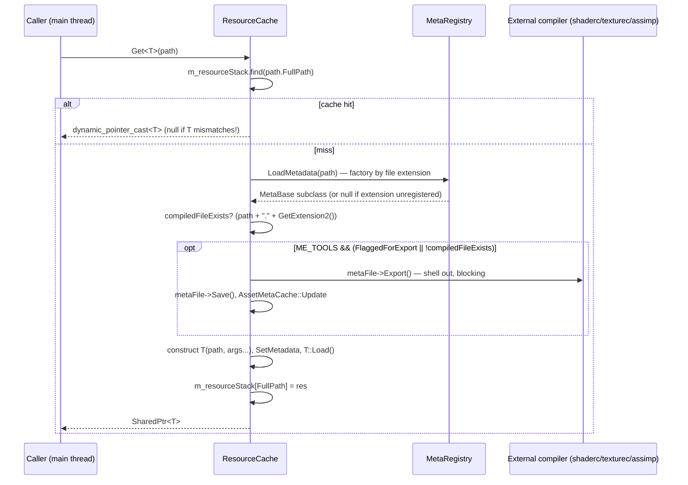

# Resources and Assets

All asset loading funnels through the `ResourceCache` singleton: a string-keyed map of `SharedPtr<Resource>` with fully **synchronous** loading, `.meta` JSON sidecars per asset, and an editor/tools-only cook step (`Export()`) that compiles sources (`.png`, `.fbx`, `.vert`…) into runtime formats (`.dds`, `.assbin`, `.<platform>.bin`). Lifetime is reference-counted with an aggressive per-frame sweep. This doc covers the load flow, the metadata/cook system, the resource type inventory, and how to add a new type.

> Verified against engine commit 047f57b8, 2026-07-10.

## Overview

A `Resource` is anything constructed from a `Path` with a `Load()` override. `ResourceCache::Get<T>(path)` is the single entry point — components call it directly during deserialization (`Mesh` materials, `AudioSource` sounds, prefab JSON…), which is why scene loading blocks on asset IO. There is no async loading, no streaming, and no load-time budget; a cold `Get<ModelResource>` pays full Assimp import on the calling (main) thread.

Cooking is driven by metadata, not by a build step: in `ME_TOOLS` builds, `Get` checks whether the asset's compiled twin exists / whether the source changed, and shells out to the appropriate compiler on the spot. Shipped (non-tools) builds only ever read the compiled files.

## Key Files

| Path | Role |
|------|------|
| `Modules/Dementia/Source/Resource/ResourceCache.h` | `Get<T>` template — the whole load/cook decision tree |
| `Modules/Dementia/Source/Resource/ResourceCache.cpp` | `Dump`, `TryToDestroy`, `LoadMetadata`, tools-only `FindByName` |
| `Modules/Dementia/Source/Resource/Resource.h` | Base class: `Load`, `Reload`, `Metadata`, `FilePath` |
| `Modules/Dementia/Source/Resource/MetaFile.h` | `MetaBase` — sidecar contract: `Export()`, `GetExtension2()`, `FlaggedForExport` |
| `Modules/Dementia/Source/Resource/MetaRegistry.h` | Extension → metadata factory map, `ME_REGISTER_METADATA` |
| `Modules/Dementia/Source/Resource/AssetMetaCache.h` / `.cpp` | Timestamp cache backing the "was it modified" check |
| `Modules/Moonlight/Source/Graphics/Texture.h` / `Modules/Moonlight/Source/Graphics/Texture.cpp` | Texture resource + `texturec` cook |
| `Modules/Moonlight/Source/Graphics/ModelResource.h` / `Modules/Moonlight/Source/Graphics/ModelResource.cpp` | Assimp model resource + `assbin` cook |
| `Modules/Moonlight/Source/Graphics/ShaderFile.h` | Shader binary resource + `shaderc` cook (see `Docs/Materials-and-Shaders.md`) |
| `Source/Resources/JsonResource.h`, `Source/Resources/SoundResource.h` | Engine-side resource types |

## How It Works

### `Get<T>` decision tree



Details that matter:

- **Cache hits skip everything** — no metadata check, no export check, and the result is `dynamic_pointer_cast<T>`: calling `Get<Texture>` on a path already cached as another type returns **null silently**.
- The missing-file paths differ: source missing + compiled missing + not flagged → `YIKES("Failed to load resource: …")` and a null return; source missing but compiled present → logs `"Shit don't exist bro: …"` and **continues** (loads from the compiled file).
- The cache key is the raw `Path::FullPath` string — no normalization/dedup beyond what `Path` itself does.

### Metadata sidecars

`LoadMetadata` looks up the file **extension** in the `MetaRegistry` and constructs the registered `MetaBase` subclass. If `<asset>.meta` exists it's parsed and deserialized; in **editor builds** a missing `.meta` is created on the spot and the asset is flagged for export. `FlaggedForExport` is also set when `AssetMetaCache` (a JSON timestamp cache, loaded at `ResourceCache` construction and saved at destruction) sees a different `LastModified` than the sidecar — and it defaults to *modified* for assets it has never seen.

Registered metadata types:

| Extension | Metadata type | Compiled twin (`GetExtension2`) | Cook tool |
|-----------|---------------|--------------------------------|-----------|
| `png`, `jpg` | `TextureResourceMetadata` (+Jpg) | `dds` | `texturec` (`--as dds`, optional `-m` mips; BC1–BC7/ETC format options) |
| `fbx`, `obj` | `ModelResourceMetadata` (+Obj) | `assbin` | Assimp binary export |
| `vert`, `frag` | `ShaderFileMetadata` / `FragShaderFileMetadata` | `<renderer>.bin` (e.g. `spirv.bin`, `dx11.bin`, `metal.bin`) | `shaderc` from `Tools/<platform>/` |
| `wav`, `mp3` | `AudioResourceMetadata` (+Mp3) — declared in `Source/Components/Audio/AudioSource.h` | — | none (pass-through) |
| `mat` | `MaterialResourceMetadata` (declared in `Modules/Moonlight/Source/Graphics/Material.h`) | `mat` | none — note the twin check degenerates to looking for `Foo.mat.mat` |

Extensions **not** in this table (e.g. `.json`, `.lvl`, `.html`) get **no metadata**: `LoadMetadata` returns null, no cook step runs, and `Get` goes straight to `T::Load()` on the source file.

### Lifetime: `Dump()` every frame

`m_resourceStack` holds one owning `SharedPtr` per resource. `ResourceCache::Dump()` — called **once per frame** at the bottom of `Engine::Run` — erases every entry whose `use_count() == 1`, i.e. anything nobody else currently references. Consequences:

- The cache is *not* an LRU or preload cache. Holding a resource across frames requires holding the `SharedPtr` (components do: `Mesh::MeshMaterial`, `AudioSource`, etc.).
- A `Get` whose result you drop is loaded, then destroyed within a frame — repeated transient `Get`s of a heavy asset thrash disk and GPU uploads.
- `TryToDestroy(Resource*)` is the targeted variant of the same refcount-1 erase.

`Reload()` exists on `Resource` but is a no-op default; there is no automatic hot-reload — the editor achieves "reimport" by flagging metadata for export and re-running `Get` after eviction.

### Tools-only path resolution

`ResourceCache::FindByName(root, filename)` (`ME_TOOLS` only) does a **recursive directory walk** matching by bare filename — convenient for editor asset lookups, `O(entire asset tree)` per call, and returns the *first* match, so duplicate filenames in different folders are ambiguous.

## How to Extend

### Add a resource type

1. Subclass `Resource`:

```cpp
// Source/Resources/CurveResource.h
#pragma once
#include "Resource/Resource.h"

class CurveResource
    : public Resource
{
public:
    CurveResource( const Path& path ) : Resource( path ) {}
    virtual bool Load() override;    // parse FilePath (or its compiled twin); return success
private:
    // parsed data
};
```

2. (Optional — only if the type needs cooking or import settings) add a `MetaBase` subclass and register it against the extension:

```cpp
struct CurveMetadata : public MetaBase
{
    CurveMetadata( const Path& p ) : MetaBase( p ) {}
    virtual std::string GetExtension2() const override { return "curvebin"; }
    virtual void Export() override { /* write FilePath + ".curvebin" */ }
    virtual void OnSerialize( json& outJson ) override {}
    virtual void OnDeserialize( const json& inJson ) override {}
};
ME_REGISTER_METADATA( "curve", CurveMetadata );
```

3. Load it anywhere with `ResourceCache::GetInstance().Get<CurveResource>( Path( "Assets/Curves/Jump.curve" ) )` and **store the `SharedPtr`** on whatever owns it — otherwise the next `Dump()` evicts it.
4. If the resource wraps GPU/API handles, release them in the destructor — that *is* reliably called on eviction (unlike cores; see `Docs/ECS.md`).

## Caveats & Fragility

- **Everything is synchronous on the main thread** — model import, texture upload, shader compile (a shell-out!) all block the frame. First-touch hitches are structural, not incidental.
- **Not thread-safe.** `m_resourceStack` is an unguarded `std::map`; calling `Get` from a job is a data race (see `Docs/Jobs-and-Events.md`).
- **Type-mismatched cache hit returns null silently** (`dynamic_pointer_cast` with no log). Two systems loading the same path as different types is a quiet failure mode.
- **Refcount-1 eviction every frame** means "cache" semantics most engines have (keep-warm, budget-based eviction) don't exist; transient `Get`s are full reloads.
- **Editor builds mutate the asset tree on read**: missing `.meta` files are created, sidecars are rewritten, exports are triggered — running the editor is not read-only with respect to `Assets/`.
- **Cook failures are soft**: `Export()` implementations shell out and don't propagate failure; a failed compile typically surfaces later as a missing/stale compiled twin (`YIKES` on next run) or a broken load.
- **`AssetMetaCache` treats unknown assets as modified** — a fresh checkout re-exports everything it touches on first editor run.
- **Path-string keying**: `Assets/Foo.png` vs an absolute path to the same file are distinct cache entries; consistency of how callers build `Path`s is load-bearing.
- **`FindByName` first-match semantics** with duplicate filenames across folders.

## Related Docs

- `Docs/Materials-and-Shaders.md` — the `shaderc` cook in full detail
- `Docs/Jobs-and-Events.md` — why `Get` must stay on the main thread
- `Docs/Serialization-and-Scenes.md` — components resolving asset paths during deserialize
- `Docs/State-of-the-Engine.md` — async-loading and cache-policy improvement notes
