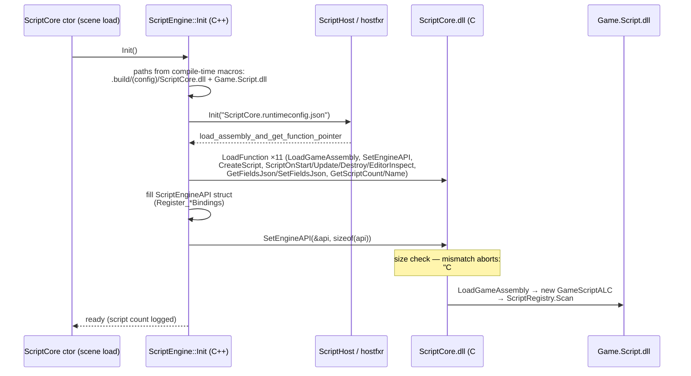

# Scripting (.NET 8)

Game scripts are C# classes implementing `IGameScript`, hosted in-process via **hostfxr** (.NET 8). The C++ side talks to managed code through a hand-maintained function-pointer table in both directions: C++ loads `[UnmanagedCallersOnly]` bridge functions from `ScriptCore.dll`, and hands C# a struct of engine callbacks (`ScriptEngineAPI`). Scripts live in a collectible `AssemblyLoadContext` — the groundwork for hot reload exists, but reload itself is not wired. This doc covers the bootstrap chain, both API surfaces, platform status, and the add-a-binding recipe.

> Verified against engine commit 047f57b8, 2026-07-10.

## Overview

The feature-flag chain is `DEFINE_ME_DOTNET` (set by Sharpmake **only when the .NET host directory exists** — see `Docs/Build-System.md`) → `ME_DOTNET` → `ME_SCRIPTING`. Scripting boots lazily: constructing a `ScriptCore` (a scene-loaded core — `Docs/ECS.md`) calls `ScriptEngine::Init()`. No `ScriptCore` in the scene's `"Cores"` array → no .NET runtime in the process.

## Key Files

| Path | Role |
|------|------|
| `Source/Scripting/ScriptHost.h` / `Source/Scripting/ScriptHost.cpp` | RAII hostfxr wrapper: init runtime, `LoadFunction("Namespace.Class, Assembly", method)` |
| `Source/Scripting/ScriptEngine.h` / `Source/Scripting/ScriptEngine.cpp` | Static façade: init, `CreateScript`, per-frame calls, fields JSON |
| `Source/Scripting/Generated/ScriptEngineAPI.generated.h` | The C++→C# callback table (**hand-written** — first line: "not actually auto generated") |
| `Source/Scripting/Bindings/BindingContext.h` / `.cpp` | Script-world pointer + name-keyed component ops (`RegisterComponent<T>`) |
| `Source/Scripting/Bindings/` (`Entity`, `ImGui`, `Components/`, `Systems/`) | Individual binding implementations |
| `Source/Scripting/ScriptCore.runtimeconfig.json` | Runtime config (net8.0) handed to hostfxr |
| `Source/Cores/Scripting/ScriptCore.cpp` | The ECS core driving `ScriptOnUpdate` per entity |
| `Source/Components/Scripting/ScriptComponent.h` | Script name + `m_dotnetHandle` + saved-fields JSON |
| `Modules/ScriptCore/Source/` | The managed side (below) |
| `Modules/ScriptCore/ScriptCore.sharpmake.cs` | Builds `ScriptCore.dll` (net8.0, unsafe) |

Managed side highlights: `IGameScript.cs` (`OnStart`/`OnUpdate(float)`/`OnDestroy`/`OnEditorInspect`), `Engine.cs` (`EngineAPIBindings` — `[StructLayout(Sequential)]` of `delegate* unmanaged<>` mirroring the C++ struct), `GameScriptALC.cs` (collectible ALC, redirects `ScriptCore` references to the loaded assembly, resolves the rest via `AssemblyDependencyResolver`), `ScriptRegistry.cs` (scans an assembly for `IGameScript` implementors, **keyed by `Type.Name`** — clash TODO in-code), `Inspector.cs` (reflection-driven ImGui field editor), `Script.cs` (base class).

## How It Works

### Bootstrap



- The dll paths are assembled from compile-time `build_prefix`/`build_platform`/`build_postfix` macros — a TODO admits this should come from Sharpmake/config. `ScriptCore.runtimeconfig.json` is read from the working directory root, not the build dir.
- The **only ABI guard is `sizeof` equality** between `ScriptEngineAPI` (C++) and `EngineAPIBindings` (C#). Same-size mistakes (reordered members, swapped same-width types) are undetectable — order and width in the two files must match exactly.

### Per-script lifecycle

`ScriptComponent::Init` (post-deserialize) calls `ScriptEngine::CreateScript(name, entityID)` — C# instantiates the registry type by name and returns an `int` handle stored in `m_dotnetHandle` — then `ScriptOnStart`. `ScriptCore::Update` walks its entities calling `ScriptOnUpdate(handle, dt)` (dormant in editor edit-mode like all loaded cores). `ScriptCore::OnEntityRemoved` fires `ScriptOnDestroy` and invalidates the handle. Public script fields round-trip as JSON (`GetFieldsJson`/`SetFieldsJson`) — that's how the editor inspector persists script data into scenes.

### Calling the engine from C#

C# calls flow through the `EngineAPIBindings` function pointers: `Engine.Log`, `Engine.GetTime`, entity ops (`Entity_IsAlive/HasComponent/AddComponent` — name-string keyed through `ScriptBindings::RegisterComponent<T>`), `Transform_Get/SetTranslation/Scale/Rotation`, `Camera_Get/SetClearColor`, `Input_IsKeyDown`, `World_CreateEntity/FindByName`, `BasicUIView_ExecuteJS`, and an ImGui subset for `OnEditorInspect`. ~26 functions total — the API is deliberately small.

Strings cross the boundary as UTF-8 `uint8_t*`; entities cross as the raw 64-bit `EntityID` value (`Docs/ECS.md`).

### Platform status

| Platform | Status |
|----------|--------|
| Win64 | ✅ `DEFINE_ME_DOTNET` when `Globals.DOTNET_Win64_Dir` (the `Microsoft.NETCore.App.Host.win-x64` native pack) exists; `nethost` copied to output |
| Linux | ✅ `Globals.DOTNET_Linux_Dir` in `Tools/BaseProject.sharpmake.cs`; the Nix dev shell (game repo `../flake.nix`) exports `DOTNET_ROOT` and discovers `DOTNET_LINUX_NATIVE_DIR` by `find`-ing the host pack inside the SDK |
| macOS | ❌ no `DEFINE_ME_DOTNET` path — scripting compiles out (the old Mono integration is gone; `ThirdParty/Mono.sharpmake.cs` is a leftover) |
| UWP | ❌ untested/unwired |

## How to Extend

### Add a script binding (engine function callable from C#)

Four places must stay in sync:

1. **Declare** the function pointer in `Source/Scripting/Generated/ScriptEngineAPI.generated.h` — append to the struct (append, don't reorder):
```cpp
void ( *Transform_LookAt )( EntityID inId, const Vector3* inTarget );
```
2. **Implement + register** in the matching binding file (`Source/Scripting/Bindings/Components/Transform.bindings.cpp`), following the `Eng_` static-function pattern, and assign it inside that file's `Register_TransformBindings( ScriptEngineAPI& )`.
3. **Mirror** it in `Modules/ScriptCore/Source/Engine.cs` — add the `delegate* unmanaged<...>` member to `EngineAPIBindings` **at the same position** with matching widths, plus a friendly wrapper on the `Engine` static class.
4. Rebuild both sides. The `sizeof` check will catch added-on-one-side-only; it will *not* catch reordering.

For a new *component* exposed to `Entity_Has/AddComponent`, call `ScriptBindings::RegisterComponent<MyComponent>( "MyComponent" )` during binding registration (`Source/Scripting/Bindings/BindingContext.h`).

### Add a game script

```csharp
public class Spinner : Script   // or any IGameScript implementor
{
    public float Speed = 90f;   // public fields surface in the inspector + serialize

    public override void OnUpdate(float dt)
    {
        var rot = Engine.Transform.GetRotation(Entity);
        rot.Y += Speed * dt;
        Engine.Transform.SetRotation(Entity, rot);
    }
}
```

Build into `Game.Script.dll` (the game's `UserGameScript` Sharpmake project), add a `ScriptComponent` naming `Spinner` to an entity, and make sure the scene loads `ScriptCore`.

## Caveats & Fragility

- **The "generated" API isn't generated** — two hand-maintained mirrors with a `sizeof` tripwire. Reordering or same-width type swaps corrupt calls silently. Treat the struct as append-only.
- **Script lookup is `Type.Name`** — two scripts with the same class name in different namespaces clash (in-code TODO).
- **`World_FindByName` is broken by design right now**: the binding only scans the scene root's *direct children* (in-code: "this shit is busted… needs a proper recursive walk").
- **Hot reload is unfinished**: `GameScriptALC` is collectible and `ReloadGameAssembly` exists on the C# side, but the C++ load of it is commented out — changing scripts means restarting.
- **Handles are bare ints** with no generation — a stale `m_dotnetHandle` after a failed load is `-1`-guarded, but nothing validates live handles against instance identity.
- **Paths are compile-time guesses** (`.build/<config>/…`, runtimeconfig in CWD) — running the executable from a different working directory breaks script init with `YIKES` logs.
- **Scripting requires the scene to declare `ScriptCore`** — a `ScriptComponent` without the core silently never runs (component `Init` still creates the instance if the engine initialized scripting earlier in another scene).
- **All script calls are synchronous on the main thread** — a slow `OnUpdate` is a frame hitch; there is no script sandboxing or time budget.

## Related Docs

- `Docs/ECS.md` — `ScriptCore` as a scene-loaded core; `EntityID` semantics
- `Docs/Build-System.md` — `DOTNET_*_Dir` detection, `ScriptCore`/`UserGameScript` projects, flake.nix
- `Docs/Editor-Havana.md` — where `OnEditorInspect` renders
- `Docs/State-of-the-Engine.md` — codegen and hot-reload recommendations
