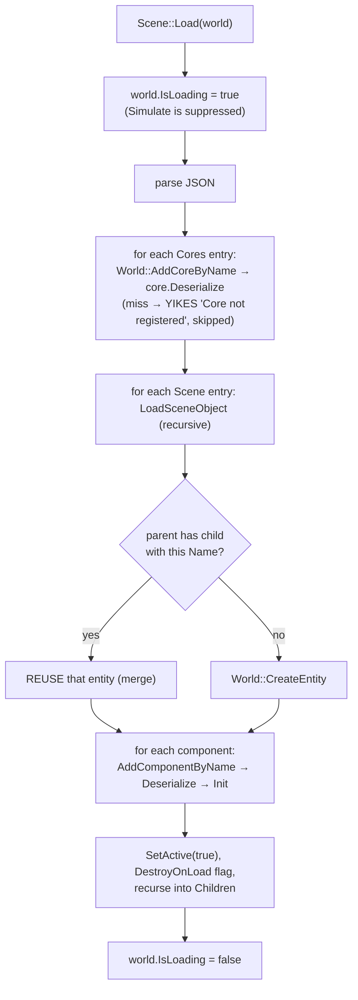

# Serialization and Scenes

Scenes are JSON `.lvl` files: a `"Cores"` array naming the systems the scene needs, and a `"Scene"` array of entities — each a `Name`, a `Components` list, and recursive `Children`. Everything is instantiated **by registry name string**; there is no schema version, no migration, and no asset GUIDs. Prefabs are the same entity-JSON shape loaded through `World::CreateFromPrefab`. This doc covers both formats, the load/save flows, and the merge-by-name semantics that make model expansion work.

> Verified against engine commit 047f57b8, 2026-07-10.

## Overview

The serialization contract is defined by the ECS base classes (`Docs/ECS.md`): components implement `OnSerialize(json&)` / `OnDeserialize(const json&)` with `Init()` guaranteed after deserialize; cores implement the same pair, where the sealed `Serialize` writes the `"Type"` name. Scene structure mirrors the **transform hierarchy** — saving walks `Transform` children from the scene root, which has consequences (below).

## Key Files

| Path | Role |
|------|------|
| `Source/World/Scene.h` / `Source/World/Scene.cpp` | `.lvl` load/save, `LoadSceneObject`, `SaveSceneRecursively`, `LoadCore` |
| `Source/Engine/World.cpp` | `CreateFromPrefab` / `LoadPrefab` (same shape, JSON via `ResourceCache`) |
| `Source/ECS/ComponentDetail.h` / `Source/ECS/CoreDetail.h` | The name → factory registries everything resolves through |
| `Source/Engine/Engine.cpp` | `Engine::LoadScene` — the orchestration around `Scene::Load` (see `Docs/Architecture.md`) |

## How It Works

### The `.lvl` format

Real example (trimmed from `../Assets/Example.lvl` in the Drumsmith project):

```json
{
    "Cores": [
        { "Type": "NoteHighwayCore" }
    ],
    "Scene": [
        {
            "Name": "Snare1",
            "DestroyOnLoad": true,
            "Components": [
                {
                    "Type": "Transform",
                    "Position": [-1.0, 0.0, 0.0],
                    "Rotation": [0.0, -0.0, 0.0],
                    "Scale": [1.0, 1.0, 1.0]
                }
            ],
            "Children": [ /* same entity shape, recursive */ ]
        }
    ]
}
```

- `"Cores"` entries carry a `"Type"` (registered core name — game cores like `NoteHighwayCore` included) plus whatever the core's `OnSerialize` wrote. Cores flagged `SetIsSerializable(false)` (e.g. `RenderCore`) never appear.
- Entity `"Name"` is stored on the entity's **Transform** — it's assigned via `Transform::SetName` on load and read from `Transform::GetName()` on save.
- Component objects carry `"Type"` + component-specific fields (e.g. `Mesh` embeds a `"Material"` object — see `Docs/Materials-and-Shaders.md`).

### Load flow



Key behaviors:

- **Merge-by-name**: when loading a child entity, if the parent's transform already has a child with the same name, that entity is **reused** and components deserialize onto it. This is deliberate: `Model::Init` (run during the parent's component loop) expands model files into child entities (`Docs/Cores-and-Components-Reference.md`); when the scene JSON then loads those same children, merge-by-name updates the spawned entities instead of duplicating them. Root-level entities (no parent) never merge.
- Components/cores whose registry name isn't found are **skipped with a log line**, and the rest of the entity keeps loading — a renamed class silently drops its data from every existing scene.
- `AddComponentByName` on a reused entity that already has the component returns the existing one (`AddComponent` semantics), so re-deserialization mutates in place.
- `World::Simulate` returns immediately while `IsLoading` — entity↔core reconciliation happens after load, in the `Simulate()` call inside `Engine::LoadScene`.
- `Scene::Load` returning false (empty/missing file) is an assert unless the scene `IsNewScene()` (empty path).

### Save flow (`Scene::Save`, editor-only)

Walks the **transform hierarchy** from the scene root: for each transform child — `Name`, `DestroyOnLoad` (from the entity), every component's `Serialize`, then recursion into transform children. Cores are appended from `World::GetAllCores()`, filtered by `GetIsSerializable()`. Output is pretty-printed JSON (`dump(4)`), and also **echoed to stdout** (`std::cout`) on every save.

Because traversal is transform-based:

- **Entities without a `Transform` are never saved.** They exist at runtime only.
- Entity order in the file is child-vector order, and *all* live entities under the root get saved — including runtime-spawned ones (unless the game removes them before save; `DestroyOnLoad` only affects *unloading*, not saving).

### Prefabs

`World::CreateFromPrefab(path, parentTransform)` loads the JSON through `ResourceCache::Get<JsonResource>` (parsed once, cached — see `Docs/Resources-and-Assets.md`) and runs `LoadPrefab`, which is the same recursive entity-loading logic (including merge-by-name against the target parent). There is no prefab *saving* API and no nested-prefab or override system — a prefab is just an entity subtree in a `.json` file under `Assets/`.

## Caveats & Fragility

- **Names are the schema.** Component class names, core class names, and material type names are the only linkage between files and code. Renaming any of them orphans data in every scene/prefab silently (one warning log per instance at load). There is no versioning or migration hook — if you rename, migrate the JSON yourself (`grep` + `sed` over `Assets/`).
- **No asset GUIDs**: components store raw relative paths to assets; moving/renaming an asset breaks references with no editor-assisted fixup.
- **Merge-by-name is also a collision hazard**: two sibling entities with the same name merge into one on load; the second's components overwrite the first's.
- **Save-echo to stdout** and save being editor-only means game builds cannot persist world state through this path (no runtime save-game system).
- **Duplicate component entries** in JSON deserialize onto the same instance sequentially (last one wins per field).
- **`DestroyOnLoad: false` entities survive `World::Unload`** but are still written into whatever scene you save while they're alive — easy to leak persistent singletons into unrelated scene files.
- **Transform is load-bearing**: the `"Name"` and the hierarchy live on it; an entity without one is invisible to save and unparentable at load.

## Related Docs

- `Docs/ECS.md` — registries, `AddComponentByName`, `Init`-after-deserialize contract
- `Docs/Architecture.md` — `Engine::LoadScene` orchestration and the double-`Simulate` quirk
- `Docs/Materials-and-Shaders.md` — the embedded material JSON
- `Docs/Editor-Havana.md` — how play-in-editor uses save/load round-trips
- `Docs/State-of-the-Engine.md` — versioning/migration recommendations
