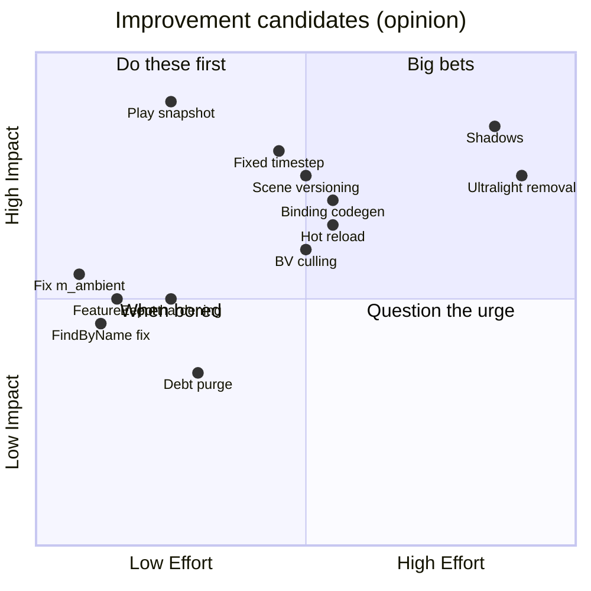

# State of the Engine

> **This doc is opinion.** Every other doc in `Docs/` is factual; this one rates, prioritizes, and recommends. Never cite it as a description of behavior — cite the subsystem docs. Assessed at engine commit 047f57b8, 2026-07-10; scorecard rows for the core runtime re-scored at dab803a2, 2026-10-08 (overhaul Waves 0–1); editor, serialization and rendering-tooling rows at 7e869c6e, 2026-10-09 (Wave 2); rendering, lighting and materials rows at 1fa55311, 2026-10-09 (Wave 3); physics at 8fdd99b1, 2026-10-09 (Wave 4); animation at 07617c5f, 2026-10-09; audio at afce7083, 2026-10-09; input at e0ca1f26, 2026-10-09; scripting at 6a4b006f, 2026-10-09; navigation at 8d6769a5, 2026-10-10.

MitchEngine is a real, working engine: it ships Drumsmith, runs a full editor on Linux/Windows, hosts .NET 8 scripting, and has genuinely thoughtful hot paths (the zero-virtual render submit, automatic instancing, transform dirty caching). Its weaknesses are the classic solo-engine kind: half-migrations left in place (Mono→.NET, fixed→variable timestep, Ultralight→web-UI), correctness debt that hasn't hurt *yet* (variable-dt physics, name-string schemas), and workflow traps that cost real work (Stop-reverts-to-last-save). The theme of this assessment: **finish or delete the half-things, then invest where the engine already punches above its weight.**

## 1. Maturity Scorecard

Ratings: **Solid** (rely on it) · **Usable** (works, know the sharp edges) · **Fragile** (works until it doesn't) · **Experimental** (incomplete by design) · **Abandoned-in-place** (do not extend).

| Subsystem | Rating | Why (one line) | Doc |
|-----------|--------|----------------|-----|
| Input | **Usable** | Action maps with prioritized, consuming contexts, composites, modifiers, interactive rebinding with persisted overrides, gamepads with deadzones and rumble, editable in the asset browser, local multiplayer (a map per player, pad pairing, join on button press, scriptable), unit tested; gamepad I/O unverified on hardware, pairing is by slot | [Input.md](Input.md) |
| Platform/Window/Input/Config | **Solid** | SDL2 everywhere, boring in the good way; DPI + crash-safe config are the gaps | [Platform-Window-Input-Config.md](Platform-Window-Input-Config.md) |
| ECS core | **Solid** | Generational ids, paged pools, deferred structural changes, lifecycle hooks, O(1) membership, unit tested | [ECS.md](ECS.md) |
| Frame loop & timing | **Usable** | Fixed timestep + pause/step/time scale/frame cap, deterministic `--frame-time`, full GPU teardown on exit; engine-core update order still hardcoded | [Architecture.md](Architecture.md) |
| Jobs | **Solid** | Work stealing, helping waits, allocation-free ParallelFor, stress tested | [Jobs-and-Events.md](Jobs-and-Events.md) |
| Events | **Usable** | Thread-safe queue, auto-deregistering receivers, safe re-entrant dispatch; still string-free but untyped `OnEvent` switches | [Jobs-and-Events.md](Jobs-and-Events.md) |
| Rendering pipeline | **Solid** | Zero-virtual submit + auto-instancing, AABB culling, a view allocator, linear HDR with a full post stack, soft particles; unverified on non-Vulkan backends and unmeasured on GPUs at 57k-mesh scale with shadows | [Rendering-Pipeline.md](Rendering-Pipeline.md) |
| Lighting & shadows | **Usable** | PBR + clustered point/spot lights, stable CSM sun shadows, spot and point-light shadows (cube faces in one atlas), IBL probes, lit smoke, height fog with volumetric light shafts (sun, point and spot lights); one shadowed sun, fixed shadow budgets, screen-space (not froxel) volumetrics | [Rendering-Pipeline.md](Rendering-Pipeline.md) |
| Materials & shaders | **Usable** | Metallic-roughness StandardMaterial, live shader hot reload with include tracking; batch-key discipline is manual; ShaderGraph half-finished; compiles block the main thread | [Materials-and-Shaders.md](Materials-and-Shaders.md) |
| Resources & assets | **Usable** | Hot reload, keep-alive cache, asset GUIDs, background texture and model loads (the main thread only uploads and builds), model unit conversion, unit tested; cooking and shader loads still block the main thread | [Resources-and-Assets.md](Resources-and-Assets.md) |
| Serialization & scenes | **Solid** | Versioned v2 format with GUIDs, references, migration and prefab links with stable source GUIDs; asset references are paths backed by asset GUIDs that follow moves and renames; declared renames (component, core, field and script aliases) keep old data loading | [Serialization-and-Scenes.md](Serialization-and-Scenes.md) |
| Physics | **Solid** | Box3D and Box2D cores with the same model: fixed step + interpolation, compound bodies, joints, mover-based 3D and platformer characters, layer matrix, events and queries, unit + editor-flow tested; Box3D is pre-1.0, and C++ code subscribes to one global CollisionEvent (scripts get per-entity callbacks) | [Physics.md](Physics.md) |
| Navigation | **Usable** | Recast/Detour with tiled parallel async bakes saved next to the scene, areas with costs, modifiers, volumes and links, DetourCrowd agents with avoidance and link arcs, queries from C++ and C#, editor bake / overlay, runtime obstacle carving (background tile rebuilds), an out-of-date warning, named agent types (surfaces bake for one, agents and queries use theirs), unit + editor-flow + game-build tested; a re-bake per agent type | [Navigation.md](Navigation.md) |
| Animation | **Usable** | Clip import, bone entities, a real state machine (parameters, exit times, cross-fades, 1D and 2D blends, events), masked override and additive layers, root motion through the character controller, edit-mode previews that never leak into saves, root motion with turning, and GPU skinning in the main, shadow and picking passes, unit + editor-flow tested; one-state previews, linear keys | [Animation.md](Animation.md) |
| Audio | **Usable** | Mixer buses in Project Settings, listener, positioned sources with rolloff and doppler, overlapping one-shots, streamed sources for music, reverb zones, physics occlusion with lowpass, pause with the game, silent automated runs, unit + editor-flow tested; no async loads, sound propagation or FMOD Studio | [Audio.md](Audio.md) |
| Scripting (.NET 8) | **Usable** | Generated ABI from one manifest, hot reload that keeps field values, engine-owned lifecycle (start after physics sync, fixed update), a gameplay API (input actions, physics with collision / trigger callbacks, character, navigation, audio, scenes, debug draw), every component's fields by name, CLI builds on Linux, editor-flow tested; no macOS host, Win64 CLI path untested | [Scripting-DotNet.md](Scripting-DotNet.md) |
| UI (Ultralight) | **Abandoned-in-place** | 60 fps cap + licensing friction; replacement (web/Vue direction) in progress — do not extend | [UI-Ultralight-and-ImGui.md](UI-Ultralight-and-ImGui.md) |
| Editor (Havana) | **Solid** | Selection/undo/actions services, in-memory play snapshots, autosave + recovery, multi-object gizmos, reflection inspector with multi-edit, prefab overrides, asset browser v2 whose moves and renames keep references intact, scripted regression tests; non-reflected components are the gap | [Editor-Havana.md](Editor-Havana.md) |
| QA automation | **Solid** | doctest unit tests (93 cases), scripted editor flows per subsystem, deterministic `--frame-time` captures with screenshot regression over showcase scenes, unattended runs that never touch user settings or speakers; no CI running the editor flows or screenshots yet | [Architecture.md](Architecture.md) |
| Build system | **Usable** | Sharpmake graph is coherent; features still follow which SDK directories exist, but generation now reports what it found and how to fix what's missing | [Build-System.md](Build-System.md) |

## 2. Platform Support Matrix

| Capability | Win64 | Linux | macOS | UWP |
|------------|-------|-------|-------|-----|
| Build + run game | ✅ primary | ✅ active dev | ⚠️ historically yes, not recently verified | ⚠️ configs exist, untested |
| Havana editor | ✅ | ✅ | ⚠️ unverified | — |
| Scripting (.NET 8) | ✅ (hot reload unverified) | ✅ (Nix shell; scripts built with the dotnet CLI) | ❌ no host path (Mono era ended) | ❌ |
| Audio (FMOD) | ✅ | ✅ | ✅ (SDK path exists) | ✅ (SDK path exists) |
| Navigation (Recast/Detour) | ⚠️ written, unverified | ✅ | ⚠️ written, unverified | ⚠️ untested |
| UI (Ultralight 1.4) | ✅ | ✅ (GTK3 stack) | ✅ | ❌ |
| Profiling (Optick) | ✅ | ⚠️ engine parses `.opt` captures, but the build define is Win64-only | ❌ | ❌ |
| Graphics backend | D3D11/12 | Vulkan (forced) | Metal | D3D11 (forced; DX12 shader issues) |

The stated bar (per the game project's conventions) is: Win64/macOS/Linux must compile and run; UWP must not be actively broken. macOS is the platform most at risk of silent rot — no scripting, no CI, no recent verification.

## 3. Half-Finished & Vestigial Inventory

| Item | Location | State | Verdict |
|------|----------|-------|---------|
| `ShaderGraphMaterial` + ShaderEditor | `Modules/Moonlight/Source/Materials/ShaderGraphMaterial.h`, `Tools/ShaderEditor` | Texture-slot-3 bug, per-instance uniform creation, external tool dependency | **Decide** — finish (fix slots, ship the tool) or delete and stay code-material-only |
| Ultralight | `Source/UI/`, `Source/Cores/UI/` | Removal declared in commit history; Vue/web direction visible in `../flake.nix` | **Finish the removal** |
| `IsRunning` check in `Simulate` | `Source/Engine/World.cpp` (`//continue;`) | Deliberately (?) disabled | **Decide** the intended semantics and either restore or remove the dead check |

## 4. Improvement Themes

Impact (H/M/L) × Effort (S/M/L). Grouped so related items can share one work session.

### A. Correctness & data safety
| Item | Impact | Effort | Notes |
|------|--------|--------|-------|
| ~~Editor: snapshot world on Play~~ | — | — | Done (Wave 2): in-memory snapshot, selection and undo survive Stop |
| ~~Fixed timestep for physics~~ | — | — | Done (Wave 1 loop + Wave 4 Box3D core): fixed steps with interpolated poses |
| ~~Component/core rename migration~~ | — | — | Done: `ME_REGISTER_COMPONENT_ALIAS` / `ME_REGISTER_CORE_ALIAS`, `.FormerName()` on reflected fields, `[FormerName]` for scripts |
| ~~Fix `m_ambient`~~ | — | — | Done (Wave 3): ambient is image-based from per-camera environment probes |
| ~~Event-system hardening~~ | — | — | Done (Wave 1): auto-deregistering receivers, a thread-safe queue drained at frame start, safe re-entrant dispatch |
| ~~Quaternion transform sync in physics~~ | — | — | Done (Wave 4): poses sync as quaternions |

### B. Rendering
| Item | Impact | Effort | Notes |
|------|--------|--------|-------|
| GPU validation of the Wave 3 renderer | **H** | S | Measure the 57k-mesh bench with shadows and IBL on real hardware, and smoke-test D3D11/Metal (only Vulkan/lavapipe verified) |
| ~~Point-light shadows~~ | — | — | Done: six faces per light in the local shadow atlas |
| ~~Lit particles~~ | — | — | Done: `ParticleSystem::Lit` shades smoke with the sun, local lights, their shadows and ambient |
| ~~Parallel shadow caster culling~~ | — | — | Done: one gather per frame, one parallel cull per pass for all its views (-24% CPU at 57k meshes on a busy machine) |
| ShaderGraph finish-or-delete | M | M/L | Decide before any new material work builds on it |

### C. Scripting
| Item | Impact | Effort | Notes |
|------|--------|--------|-------|
| ~~Binding codegen~~ | — | — | Done: `ScriptAPI.def` + `Tools/GenerateScriptAPI.py` generate both halves |
| ~~Hot reload~~ | — | — | Done: rebuild on a worker thread, swap the ALC, same handles, fields restored |
| ~~Collision/trigger callbacks + generic component get/set~~ | — | — | Done: `OnCollisionEnter/Exit`, `OnTriggerEnter/Exit`, and `Entity.GetField/SetField` over reflection paths |
| macOS .NET host | M | M | Same hostfxr dance with the osx-x64/arm64 host pack; restores platform parity |
| ~~Fix `World_FindByName`~~ | — | — | Done: searches the whole world |

### D. Editor & workflow
| Item | Impact | Effort | Notes |
|------|--------|--------|-------|
| Finish Ultralight removal | **H** | L | Unblocks UI work, deletes the GTK3 dependency tail and the 60 fps cap |
| ~~Undo coverage + dirty-scene indicator~~ | — | — | Done (Wave 2): transactions cover properties, create/delete/duplicate, reparenting and components; `*` in the title when dirty |
| ~~Generation-time feature report~~ | — | — | Done: generation prints each optional feature, on / OFF, with the fix |
| Async cooking and shader loads | M | M | Textures and models load in the background (`GetAsync`); first-time cooking (texturec, Assimp export, shaderc) and shader loads still run on the main thread |

### E. Debt removal (one satisfying purge)
Done (overhaul): the legacy job systems, Mono files, `Canvas.h`, `UpdateMesh`, `UWPWindow` and the boot-log noise are gone. The legacy `Collider2D` is gone too (Box2D colliders replaced it). Left: stale includes in `Source/Engine/Engine.h`.

## 5. Top 10 Priorities

1. ~~Snapshot-on-Play~~ — done in Wave 2 (in-memory snapshot; selection and undo survive Stop). → `Editor-Havana.md`
2. ~~Fix `m_ambient`~~ — done in Wave 3 (the legacy uniform is gone; ambient is image-based). → `Rendering-Pipeline.md`
3. ~~Debt purge (theme E)~~ — mostly done (see theme E for what's left).
4. ~~Fixed timestep for physics~~ — done (Wave 4: Box3D `PhysicsCore` in the fixed loop with interpolation). → `Physics.md`
5. ~~Scene versioning + rename aliases~~ — done (v2 format with migration; component/core aliases, field and script `FormerName`s; asset references follow moves by GUID). → `Serialization-and-Scenes.md`
6. **Finish Ultralight removal** — *why now:* it's already declared dead; limbo is the worst state. *First step:* land the web-UI spike behind `ME_UI`, delete `Source/UI/Graphics/GPUDriver.*` last. → `UI-Ultralight-and-ImGui.md`
7. ~~Script binding codegen~~ — done (`ScriptAPI.def` + generator with a `--check` mode). → `Scripting-DotNet.md`
8. ~~Script hot reload~~ — done (editing a `.cs` rebuilds and swaps in place; fields survive), and so are collision callbacks and generic component access. → `Scripting-DotNet.md`
9. ~~Bounding-volume culling~~ — done (AABB per mesh, tested in the mesh job). → `Rendering-Pipeline.md`
10. ~~Shadow mapping~~ — done in Wave 3 (cascaded sun + spot shadows). Next rendering priority: validate on real GPUs and non-Vulkan backends. → `Rendering-Pipeline.md`

## 6. Reassessment Triggers

Re-score the affected rows when any of these land: Ultralight removal completes (UI row + Linux deps) · shadows/multi-light ship (lighting row) · scripting ships inside a released game build (scripting row) · a macOS build is verified again (platform matrix) · fixed timestep lands (frame loop + physics rows) · scene versioning lands (serialization row). Also re-stamp any subsystem doc whose behavior these changes touch — the freshness contract in [README.md](README.md) applies to this doc too.
