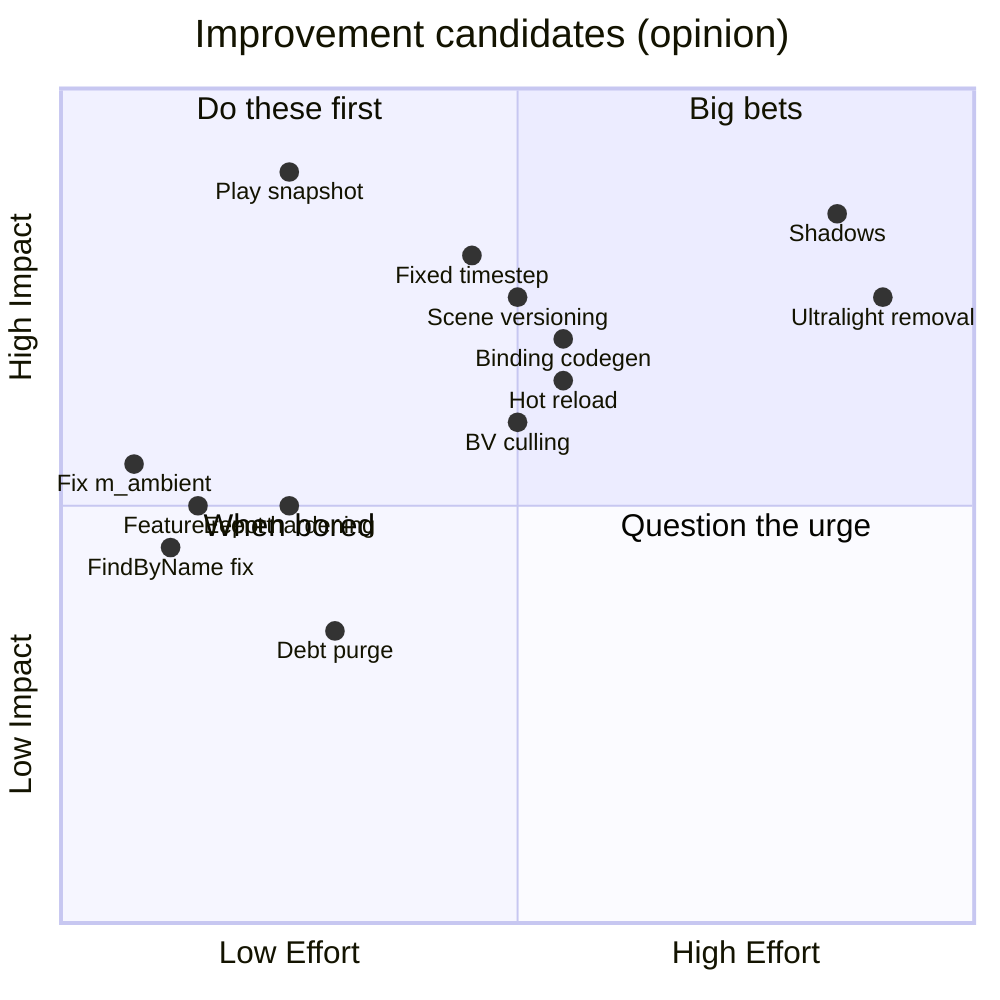

# State of the Engine

> **This doc is opinion.** Every other doc in `Docs/` is factual; this one rates, prioritizes, and recommends. Never cite it as a description of behavior — cite the subsystem docs. Assessed at engine commit 047f57b8, 2026-07-10; scorecard rows for the core runtime re-scored at dab803a2, 2026-10-08 (overhaul Waves 0–1); editor, serialization and rendering-tooling rows at 7e869c6e, 2026-10-09 (Wave 2); rendering, lighting and materials rows at 1fa55311, 2026-10-09 (Wave 3); physics at 8fdd99b1, 2026-10-09 (Wave 4).

MitchEngine is a real, working engine: it ships Drumsmith, runs a full editor on Linux/Windows, hosts .NET 8 scripting, and has genuinely thoughtful hot paths (the zero-virtual render submit, automatic instancing, transform dirty caching). Its weaknesses are the classic solo-engine kind: half-migrations left in place (Mono→.NET, fixed→variable timestep, Ultralight→web-UI), correctness debt that hasn't hurt *yet* (variable-dt physics, name-string schemas), and workflow traps that cost real work (Stop-reverts-to-last-save). The theme of this assessment: **finish or delete the half-things, then invest where the engine already punches above its weight.**

## 1. Maturity Scorecard

Ratings: **Solid** (rely on it) · **Usable** (works, know the sharp edges) · **Fragile** (works until it doesn't) · **Experimental** (incomplete by design) · **Abandoned-in-place** (do not extend).

| Subsystem | Rating | Why (one line) | Doc |
|-----------|--------|----------------|-----|
| Platform/Window/Input/Config | **Solid** | SDL2 everywhere, boring in the good way; DPI + crash-safe config are the gaps | [Platform-Window-Input-Config.md](Platform-Window-Input-Config.md) |
| ECS core | **Solid** | Generational ids, paged pools, deferred structural changes, lifecycle hooks, O(1) membership, unit tested | [ECS.md](ECS.md) |
| Frame loop & timing | **Usable** | Fixed timestep + pause/step/time scale/frame cap; engine-core update order still hardcoded; partial teardown (no bgfx shutdown) | [Architecture.md](Architecture.md) |
| Jobs | **Solid** | Work stealing, helping waits, allocation-free ParallelFor, stress tested | [Jobs-and-Events.md](Jobs-and-Events.md) |
| Events | **Usable** | Thread-safe queue, auto-deregistering receivers, safe re-entrant dispatch; still string-free but untyped `OnEvent` switches | [Jobs-and-Events.md](Jobs-and-Events.md) |
| Rendering pipeline | **Solid** | Zero-virtual submit + auto-instancing, AABB culling, a view allocator, linear HDR with a full post stack, soft particles; unverified on non-Vulkan backends and unmeasured on GPUs at 57k-mesh scale with shadows | [Rendering-Pipeline.md](Rendering-Pipeline.md) |
| Lighting & shadows | **Usable** | PBR + clustered point/spot lights, stable CSM sun shadows, spot shadows and IBL probes; no point-light shadows, unlit particles, one shadowed sun | [Rendering-Pipeline.md](Rendering-Pipeline.md) |
| Materials & shaders | **Usable** | Metallic-roughness StandardMaterial, live shader hot reload with include tracking; batch-key discipline is manual; ShaderGraph half-finished; compiles block the main thread | [Materials-and-Shaders.md](Materials-and-Shaders.md) |
| Resources & assets | **Usable** | Hot reload, keep-alive cache, asset GUIDs; loads still synchronous on the main thread | [Resources-and-Assets.md](Resources-and-Assets.md) |
| Serialization & scenes | **Solid** | Versioned v2 format with GUIDs, references, migration and prefab links with stable source GUIDs; asset references are still paths | [Serialization-and-Scenes.md](Serialization-and-Scenes.md) |
| Physics | **Solid** | Box3D and Box2D cores with the same model: fixed step + interpolation, compound bodies, joints, mover-based 3D and platformer characters, layer matrix, events and queries, unit + editor-flow tested; Box3D is pre-1.0 and CollisionEvent is global (no per-entity callbacks) | [Physics.md](Physics.md) |
| Audio | **Usable** | FMOD basics + event-driven fire-and-forget; nonstandard update signature; feature-thin (no 3D emitters/mixing story) | [Cores-and-Components-Reference.md](Cores-and-Components-Reference.md) |
| Scripting (.NET 8) | **Experimental** | The hosting chain is genuinely impressive and works on Win64+Linux; hand-mirrored ABI, no hot reload, no macOS | [Scripting-DotNet.md](Scripting-DotNet.md) |
| UI (Ultralight) | **Abandoned-in-place** | 60 fps cap + licensing friction; replacement (web/Vue direction) in progress — do not extend | [UI-Ultralight-and-ImGui.md](UI-Ultralight-and-ImGui.md) |
| Editor (Havana) | **Solid** | Selection/undo/actions services, in-memory play snapshots, autosave + recovery, multi-object gizmos, reflection inspector with multi-edit, prefab overrides, asset browser v2, scripted regression tests; non-reflected components and path-based asset refs are the gaps | [Editor-Havana.md](Editor-Havana.md) |
| Build system | **Usable** | Sharpmake graph is coherent; silent directory-existence feature variance bites every fresh machine | [Build-System.md](Build-System.md) |

## 2. Platform Support Matrix

| Capability | Win64 | Linux | macOS | UWP |
|------------|-------|-------|-------|-----|
| Build + run game | ✅ primary | ✅ active dev | ⚠️ historically yes, not recently verified | ⚠️ configs exist, untested |
| Havana editor | ✅ | ✅ | ⚠️ unverified | — |
| Scripting (.NET 8) | ✅ | ✅ (Nix shell wiring) | ❌ no host path (Mono era ended) | ❌ |
| Audio (FMOD) | ✅ | ✅ | ✅ (SDK path exists) | ✅ (SDK path exists) |
| UI (Ultralight 1.4) | ✅ | ✅ (GTK3 stack) | ✅ | ❌ |
| Profiling (Optick) | ✅ | ⚠️ engine parses `.opt` captures, but the build define is Win64-only | ❌ | ❌ |
| Graphics backend | D3D11/12 | Vulkan (forced) | Metal | D3D11 (forced; DX12 shader issues) |

The stated bar (per the game project's conventions) is: Win64/macOS/Linux must compile and run; UWP must not be actively broken. macOS is the platform most at risk of silent rot — no scripting, no CI, no recent verification.

## 3. Half-Finished & Vestigial Inventory

| Item | Location | State | Verdict |
|------|----------|-------|---------|
| Mono remnants | `ThirdParty/Mono.sharpmake.cs`, `Globals.MONO_*_Dir` checks | Define nothing | **Delete** |
| `Canvas` | `Source/Components/UI/Canvas.h` | Empty file | **Delete** |
| `ShaderGraphMaterial` + ShaderEditor | `Modules/Moonlight/Source/Materials/ShaderGraphMaterial.h`, `Tools/ShaderEditor` | Texture-slot-3 bug, per-instance uniform creation, external tool dependency | **Decide** — finish (fix slots, ship the tool) or delete and stay code-material-only |
| Ultralight | `Source/UI/`, `Source/Cores/UI/` | Removal declared in commit history; Vue/web direction visible in `../flake.nix` | **Finish the removal** |
| `ScriptEngineAPI.generated.h` | `Source/Scripting/Generated/` | Hand-written mirror pair with `sizeof` tripwire | **Automate** — generate both sides from one description |
| Script hot reload | `Modules/ScriptCore/Source/GameScriptALC.cs` (collectible ALC) + commented `ReloadGameAssembly` | Groundwork only | **Finish** — the hard part (ALC isolation) is done |
| `World_FindByName` binding | `Source/Scripting/Bindings/Systems/World.bindings.cpp` | Scans root's direct children only (in-code "this shit is busted") | **Fix** (small: recursive walk or name index) |
| `RenderCore::UpdateMesh` | `Source/Cores/Rendering/RenderCore.cpp` | Fully commented out | **Delete** (the per-frame job rewrite made it moot) |
| `UWPWindow` | `Source/Window/UWPWindow.cpp` | Superseded by SDLWindow-on-UWP | **Delete or revive** with a UWP pass |
| `IsRunning` check in `Simulate` | `Source/Engine/World.cpp` (`//continue;`) | Deliberately (?) disabled | **Decide** the intended semantics and either restore or remove the dead check |
| Boot log noise | `YIKES("Engine::InitGame")`, `BRUH("renderFrame")`×2, save-echo to stdout | Error/warn-level noise every session | **Clean** (trivial) |

## 4. Improvement Themes

Impact (H/M/L) × Effort (S/M/L). Grouped so related items can share one work session.

### A. Correctness & data safety
| Item | Impact | Effort | Notes |
|------|--------|--------|-------|
| ~~Editor: snapshot world on Play~~ | — | — | Done (Wave 2): in-memory snapshot, selection and undo survive Stop |
| ~~Fixed timestep for physics~~ | — | — | Done (Wave 1 loop + Wave 4 Box3D core): fixed steps with interpolated poses |
| Scene versioning + rename migration | **H** | M | Minimal viable: `"Version"` field + a name-alias map consulted by the registries |
| Fix `m_ambient` | M | **S** | Uninitialized GPU uniform; also unlocks actually *having* ambient light |
| Event-system hardening | M | S–M | Auto-deregistering `EventReceiver` destructor + main-thread assert; optionally finish the queue |
| ~~Quaternion transform sync in physics~~ | — | — | Done (Wave 4): poses sync as quaternions |

### B. Rendering
| Item | Impact | Effort | Notes |
|------|--------|--------|-------|
| GPU validation of the Wave 3 renderer | **H** | S | Measure the 57k-mesh bench with shadows and IBL on real hardware, and smoke-test D3D11/Metal (only Vulkan/lavapipe verified) |
| Point-light shadows | M | M | Cube or dual-paraboloid maps in the spot atlas scheme |
| Lit particles | M | M | Ambient/IBL + clustered lights for alpha particles (smoke currently ignores lighting) |
| Parallel shadow caster culling | M | S | One pass over commands for all cascades, ParallelFor; ~1.5 ms CPU at 57k meshes today |
| ShaderGraph finish-or-delete | M | M/L | Decide before any new material work builds on it |

### C. Scripting
| Item | Impact | Effort | Notes |
|------|--------|--------|-------|
| Binding codegen (single source of truth) | **H** | M | Generate `ScriptEngineAPI.generated.h` + `EngineAPIBindings` from one manifest; deletes the ABI-drift class of bugs |
| Hot reload | **H** | M | `ReloadGameAssembly` + ALC unload + re-`CreateScript` with fields JSON re-applied |
| macOS .NET host | M | M | Same hostfxr dance with the osx-x64/arm64 host pack; restores platform parity |
| Fix `World_FindByName` | M | **S** | Known-broken API surface |

### D. Editor & workflow
| Item | Impact | Effort | Notes |
|------|--------|--------|-------|
| Finish Ultralight removal | **H** | L | Unblocks UI work, deletes the GTK3 dependency tail and the 60 fps cap |
| Undo coverage + dirty-scene indicator | M | M | Wrap component add/remove + hierarchy ops in `ICommand`s |
| Generation-time feature report | M | **S** | Print the `DEFINE_ME_*` set per target at Sharpmake time; ends "why is FMOD off" debugging (`Build-System.md`) |
| Async asset import / keep-warm cache | M | M–L | At minimum: stop evicting refcount-1 resources every frame; add an editor preload set |

### E. Debt removal (one satisfying purge)
Legacy job systems, Mono files, `Collider2D`, `Canvas.h`, `UpdateMesh`, `UWPWindow`, log noise, stale includes in `Source/Engine/Engine.h`. Impact L each but **compounding** — every deleted decoy makes the codebase more honest. Effort: S, mostly deletions.

## 5. Top 10 Priorities

1. **Snapshot-on-Play** — *why now:* it silently destroys real work today. *First step:* serialize to a temp `.lvl` in `EditorApp::StartGame`, reload it (not the config scene) in `StopGame`. → `Editor-Havana.md`
2. ~~Fix `m_ambient`~~ — done in Wave 3 (the legacy uniform is gone; ambient is image-based). → `Rendering-Pipeline.md`
3. **Debt purge (theme E)** — *why now:* cheap, and every future task navigates past the corpses. *First step:* delete the legacy `Work/` job files + `Engine.h` includes; build all targets.
4. ~~Fixed timestep for physics~~ — done (Wave 4: Box3D `PhysicsCore` in the fixed loop with interpolation). → `Physics.md`
5. **Scene versioning + rename aliases** — *why now:* every rename risk grows with content volume. *First step:* write `"Version": 1` on save; add alias map to component/core registries. → `Serialization-and-Scenes.md`
6. **Finish Ultralight removal** — *why now:* it's already declared dead; limbo is the worst state. *First step:* land the web-UI spike behind `ME_UI`, delete `Source/UI/Graphics/GPUDriver.*` last. → `UI-Ultralight-and-ImGui.md`
7. **Script binding codegen** — *why now:* before the API grows; every added binding is currently a 4-file ABI hazard. *First step:* a small generator (even a python script) emitting both structs from a manifest. → `Scripting-DotNet.md`
8. **Script hot reload** — *why now:* biggest iteration-speed win available; groundwork exists. *First step:* wire `ReloadGameAssembly`, re-create instances from `ScriptComponent` names + fields JSON. → `Scripting-DotNet.md`
9. ~~Bounding-volume culling~~ — done (AABB per mesh, tested in the mesh job). → `Rendering-Pipeline.md`
10. ~~Shadow mapping~~ — done in Wave 3 (cascaded sun + spot shadows). Next rendering priority: validate on real GPUs and non-Vulkan backends. → `Rendering-Pipeline.md`

## 6. Reassessment Triggers

Re-score the affected rows when any of these land: Ultralight removal completes (UI row + Linux deps) · shadows/multi-light ship (lighting row) · scripting ships inside a released game build (scripting row) · a macOS build is verified again (platform matrix) · fixed timestep lands (frame loop + physics rows) · scene versioning lands (serialization row). Also re-stamp any subsystem doc whose behavior these changes touch — the freshness contract in [README.md](README.md) applies to this doc too.
