# UI: Ultralight and ImGui

Two UI systems coexist. **Ultralight** renders HTML/CSS/JS game UI (`BasicUIView` components driven by `UICore`) into a texture the renderer composites over the main camera. **ImGui** renders editor chrome, debug tools, and profiling overlays. Ultralight is **on its way out** — its hard 60 fps cap and licensing friction have the author replacing it (recent commits: "Remaining UI work that WILL be deleted") — so the guidance here is: understand it, ship with it if you must, **don't build new features on it**.

> Verified against engine commit 047f57b8, 2026-07-10.

## Overview

Ultralight is gated by `ME_ULTRALIGHT` → `ME_UI` (only defined when `ThirdParty/UltralightSDK` exists — `Docs/Build-System.md`; currently SDK 1.4). `UICore` is one of the five engine-owned cores and is special-cased in `Engine::LoadScene` (re-added after every scene load — `Docs/Architecture.md`). ImGui is gated by `ME_IMGUI` (editor, tools, or profiling builds) and lives in `Modules/ImGUI/` with the render backend in Moonlight's `ImGuiRenderer`.

## Key Files

| Path | Role |
|------|------|
| `Source/Cores/UI/UICore.h` / `Source/Cores/UI/UICore.cpp` | Ultralight platform setup, view lifecycle, per-frame update/render |
| `Source/Components/UI/BasicUIView.h` | The component: HTML path, load listeners, JS bridge |
| `Source/UI/Graphics/GPUDriver.h` / `Source/UI/Graphics/GPUDriver.cpp` | `UIDriver` — Ultralight's GPU backend implemented on bgfx (views 11+N) |
| `Source/UI/Graphics/GPUContext.h` | bgfx device wrapper for Ultralight |
| `Source/UI/FileSystemBasic.h`, `Source/UI/FontLoaderWin.h`, `Source/UI/FontLoaderMac.h`, `Source/UI/FileLogger.h` | Ultralight platform services |
| `Source/UI/JSHelpers.h` | C++ ⇄ JavaScript interop helpers |
| `Modules/Moonlight/Source/Renderer.cpp` | The view-9 composite of `camera.UITexture` (see `Docs/Rendering-Pipeline.md`) |

## How It Works

### Ultralight pipeline

```mermaid
flowchart LR
    B["BasicUIView component<br/>(HTML in Assets/UI)"] -->|OnEntityAdded → InitUIView| V["ultralight::View"]
    V -->|"UICore::Update →<br/>m_uiRenderer->Update()"| L["layout/JS tick"]
    L -->|"UICore::Render →<br/>RefreshDisplay + Render"| D["UIDriver command list<br/>(bgfx views 11+N)"]
    D --> RT["view render targets"]
    RT -->|composite| FB["UICore m_uiFrameBuffer<br/>→ camera.UITexture"]
    FB -->|"BGFXRenderer view 9<br/>premultiplied-alpha over"| Screen
```

- Platform setup (`UICore` constructor): filesystem rooted at `Assets/UI` (`FileSystemBasic`), per-platform font loader (custom Win/Mac loaders; platform default elsewhere — on Linux this is what drags in the GTK dependency stack, see the game repo's `../flake.nix`), a `FileLogger`, and the custom `UIDriver` GPU backend.
- `UICore::Update` ticks the Ultralight renderer; `UICore::Render` calls `RefreshDisplay(0)` + `Render()` then flushes `UIDriver`'s accumulated command list into bgfx. Per `BasicUIView`, the view's render target is composited into `UICore`'s `m_uiFrameBuffer`; that texture becomes `camera.UITexture`, which the main renderer draws as a screen-space quad at **view 9** with the premultiplied-alpha blend (`Docs/Rendering-Pipeline.md`).
- `UIDriver` allocates bgfx views starting at `kViewId` = 11 (one per Ultralight render buffer), manages texture/geometry maps keyed by Ultralight IDs, and there's an in-code warning about not sampling a render target while rendering into it.
- Resize flows from the window through `Engine`'s resize lambda → `UICore::OnResize( Camera::CurrentCamera->OutputSize )` — UI resolution follows the main camera's output size, and is also re-checked every frame in the loop.

### The JS bridge

`BasicUIView` is an `ultralight::LoadListener`: when the page's window object is ready it binds built-in C++ callbacks into JS — `PlaySound`, `LoadScene`, `Quit`, `AreToolsEnabled` — and calls `OnUILoad`/`OnJSReady`, which subclasses override to bind game-specific functions (see `Source/UI/JSHelpers.h` for the `JSObject`/`JSArgs` plumbing). C++→JS goes through `ExecuteScript(string)` (also exposed to C# scripting as `BasicUIView_ExecuteJS` — `Docs/Scripting-DotNet.md`).

### ImGui

- Backend init happens in `Engine::Init` per platform (`ImGui_ImplSDL2_InitForD3D`/`Metal`/`Vulkan`); the render backend is Moonlight's `ImGuiRenderer`, driven by `BGFXRenderer::BeginFrame`/`EndFrame` at **view 255**, with mouse state fed from the engine's input (editor input in editor builds).
- Consumers: the whole Havana editor (`Docs/Editor-Havana.md`), component/core `OnEditorInspect` methods, `DebugTools` in `ME_GAME_TOOLS` builds, and the `ME_BASIC_PROFILER` overlay.
- Multi-viewport (`ImGuiConfigFlags_ViewportsEnable`) is handled for mouse coordinates in the frame loop (global vs window-local mouse position).

## How to Extend

Don't — for Ultralight. New UI work should wait for (or be) the replacement. If you must touch an existing screen:

1. HTML/CSS/JS lives under the game's `Assets/UI`; views load via the `BasicUIView::FilePath`.
2. Game-side C++ hooks go in a `BasicUIView` subclass's `OnUILoad` (bind JS callbacks there), not in `UICore`.
3. For editor/debug UI, prefer ImGui: override `OnEditorInspect` on your component/core (free in editor builds), or extend `DebugTools` for game-tools builds.

## Caveats & Fragility

- **Ultralight caps at 60 fps** (`RefreshDisplay` pacing — the library enforces it) — UI animation cadence is decoupled from and slower than the engine's frame rate; this is the headline reason it's being replaced.
- **Deprecation in progress**: expect `UICore`/`BasicUIView` internals to be deleted or rewritten; don't couple new systems to Ultralight types.
- **View-ID budget**: each Ultralight render buffer takes a bgfx view from 11 upward, colliding with camera views in many-camera scenes (`Docs/Rendering-Pipeline.md`).
- **UI follows `Camera::CurrentCamera`**: no main camera → `OnResize` is skipped and the composite doesn't run; UI silently disappears in camera-less scenes.
- **Linux runtime deps are heavy**: the platform font loader path pulls the GTK3 stack — set up via the game repo's `../flake.nix` dev shell, fragile outside it.
- **`UICore` must be re-added after world unloads** (`Engine::LoadScene` does it); a manually constructed world without that step has components but no ticking UI.
- **JS console messages** are forwarded to the engine log (`OnAddConsoleMessage`) — UI script errors land in `Engine.txt`, easy to miss.

## Related Docs

- `Docs/Rendering-Pipeline.md` — the view-9 composite and blend mode
- `Docs/Architecture.md` — UICore's place in the frame loop and scene loads
- `Docs/Scripting-DotNet.md` — `ExecuteJS` from C#
- `Docs/State-of-the-Engine.md` — replacement plan status
